天津科技大学研究生学位论文 （申请硕士学位）

二次纤维角质化及其纸页损伤研究 STUDY ON HORNIFICATION OF RECYCLED FIBER AND PAPER DAMAGE

专业名称: 制浆造纸工程指导教师: 胡开堂教授研究生姓名: 邵素英申请学位级别: 硕士论文提交日期: 2002年12月

---

分类号：

学号代碼: 10057 研究生学号: 2000102

二次纤维角质化及其纸页损伤研究 STUDY ON HORNIFICATION OF RECYCLED FIBER AND PAPER DAMAGE

专业名称：制浆造纸工程指导教师：胡开良 教授研究生姓名：邵素英申请学位级别：硕士论文提交时间：2002年12月单位授予单位：天津科技大学

---

## 摘要

近年来国际上造纸原料日益短缺,特别是国内制浆工业面临的环境污染和能耗问题,使人们对再生纤维即废纸的利用越来越重视。废纸利用率的迅速增长成为世界造纸工业的重要发展趋势。再生纤维作为重要的纤维来源, 不但可以缓解造纸原料的匮乏和能源消耗的矛盾,而且可以减轻日益严重的环境污染问题及对维护地球的生态平衡产生重要作用。

纸张的损伤力学是损伤理论与纸张结构有机结 的一门刚刚研究的科学。本论文将进一步将损伤理论用于纸张第二纤维及其回用页性衰变

首先本文研究了二次纤维及其纸页性能的变化,分析了纤维长度、强度、 聚合度、结晶等性能及其纸页抗张强度、撕裂度、相对键合面积等性能的变化。

纤维及其纸页的一系列变化归根结底是由二次纤维角质化损伤引起的。 因此本文接着又研究了有关纤维角质化的问题,包括其影响因素,发生规律等。并初步探讨了二次纤维角质化的解决方法,得出了纤维角质化的一些机理及其原因。

最后本文引入了损伤力学理论,初步定义了适合二次纤维损伤的损伤变量,研究了纸页强度性能随损伤变量的演化规律;简单地设计了纸页材料的环境损伤。

### 关键词：

回用 二次纤维 角质化 损伤力学 损伤变量

---

## ABSTRACT

In recent years, the increasing shortage of raw material, in particular, the problems of environmental pollution and energy consumption facing the domestic pulping and papermaking industry, makes people attach great importance to re-utility of recycled fibers, namely waste paper. The rapid increase in utility rate of waste paper is an important tendency in the international papermaking industry. Secondary fibers as an important fiber source can not only alleviate the paradox between the lack of papermaking raw materials and energy consumption, but also play essential role in keeping up the ecological balance by decreasing the environmental pollution problems.

Damage mechanism of paper, a newly developed science, combines the damage theory with the paper structure. In this paper, damage theory is further introduced to study the degradation of fiber and paper property.

Firstly, the changes in property of recycled fibers and paper were studied.

Fiber properties such as fiber length, strength, DP and crystallization and those of

paper such as tensile, tearing strength, and RBA are analyzed

The series of changes ultimately were caused by hornification of recycled fibers. Therefore, the hornification problems of recycled fibers including the affecting factors, occurring rules , that sort of things were then studied. In the meaning time, the ways of resolution of hornification were discussed, from which some mechanisms and reasons of it were observed.

In the end, damage theory was introduced. The damage factors suitable for recycled fiber damage were defined elementally, with which involvement rules of paper strength with damage variables were studied. Here, the environmental damage—aging due to heat was simply involved.

## KEYWORDS:

Recycled Fiber Damage Mechanism Hornification Damage Variable

---

## 目 录

第一章   文献综述  ······1 1、二次纤维研究的意义及其现状  ······1 2、二次纤维的角质化理论  ······2 2.1 角质化基本理论  ······2 2.2 二次纤维的角质化机理  ······3 2.3 影响角质化的因素  ······5 3、纸页的主要力学性能及其影响因素  ······7 4、相对键合面积（RBA）  ······9 4.1 RBA 的表征  ······9 4.2 RBA 的测量  ······10 5、损伤力学理论  ······12 5.1 纸页损伤理论的研究内容、意义和方法  ······12 5.2 损伤理论的基础  ······13 6、本论文研究的内容及意义  ······15 6.1 研究内容  ······15 6.2 研究意义  ······15 第二章   纤维损伤的纸页性能研究第一节   二次纤维特性变化  ······16 1、引言  ······16 2、实验部分  ······17 3、结果与讨论  ······18 3.1 纤维长度的变化  ······18 3.2 纤维聚合度的变化  ······19 3.3 纤维润胀能力的变化  ······21 3.4 纤维强度性能变化  ······22 4、本节结论  ······23 第二节   纸页强度性能的变化  ······24 1、引言  ······24 2、实验部分  ······24 2.1 实验原料  ······24 2.2 实验仪器与设备  ······24 2.3 实验过程与方法  ······24

---

3.  研果与讨论................................................25 3. 1 回用对纸页抗张强度的影响................25 3. 2 回用对纸页撕裂性能的影响................26 3. 3 回用过程中纸页键合性能的变化................27 第三章  二次纤维的角质化问题 1、引言......30 2、实验部分......30 2. 1 实验原料......30 2. 2 实验仪器与设备......30 2. 3 实验方法......30 3. 结果与讨论......31 3. 1 二次纤维角质化过程变化规律......31 3. 2 二次纤维角质化的影响因素......32 4、本章结论......36 第四章  纤维角质化损伤解决方法初探 1、引言......37 2、实验部分......37 2. 1 实验原料......37 2. 2 实验仪器与设备......37 2. 3 实验过程与方法......38 3、结果与讨论......38 3. 1 改变处理浆料的 pH 值......38 3. 2 弱极性溶液处理后纤维角质化的变化......39 3. 3 表面活性剂对纤维角质化的影响......39 3. 4 还原剂处理后纤维角质化的变化......40 4、本章结论......41 第五章  回用纸页损伤研究第一节  损伤因子表征......42 1、引言......42 2、损伤因子的定义......42 3、 纤维损伤因子的确定......43 第二节  二次纤维损伤变量与纸页力学性能关系......45 1、引言......45 2、实验部分......45 2. 1 实验原料......45

---

2.2 实验过程与方法......45 3. 结果与讨论......45 3.1 纸页性能随损伤变量$D_{1}$的演化规律......45 3.2 纸页性能随损伤变量$D_{5}$的演化规律......47 第三节 纸页的环境损伤......50 1. 引言......50 2. 实验部分......50 3. 结果与讨论......50 4. 本节结论......52 第六章 全文总结......53 参考文献......55 致 谢......58 附 录......59

---

## 第一章   前   言

### 1 二次纤维研究的意义及其现状

近年来国际上造纸原料日益短缺,特别是国内制浆工业面临的环境污染和能耗问题,使人们对再生纤维即废纸的利用越来越重视。废纸利用率的迅速增长成为世界造纸工业的重要发展趋势$^{[1]}$。再生纤维作为重要的纤维来源, 不但可以缓解造纸原料的匮乏和能源消耗的矛盾,而且可以减轻日益严重的环境污染问题及对维护地球的生态平衡产生重要作用。

目前我国的再生纤维约占造纸原料总量的20%,到"十五"末期,我国的纸和纸板产量预计为五千万吨,届时预计我国再生纤维利用率将超过50%。 这意味着到2005年,我国每年造纸工业使用的再生纤维原料将可能超过1500 万吨,超过现在的一倍。因此可以说废纸回收再利用问题将是国际上,同时也是我国造纸工业二十一世纪可持续发展所面临的重要的问题。

对二次纤维较系统的研究始于八十年代初期,在九十年代达到高潮。国外对二次纤维展开研究较早,关于植物纤维民用的前期研究工作很多,但都是针对木浆而言的$^{[1]}$,而且由于所选取的浆料和试验条件各不相同,很多研究结果尚未达成共识。其研究人员分析了二次纤维衰变的主要原因是发生了不可逆的角化质。定义角化为纤维润胀能力的减少并用数学公式进行了量化;提出了许多有关纤维角化质的机理,如结晶(或共结晶)机理、交联、 细胞壁孔隙的不可封闭等等,但对究竟是纤维及细胞壁的哪种变引起纤维的衰变没有确切的答案。他们也初步研究了角化质抑制方法,分析了纸页的各个强度性能随纤维回用次数的变化趋势。国内这方面的研究起步较晚。 我国非木材资源丰富,非木材纸浆能力占80%以上。针对这一现状,九十年代后期我国大量研究了草浆二次纤维的回用性能及变化机理,从而来推动我国废纸回用,提高草浆二次纤维的利用水平与利用价值。目前,国家重点实验室已经在对二次纤维的衰变规律及机理进行初探,以寻求抑制二次纤维回用性能衰变的方法$^{[2]}$。

至今为止，国内外对二次纤维的研究内容可归结为以下几个方面：

第一、二次纤维利用的工艺研究，如二次纤维的碎解、脱墨、漂白、打浆和造纸工艺的研究，二次纤维纸浆的适用助剂研究等。第二、对二次纤维纸张的物理性能特别是在不同的使用状态和使用环境下纸页性能的研究，如不同的温度和湿度条件下的纸页的光学性能；白度、不透明度的变化和力学性能；抗张强度、撕裂度等的变化等。第三、利用化学方法和仪器分析的方法研究二次纤维的化学成分、超微结构和形态的变化，如用红外、核磁共振、 X-射线衍射光谱等手段研究二次纤维表面和内部纤维形态的变化等。另外，

---

也有利用扫描电镜对二次纤维宏观损伤等方面的研究,但目前国内外对二次纤维研究的主要着眼点多方在工艺上,特别是着重于问题的现象和结果的宏观认识上。

## 2 二次纤维的角质化理论

二次纤维严格来讲应称为“再生纤维”或“回用纤维”,是指经一次或多次回用的废纸纤维。然而,二次纤维经过整个抄纸过程,其性能发生了变化。二次纤维所抄造的纸张的各个强度性能如耐破度、抗张强度等普遍下降, 成纸紧度减小。纤维经多次回用后,纤维细胞腔被压实、压溃,长度减小, 弹性模量增大。整根纤维变得挺硬,湿韧性、塑性明显减小。纤维润胀能力降低,表现在纤维保水值(WRV)减小。造成这一系列损伤的主要原因是在不断回抄过程中纤维细胞结构不可逆的变化,即纤维角质化(Hornification) [5]。

二次纤维的角质化通常指的是发生在纤维细胞壁的变化,表现为诸多性质如润胀能力、湿敏性或可塑性等的降低,最终表现在成纸各强度性能的变衰。因此,二次纤维的角质化问题是有效利用二次纤维所面临的最重要问题, 是研究二次纤维损伤规律的首要切入点。

### 2.1 角质化基本理论

角质化是一个用来描述干燥或回收的纤维发生物理化学变化的技术术语$^{[1]}$。这些变化主要包括纤维细胞腔的不可逆收缩和内部氢键的形成。纤维发生角质化后,其内表面减少、结构更坚实、亲水性下降、挺度增加,渗透试剂可及度降低,并且角质随纸张受到交替润湿和干燥作用而加强,这种变化不可能完全恢复,从而影响纸张的强度和光学等性能$^{[4]}$。

研究人员一直试图对角质化进行大量研究，但目前仍以角质化的原始定义，即以体现纤维膨胀能力的水保值（WRV）的减少来表征纤维的角质化程度作为研究基础。因此纤维角质化的数学表达式为$^{[1]}$:

$$\text{角质化}=\frac{\left|W R I 6-W R I\right|}{W R I 6}\times100\%\quad (1-1)$$

$WR_{V_{c}}$ - 纤维开始的水保值 $WR_{T_{c}}$ - 发生角质和纤维的保水值。

研究发现不湿干燥会引起角质化,湿榨擦也会使纤维发生质变。即角质化形成于两个阶段$^{[21]}$,1、湿榨擦脱水引起的角质化——“湿”角质化。2、 干燥过程中造成的角质化——“干”角质化。对许多浆而言,固含量为40-70% 时便会发生湿角质化;湿角质化主要表现在纤维壁形态的变化,如纤维细胞压实、压渗等。纸页干燥时,由于纤维收缩和结构的突实,纤维表面上最细小的孔隙被封闭,留在孔隙中的空气在打浆时难以破除,从而导致纤维

---

的弹性、润胀能力减小。干角质化不表现在纤维微观形态的变化,即干角质化与形态无关。它主要指分子上的变化,不影响纤维外观形态。如纤维素分子链重排和共结晶,原来分离的纤维结合成额外的结晶区,或者形成更强的氢键$^{[6]}$。

多层细胞壁模型理论从结构上对纤维角质化过程做了解释$^{[1]}$,如图1所示.

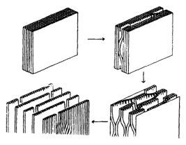

图1. 细胞壁模型（箭头方向表示纤维润胀过程）

角质化与干涸时纤维的胞腔和孔隙收缩有关。纤维干燥过程中,管状的纤维细胞形成带状,然后一些单根微细纤维和小纤维会粘着在纤维的外表面, 最后水从纤维壁上解吸脱除。由此可知纤维的角质化包括两个现象$^{[1]}$:一是整根纤维变得纤硬,二是纤维的表面物理化学性质发生变化。前者指纤维壁内的孔隙发生不可逆封闭,即使再润湿甚至长时间打浆仍难以使纤维壁分层。 后者指纤维表面的疏水化。

### 2.2 二次纤维的角质化机理

不同的研究者提出了角质化的不同作用机理。这里我们主要介绍纤维角质化的聚集、结晶、交联机理。

最早提出的一种纤维角质化机理是聚糖链由于脱水而紧实的联接在一起所形成的角质化。该机理认为,纸页在压榨和干燥时,纤维细体壁中的毛细管会逐渐封闭,即使再次浸入水中时也不能重新打开。随着水分的脱出, 纤维素聚糖链会因为氢键的形成而压紧。这种角质化了的细胞壁韧性小,并不易润胀。

后来研究人员提出角质化的聚集机理:细纤维联在一起形成扁平的带状,

---

重新再湿后仍保持部分结合$^{[2]}$,如图2所示。

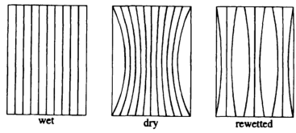

图 2  Jayme 和 Hunger 提出的角质化机理

细纤维素集成后的单元,自然会引起水可到达的表面减少。低得率纤维浆的角质化符合此机理。纤维烘干后,纤维壁与壁间也可能发生不可逆的交联,大的孔隙减少。由于孔隙的不可逆封闭,烘干和再湿后的纤维细胞壁基质变密,同时细胞壁间出现裂缝。纤维细胞横切面径向形成裂纹并且脱层, 层结构的断裂形成更多不规则的纹理,如图1中第三幅图。该理论认为部分或全部脱水是纤维角质化的主要原因。

## 2.  结晶：

众所周知,纤维素结晶区结构规则,润胀时水分子不易进入。许多研究发现纤维发生角质化后,纤维表面积减少,结晶区增大。所以角质化不利于纤维吸水润胀和氢键的形成。对纤维进行蒸汽处理或升高温度,发现纤维素凝胶脱水收缩,纤维润胀减少,并且此过程部分不可逆。据此认为纤维素链的靠近会增大结晶区面积。测定用氢氧化钠处理后的纤维的润水值(WRv) 和结晶指数发现,两者成线性关系变化,从而确定不可逆的角度化是一个结晶过程$^{[10]}$。

研究人员还研究了研究气聚受热时结晶的变质。在 130~175℃ 范围内, 水热作用引起纤维结晶,更高的温度使纤维热降而破坏。纤维素结晶增加了结晶区宽度,改善了晶区内存在的缺陷。对固体状态的纤维素做磁核共振 (NMR)分析,同样发现 20℃下经多次循环干燥的烘干处理,结晶指数增加了几个百分点。其他研究人员同样发现湿的浆样热处理后,结晶度增加。因此提出结晶是“不可逆的角化质”过程的观点。

导致结晶区增大还可能由于共结晶过程(cocrystallization)。部分半纤维素与结晶纤维素链平行排列,纸页干燥时半纤维素和纤维素会规则地键合在一起,使两个结晶区连成一个晶区。共结晶后,半纤维素在随后的抄纸中将不再有利于形成纤维间的氢键。

---

## 3. 交联

正如上面所描述,纤维微细结构内的交联也被认为是角质的一个机理 $^{[4]}$。此处所说的交联并不是指形成共价键,而是细纤维表面的不可逆连接。 这种交联主要发生在生长爆初期,而把进一步或大量干燥后形成的化学键合认为是纸或纤维的老化現象。自然老化或受热促进酸性纸中纤维素和半纤维素链间发生半缩型自交联$^{[8]}$。在此过程中段基起着重要作用。高得率羊的角质化主要由木素和半纤维素发生交联引起。化学浆木素含量较少,有产生较多氢键的可能,因此易于产生纤维角化。

综合以上研究, 可以认为角质化源于以下几种不可逆作用:

- ● 纤维丝内较软尺寸孔隙的封闭
● 纤维素非水凝胶和半纤维素的变化
● 化学变化，也能说明老化过程中发生的变化。
纤维湿角质化的机理主要是聚集机理,纤维中的孔隙发生不可封闭 ,聚集机理是低得要求纤维角质化的特征。干质角化主要由结晶、交联机理、

二次纤维的角质化是纤维与水相互作用的结果。另一方面,热以某种方式改变了纤维内部结构,但此变化用来是微镜不能观察到(干角质化)。纤维的两种角质化可以用纤维形态变化来加以区别。纤维的混角质化与形态变化相关,而干角质化与形态变化无关。总之,纤维角质化描述了纤维与水相互作用发生的变化。

### 2.3 影响角质化的因素

以上我们介绍了角质化形成的机理和有关的理论。在此基础上，下面我们讨论了制浆造纸过程中影响纤维质量的一些主要因素。

### ，制浆方法

不同的制浆方法,纤维角质化的程度不同。低得率浆回用时,纤维容易发生角质化,即机械角质化程度比化学浆轻。机械浆纤维细胞壁中含有木素丰半纤维素胶,干燥时能够阻止纤维素表面的接触$^{[10]}$。并且机械浆纤维素木含量多,孔隙少。而木素属于憎水性物质,所以原机械浆纤维淤浆程度轻, 回用后的纤维角质化程度小。化学浆由木素的脱除而形成很多孔隙,并且充满了水。在挤压和干燥过程中,纤维细胞而发生许多不可逆的变化。另一方面,机械浆细小组分多,而纤维角质化主要是发生在细小纤维上。因此随着纤维的回用细小组分不断流失,表浆为浆中的纤维角质化程度小。目前对机械浆角质化研究较少,但从现有的研究成果来看,机械浆纤维有限度回用对纤维强度有正面影响。

化学浆打浆越重，一次纤维润胀能力越大，回用后，纤维角质化越严重。

---

对一次纤维强烈拉伸,造成了纤维回用时原有的润胀程度难以恢复。细小组分多的浆纤维质化严重。

纤维角质化的成浆机理表明:通过打浆不仅能使角质化恢复至原状的态,因为打浆不改变纤维的结晶度,而且角质化了的浆料的打浆性能较差, 产生的细纤维也比原有细纤维粗,由于老化或热处理造成纤维链断裂,但通过机械作用无法使纤维恢复原有的长度。打浆仅仅可以降低纤维角质化程度,但又增加了再次抄回纤维的角质化程度。

研究纤维角质化主要发生在细小组分上,角质化的纤维与未干燥的纤维相比,细小组分含量随打浆的进行而增多。二次细小组分比原细小组分再润胀能力小,对增加表面积有更大的作用。

有人利用 WRV 测定方法研究纤维的质化$^{[1]}$。认为:①角质化的纤维在打浆时易于断裂;②经一次干燥的细小组分性质类似于惰性填料。采用溶解物排除技术测量,纤维和细小组分经适度打浆可以使角质化的纤维得到恢复。目前该研究结论尚有争议,争议主要在于测量方法和研寄件的差异。

## 3、压榨

纤维在湿压过程中会发生“湿”角化质。随着压力增大,纤维角化越严重;在相同的压力下,反复压榨也降低了纤维的润胀能力$^{[5]}$。湿压榨时,随着压力的增大和压抑时间的增长,纤维腔压溃、孔隙发生不可逆封闭,并且纸页水分减少,从而影响纤维的角化程度,特别是纸页上度过35%时压榨对角化角化的影响更大。在相同的压榨过程中,湿压榨对机械浆纤维的影响甚微,即使当压榨后纸页的干度超过73%,机械浆回用纤维的保水值WRV 下降也在5%以内$^{[5]}$。与干燥相比,压榨是一种不均匀的脱水方式。压榨时, 纤维局部固含量高,纤维较细的部分因受较大的压力,润胀能力降低得多$^{[5]}$。 纤维湿角化机理主要是孔隙的不可逆封闭。

二次纤维的角化主要是由于纤维的,纤维经干燥后,纤维内部孔隙由于脱水而封闭,其腔胞发生塌陷,形成部分不可逆的键合,纤维沉积程度下降。胞腔塌陷通常以塌陷指数表示,公式如下:

$$\begin{array} { r } { \left.  填陷指数  C I = 1 - \frac { L A } { L A _ { s } } \right] ^ { [ 1 ] } \quad ( 1 . 2 ) } \end{array}$$

1一纤维处理或涂装后，细胞槽的面积 LAM-1纤维处理或涂装前的胞腔剪切面积

随着干燥温度和干燥程度的提高,纤维角质化程度提高。与从未干燥过的纤维相比,角质化的纤维的润胀程度可减少30%左右。相同温度下,强制干燥的纤维角质化程度比自由干燥的大。升高温度和强制干燥,纤维脱水剧烈、压溃、形成更多的结晶区、形成更强的键合等,纤维角质化程度增大。

---

抄纸的pH同样会影响纤维的角质化程度。研究表明:含胶团的浆如果酸性基因以离子形式存在,干燥时的角度化程度会降低$^{[5]}$。pH对未脱KP 炭角质化有很大影响。而对胶基含量少的漂白浆无任何作用。酸性环境下干燥的浆再润湿后,碱处理可以恢复部分润胀能力,降低纤维角质化程度。

### 6、回用次数

二次纤维角质化程度随回用次数增加而增大,尤其是第一次回用,纤维保水值明显下降。从第二次干燥开始降趋势逐渐平缓,对高得率浆的研究表明$^{[10]}$. 第二次回用以后保水值几乎不变,角质化随回用次数变化极微。总之,纤维经第一次干燥后角质化程度最重。

## 3  纸页的主要力学性能及其影响因素$^{[11-16]}$

### 3.1 抗张强度

在造纸工业中,纸的抗张强度是指纸或成 Paper在一定条件下所能承受的最大张力。通常以两百米方式表示, 绝对抗张强度和断裂长。

（1）绝对抗张强度，

这是指一定宽度的试样断裂时所承受的张力，以 kN/m（kg/15mm）表示。

这个假设的指标表示当一定宽度的纸条以一端悬挂时,在其自重力的作用下直至断裂时的长度,以千米数表示。从这个概念本身的定义可以看出, 它是有条件的和不完善的。但是,纸的这个强度指标暂时还未由其它指标代替,并且在世界造纸工业的实践中是公认的。

（3）抗张指数

抗张指数由绝对抗张强度除以定量求得，其值按下式计算：

$$X = \frac { G _ { p } } { W } \quad  ~ ~ ~ ~ ~ ~ ~ ~ ~ ~ ~ ~ ~ ~ ~ ~ ~ ~ ~ ~ ~ ~ ~ ~ ~ ~ ~ ~ ~ ~ ~ ~ ~ ~ ~ ~ ~ ~ ~ ~ ~ ~ ~ ~ ~ ~ ~ ~ ~ ~ ~ ~ ~ ~ ~ ~ ~ ~ ~ ~ ~ ~ ~ ~ ~ ~ ~ ~ ~ ~ ~ ~ ~ ~ ~ ~ ~ ~ ~ ~ ~ ~ ~ ~ ~ ~ ~ ~ ~ ~ ~ ~ ~ ~ ~ ~ ~ ~ ~ ~ ~ ~ ~ ~ ~ ~ ~ ~ ~ ~ ~ ~ ~ ~ ~ ~ ~ ~ ~ ~ ~ ~ ~ ~ ~ ~ ~ ~ ~ ~ ~ ~ ~ ~ ~ ~ ~ ~ ~ ~ ~ ~ ~ ~ ~ ~ ~ ~ ~ ~ ~ ~ ~ ~ ~ ~ ~ ~ ~ ~ ~ ~ ~ ~ ~ ~ ~ ~ ~ ~ ~ ~ ~ ~ ~ ~ ~ ~ ~ ~ ~ ~ ~ ~ ~ ~ ~ ~ ~ ~ ~ ~ ~ ~ ~ ~ ~ ~ ~ ~ ~ ~ ~ ~ ~ ~ ~ ~ ~ ~ ~ ~ ~ ~ ~ ~ ~ ~ ~ ~ ~ ~ ~ ~ ~ ~ ~ ~ ~ ~ ~ ~ ~ ~ ~ ~ ~ ~ ~ ~ ~ ~ ~ ~ ~ ~ ~ ~ ~ ~ ~ ~ ~ ~ ~ ~ ~ ~ ~ ~ ~ ~ ~ ~ ~ ~ ~ ~ ~ ~ ~ ~ ~ ~ ~ ~ ~ ~ ~ ~ ~ ~ ~ ~ ~ ~ ~ ~ ~ ~ ~ ~ ~ ~ ~ ~ ~ ~ ~ ~ ~ ~ ~ ~ ~ ~ ~ ~ ~ ~ ~ ~ ~ ~ ~ ~ ~ ~ ~ ~ ~ ~ ~ ~ ~ ~ ~ ~ ~ ~ ~ ~ ~ ~ ~ ~ ~ ~ ~ ~ ~ ~ ~ ~ ~ ~ ~ ~ ~ ~ ~ ~ ~ ~ ~ ~ ~ ~ ~ ~ ~ ~ ~ ~ ~ ~ ~ ~ ~ ~ ~ ~ ~ ~ ~ ~ ~ ~ ~ ~ ~ ~ ~ ~ ~ ~ ~ ~ ~ ~ ~ ~ ~ ~ ~ ~ ~ ~ ~ ~ ~ ~ ~ ~ ~ ~ ~ ~ ~ ~ ~ ~ ~ ~ ~ ~ ~ ~ ~ ~ ~ ~ ~ ~ ~ ~ ~ ~ ~ ~ ~ ~ ~ ~ ~ ~ ~ ~ ~ ~ ~ ~ ~ ~ ~ ~ ~ ~ ~ ~ ~ ~ ~ ~ ~ ~ ~ ~ ~ ~ ~ ~ ~ ~ ~ ~ ~ ~ ~ ~ ~ ~ ~ ~ ~ ~ ~ ~ ~ ~ ~ ~ ~ ~ ~ ~ ~ ~ ~ ~ ~ ~ ~ ~ ~ ~ ~ ~ ~ ~ ~ ~ ~ ~ ~ ~ ~ ~ ~ ~ ~ ~ ~ ~ ~ ~ ~ ~ ~ ~ ~ ~ ~ ~ ~ ~ ~ ~ ~ ~ ~ ~ ~ ~ ~ ~ ~ ~ ~ ~ ~ ~ ~ ~ ~ ~ ~ ~ ~ ~ ~ ~ ~ ~ ~ ~ ~ ~ ~ ~ ~ ~ ~ ~ ~ ~ ~ ~ ~ ~ ~ ~ ~ ~ ~ ~ ~ ~ ~ ~ ~ ~ ~ ~ ~ ~ ~ ~ ~ ~ ~ ~ ~ ~ ~ ~ ~ ~ ~ ~ ~ ~ ~ ~ ~ ~ ~ ~ ~ ~ ~ ~ ~ ~ ~ ~ ~ ~ ~ ~ ~ ~ ~ ~ ~ ~ ~ ~ ~ ~ ~ ~ ~ ~ ~ ~ ~ ~ ~ ~ ~ ~ ~ ~ ~ ~ ~ ~ ~ ~ ~ ~ ~ ~ ~ ~ ~ ~ ~ ~ ~ ~ ~ ~ ~ ~ ~ ~ ~ ~ ~ ~ ~ ~ ~ ~ ~ ~ ~ ~ ~ ~ ~ ~ ~ ~ ~ ~ ~ ~ ~ ~ ~ ~ ~ ~ ~ ~ ~ ~ ~ ~ ~ ~ ~ ~ ~ ~ ~ ~ ~ ~ ~ ~ ~ ~ ~ ~ ~ ~ ~ ~ ~ ~ ~ ~ ~ ~ ~ ~ ~ ~ ~ ~ ~ ~ ~ ~ ~ ~ ~ ~ ~ ~ ~ ~ ~ ~ ~ ~ ~ ~ ~ ~ ~ ~ ~ ~ ~ ~ ~ ~ ~ ~ ~ ~ ~ ~ ~ ~ ~ ~ ~ ~ ~ ~ ~ ~ ~ ~ ~ ~ ~ ~ ~ ~ ~ ~ ~ ~ ~ ~ ~ ~ ~ ~ ~ ~ ~ ~ ~ ~ ~ ~ ~ ~ ~ ~ ~ ~ ~ ~ ~ ~ ~ ~ ~ ~ ~ ~ ~ ~ ~ ~ ~ ~ ~ ~ ~ ~ ~ ~ ~ ~ ~ ~ ~ ~ ~ ~ ~ ~ ~ ~ ~ ~ ~ ~ ~ ~ ~ ~ ~ ~ ~ ~ ~ ~ ~ ~ ~ ~ ~ ~ ~ ~ ~ ~ ~ ~ ~ ~ ~ ~ ~ ~ ~ ~ ~ ~ ~ ~ ~ ~ ~ ~ ~ ~ ~ ~ ~ ~ ~ ~ ~ ~ ~ ~ ~ ~ ~ ~ ~ ~ ~ ~ ~ ~ ~ ~ ~ ~ ~ ~ ~ ~ ~ ~ ~ ~ ~ ~ ~ ~ ~ ~ ~ ~ ~ ~ ~ ~ ~ ~ ~ ~ ~ ~ ~ ~ ~ ~ ~ ~ ~ ~ ~ ~ ~ ~ ~ ~ ~ ~ ~ ~ ~ ~ ~ ~ ~ ~ ~ ~ ~ ~ ~ ~ ~ ~ ~ ~ ~ ~ ~ ~ ~ ~ ~ ~ ~ ~ ~ ~ ~ ~ ~ ~ ~ ~ ~ ~ ~ ~ ~ ~ ~ ~ ~ ~ ~ ~ ~ ~ ~ ~ ~ ~ ~ ~ ~ ~ ~ ~ ~ ~ ~ ~ ~ ~ ~ ~ ~ ~ ~ ~ ~ ~ ~ ~ ~ ~ ~ ~ ~ ~ ~ ~ ~ ~ ~ ~ ~ ~ ~ ~ ~ ~ ~ ~ ~ ~ ~ ~ ~ ~ ~ ~ ~ ~ ~ ~ ~ ~ ~ ~ ~ ~ ~ ~ ~ ~ ~ ~ ~ ~ ~ ~ ~ ~ ~ ~ ~ ~ ~ ~ ~ ~ ~ ~ ~ ~ ~ ~ ~ ~ ~ ~ ~ ~ ~ ~ ~ ~ ~ ~ ~ ~ ~ ~ ~ ~ ~ ~ ~ ~ ~ ~ ~ ~ ~ ~ ~ ~ ~ ~ ~ ~ ~ ~ ~ ~ ~ ~ ~ ~ ~ ~ ~ ~ ~ ~ ~ ~ ~ ~ ~ ~ ~ ~ ~ ~ ~ ~ ~ ~ ~ ~ ~ ~ ~ ~ ~ ~ ~ ~ ~ ~ ~ ~ ~ ~ ~ ~ ~ ~ ~ ~ ~ ~ ~ ~ ~ ~ ~ ~ ~ ~ ~ ~ ~ ~ ~ ~ ~ ~ ~ ~ ~ ~ ~ ~ ~ ~ ~ ~ ~ ~ ~ ~ ~ ~ ~ ~ ~ ~ ~ ~ ~ ~ ~ ~ ~ ~ ~ ~ ~ ~ ~ ~ ~ ~ ~ ~ ~ ~ ~ ~ ~ ~ ~ ~ ~ ~ ~ ~ ~ ~ ~ ~ ~ ~ ~ ~ ~ ~ ~ ~ ~ ~ ~ ~ ~ ~ ~ ~ ~ ~ ~ ~ ~ ~ ~ ~ ~ ~ ~ ~ ~ ~ ~ ~ ~ ~ ~ ~ ~ ~ ~ ~ ~ ~ ~ ~ ~ ~ ~ ~ ~ ~ ~ ~ ~ ~ ~ ~ ~ ~ ~ ~ ~ ~ ~ ~ ~ ~ ~ ~ ~ ~ ~ ~ ~ ~ ~ ~ ~ ~ ~ ~ ~ ~ ~ ~ ~ ~ ~ ~ ~ ~ ~ ~ ~ ~ ~ ~ ~ ~ ~ ~ ~ ~ ~ ~ ~ ~ ~ ~ ~ ~ ~ ~ ~ ~ ~ ~ ~ ~ ~ ~ ~ ~ ~ ~ ~ ~ ~ ~ ~ ~ ~ ~ ~ ~ ~ ~ ~ ~ ~ ~ ~ ~ ~ ~ ~ ~ ~ ~ ~ ~ ~ ~ ~ ~ ~ ~ ~ ~ ~ ~ ~ ~ ~ ~ ~ ~ ~ ~ ~ ~ ~ ~ ~ ~ ~ ~ ~ ~ ~ ~ ~ ~ ~ ~ ~ ~ ~ ~ ~ ~ ~ ~ ~ ~ ~ ~ ~ ~ ~ ~ ~ ~ ~ ~ ~ ~ ~ ~ ~ ~ ~ ~ ~ ~ ~ ~ ~ ~ ~ ~ ~ ~ ~ ~ ~ ~ ~ ~ ~ ~ ~ ~ ~ ~ ~ ~ ~ ~ ~ ~ ~ ~ ~ ~ ~ ~ ~ ~ ~ ~ ~ ~ ~ ~ ~ ~ ~ ~ ~ ~ ~ ~ ~ ~ ~ ~ ~ ~ ~ ~ ~ ~ ~ ~ ~ ~ ~ ~ ~ ~ ~ ~ ~ ~ ~ ~ ~ ~ ~ ~ ~ ~ ~ ~ ~ ~ ~ ~ ~ ~ ~ ~ ~ ~ ~ ~ ~ ~ ~ ~ ~ ~ ~ ~ ~ ~ ~ ~ ~ ~ ~ ~ ~ ~ ~ ~ ~ ~ ~ ~ ~ ~ ~ ~ ~ ~ ~ ~ ~ ~ ~ ~ ~ ~ ~ ~ ~ ~ ~ ~ ~ ~ ~ ~ ~ ~ ~ ~ ~ ~ ~ ~ ~ ~ ~ ~ ~ ~ ~ ~ ~ ~ ~ ~ ~ ~ ~ ~ ~ ~ ~ ~ ~ ~ ~ ~ ~ ~ ~ ~ ~ ~ ~ ~ ~ ~ ~ ~ ~ ~ ~ ~ ~ ~ ~ ~ ~ ~ ~ ~ ~ ~ ~ ~ ~ ~ ~ ~ ~ ~ ~ ~ ~ ~ ~ ~ ~ ~ ~ ~ ~ ~ ~ ~ ~ ~ ~ ~ ~ ~ ~ ~ ~ ~ ~ ~ ~ ~ ~ ~ ~ ~ ~ ~ ~ ~ ~ ~ ~ ~ ~ ~ ~ ~ ~ ~ ~ ~ ~ ~ ~ ~ ~ ~ ~ ~ ~ ~ ~ ~ ~ ~ ~ ~ ~ ~ ~ ~ ~ ~ ~ ~ ~ ~ ~ ~ ~ ~ ~ ~ ~ ~ ~ ~ ~ ~ ~ ~ ~ ~ ~ ~ ~ ~ ~ ~ ~ ~ ~ ~ ~ ~ ~ ~ ~ ~ ~ ~ ~ ~ ~ ~ ~ ~ ~ ~ ~ ~ ~ ~ ~ ~ ~ ~ ~ ~ ~ ~ ~ ~ ~ ~ ~ ~ ~ ~ ~ ~ ~ ~ ~ ~ ~ ~ ~ ~ ~ ~ ~ ~ ~ ~ ~ ~ ~ ~ ~ ~ ~ ~ ~ ~ ~ ~ ~ ~ ~ ~ ~ ~ ~ ~ ~ ~ ~ ~ ~ ~ ~ ~ ~ ~ ~ ~ ~ ~ ~ ~ ~ ~ ~ ~ ~ ~ ~ ~ ~ ~ ~ ~ ~ ~ ~ ~ ~ ~ ~ ~ ~ ~ ~ ~ ~ ~ ~ ~ ~ ~ ~ ~ ~ ~ ~ ~ ~ ~ ~ ~ ~ ~ ~ ~ ~ ~ ~ ~ ~ ~ ~ ~ ~ ~ ~ ~ ~ ~ ~ ~ ~ ~ ~ ~ ~ ~ ~ ~ ~ ~ ~ ~ ~ ~ ~ ~ ~ ~ ~ ~ ~ ~ ~ ~ ~ ~ ~ ~ ~ ~ ~ ~ ~ ~ ~ ~ ~ ~ ~ ~ ~ ~ ~ ~ ~ ~ ~ ~ ~ ~ ~ ~ ~ ~ ~ ~ ~ ~ ~ ~ ~ ~ ~ ~ ~ ~ ~ ~ ~ ~ ~ ~ ~ ~ ~ ~ ~ ~ ~ ~ ~ ~ ~ ~ ~ ~ ~ ~ ~ ~ ~ ~ ~ ~ ~ ~ ~ ~ ~ ~ ~ ~ ~ ~ ~ ~ ~ ~ ~ ~ ~ ~ ~ ~ ~ ~ ~ ~ ~ ~ ~ ~ ~ ~ ~ ~ ~ ~ ~ ~ ~ ~ ~ ~ ~ ~ ~ ~ ~ ~ ~ ~ ~ ~ ~ ~ ~ ~ ~ ~ ~ ~ ~ ~ ~ ~ ~ ~ ~ ~ ~ ~ ~ ~ ~ ~ ~ ~ ~ ~ ~ ~ ~ ~ ~ ~ ~ ~ ~ ~ ~ ~ ~ ~ ~ ~ ~ ~ ~ ~ ~ ~ ~ ~ ~ ~ ~ ~ ~ ~ ~ ~ ~ ~ ~ ~ ~ ~ ~ ~ ~ ~ ~ ~ ~ ~ ~ ~ ~ ~ ~ ~ ~ ~ ~ ~ ~ ~ ~ ~ ~ ~ ~ ~ ~ ~ ~ ~ ~ ~ ~ ~ ~ ~ ~ ~ ~ ~ ~ ~ ~ ~ ~ ~ ~ ~ ~ ~ ~ ~ ~ ~ ~ ~ ~ ~ ~ ~ ~ ~ ~ ~ ~ ~ ~ ~ ~ ~ ~ ~ ~ ~ ~ ~ ~ ~ ~ ~ ~ ~ ~ ~ ~ ~ ~ ~ ~ ~ ~ ~ ~ ~ ~ ~ ~ ~ ~ ~ ~ ~ ~ ~ ~ ~ ~ ~ ~ ~ ~ ~ ~ ~ ~ ~ ~ ~ ~ ~ ~ ~ ~ ~ ~ ~ ~ ~ ~ ~ ~ ~ ~ ~ ~ ~ ~ ~ ~ ~ ~ ~ ~ ~ ~ ~ ~ ~ ~ ~ ~ ~ ~ ~ ~ ~ ~ ~ ~ ~ ~ ~ ~ ~ ~ ~ ~ ~ ~ ~ ~ ~ ~ ~ ~ ~ ~ ~ ~ ~ ~ ~ ~ ~ ~ ~ ~ ~ ~ ~ ~ ~ ~ ~ ~ ~ ~ ~ ~ ~ ~ ~ ~ ~ ~ ~ ~ ~ ~ ~ ~ ~ ~ ~ ~ ~ ~ ~ ~ ~ ~ ~ ~ ~ ~ ~ ~ ~ ~ ~ ~ ~ ~ ~ ~ ~ ~ ~ ~ ~ ~ ~ ~ ~ ~ ~ ~ ~ ~ ~ ~ ~ ~ ~ ~ ~ ~ ~ ~ ~ ~ ~ ~ ~ ~ ~ ~ ~ ~ ~ ~ ~ ~ ~ ~ ~ ~ ~ ~ ~ ~ ~ ~ ~ ~ ~ ~ ~ ~ ~ ~ ~ ~ ~ ~ ~ ~ ~ ~ ~ ~ ~ ~ ~ ~ ~ ~ ~ ~ ~ ~ ~ ~ ~ ~ ~ ~ ~ ~ ~ ~ ~ ~ ~ ~ ~ ~ ~ ~ ~ ~ ~ ~ ~ ~ ~ ~ ~ ~ ~ ~ ~ ~ ~ ~ ~ ~ ~ ~ ~ ~ ~ ~ ~ ~ ~ ~ ~ ~ ~ ~ ~ ~ ~ ~ ~ ~ ~ ~ ~ ~ ~ ~ ~ ~ ~ ~ ~ ~ ~ ~ ~ ~ ~ ~ ~ ~ ~ ~ ~ ~ ~ ~ ~ ~ ~ ~ ~ ~ ~ ~ ~ ~ ~ ~ ~ ~ ~ ~ ~ ~ ~ ~ ~ ~ ~ ~ ~ ~ ~ ~ ~ ~ ~ ~ ~ ~ ~ ~ ~ ~ ~ ~ ~ ~ ~ ~ ~ ~ ~ ~ ~ ~ ~ ~ ~ ~ ~ ~ ~ ~ ~ ~ ~ ~ ~ ~ ~ ~ ~ ~ ~ ~ ~ ~ ~ ~ ~ ~ ~ ~ ~ ~ ~ ~ ~ ~ ~ ~ ~ ~ ~ ~ ~ ~ ~ ~ ~ ~ ~ ~ ~ ~ ~ ~ ~ ~ ~ ~ ~ ~ ~ ~ ~ ~ ~ ~ ~ ~ ~ ~ ~ ~ ~ ~ ~ ~ ~ ~ ~ ~ ~ ~ ~ ~ ~ ~ ~ ~ ~ ~ ~ ~ ~ ~ ~ ~ ~ ~ ~ ~ ~ ~ ~ ~ ~ ~ ~ ~ ~ ~ ~ ~ ~ ~ ~ ~ ~ ~ ~ ~ ~ ~ ~ ~ ~ ~ ~ ~ ~ ~ ~ ~ ~ ~ ~ ~ ~ ~ ~ ~ ~ ~ ~ ~ ~ ~ ~ ~ ~ ~ ~ ~ ~ ~ ~ ~ ~ ~ ~ ~ ~ ~ ~ ~ ~ ~ ~ ~ ~ ~ ~ ~ ~ ~ ~ ~ ~ ~ ~ ~ ~ ~ ~ ~ ~ ~ ~ ~ ~ ~ ~ ~ ~ ~ ~ ~ ~ ~ ~ ~ ~ ~ ~ ~ ~ ~ ~ ~ ~ ~ ~ ~ ~ ~ ~ ~ ~ ~ ~ ~ ~ ~ ~ ~ ~ ~ ~ ~ ~ ~ ~ ~ ~ ~ ~ ~ ~ ~ ~ ~ ~ ~ ~ ~ ~ ~ ~ ~ ~ ~ ~ ~ ~ ~ ~ ~ ~ ~ ~ ~ ~ ~ ~ ~ ~ ~ ~ ~ ~ ~ ~ ~ ~ ~ ~ ~ ~ ~ ~ ~ ~ ~ ~ ~ ~ ~ ~ ~ ~ ~ ~ ~ ~ ~ ~ ~ ~ ~ ~ ~ ~ ~ ~ ~ ~ ~ ~ ~ ~ ~ ~ ~ ~ ~ ~ ~ ~ ~ ~ ~ ~ ~ ~ ~ ~ ~ ~ ~ ~ ~ ~ ~ ~ ~ ~ ~ ~ ~ ~ ~ ~ ~ ~ ~ ~ ~ ~ ~ ~ ~ ~ ~ ~ ~ ~ ~ ~ ~ ~ ~ ~ ~ ~ ~ ~ ~ ~ ~ ~ ~ ~ ~ ~ ~ ~ ~ ~ ~ ~ ~ ~ ~ ~ ~ ~ ~ ~ ~ ~ ~ ~ ~ ~ ~ ~ ~ ~ ~ ~ ~ ~ ~ ~ ~ ~ ~ ~ ~ ~ ~ ~ ~ ~ ~ ~ ~ ~ ~ ~ ~ ~ ~ ~ ~ ~ ~ ~ ~ ~ ~ ~ ~ ~ ~ ~ ~ ~ ~ ~ ~ ~ ~ ~ ~ ~ ~ ~ ~ ~ ~ ~ ~ ~ ~ ~ ~ ~ ~ ~ ~ ~ ~ ~ ~ ~ ~ ~ ~ ~ ~ ~ ~ ~ ~ ~ ~ ~ ~ ~ ~ ~ ~ ~ ~ ~ ~ ~ ~ ~ ~ ~ ~ ~ ~ ~ ~ ~ ~ ~ ~ ~ ~ ~ ~ ~ ~ ~ ~ ~ ~ ~ ~ ~ ~ ~ ~ ~ ~ ~ ~ ~ ~ ~ ~ ~ ~ ~ ~ ~ ~ ~ ~ ~ ~ ~ ~ ~ ~ ~ ~ ~ ~ ~ ~ ~ ~ ~ ~ ~ ~ ~ ~ ~ ~ ~ ~ ~ ~ ~ ~ ~ ~ ~ ~ ~ ~ ~ ~ ~ ~ ~ ~ ~ ~ ~ ~ ~ ~ ~ ~ ~ ~ ~ ~ ~ ~ ~ ~ ~ ~ ~ ~ ~ ~ ~ ~ ~ ~ ~ ~ ~ ~ ~ ~ ~ ~ ~ ~ ~ ~ ~ ~ ~ ~ ~ ~ ~ ~ ~ ~ ~ ~ ~ ~ ~ ~ ~ ~ ~ ~ ~ ~ ~ ~ ~ ~ ~ ~ ~ ~ ~ ~ ~ ~ ~ ~ ~ ~ ~ ~ ~ ~ ~ ~ ~ ~ ~ ~ ~ ~ ~ ~ ~ ~ ~ ~ ~ ~ ~ ~ ~ ~ ~ ~ ~ ~ ~ ~ ~ ~ ~ ~ ~ ~ ~ ~ ~ ~ ~ ~ ~ ~ ~ ~ ~ ~ ~ ~ ~ ~ ~ ~ ~ ~ ~ ~ ~ ~ ~ ~ ~ ~ ~ ~ ~ ~ ~ ~ ~ ~ ~ ~ ~ ~ ~ ~ ~ ~ ~ ~ ~ ~ ~ ~ ~ ~ ~ ~ ~ ~ ~ ~ ~ ~ ~ ~ ~ ~ ~ ~ ~ ~ ~ ~ ~ ~ ~ ~ ~ ~ ~ ~ ~ ~ ~ ~ ~ ~ ~ ~ ~ ~ ~ ~ ~ ~ ~ ~ ~ ~ ~ ~ ~ ~ ~ ~ ~ ~ ~ ~ ~ ~ ~ ~ ~ ~ ~ ~ ~ ~ ~ ~ ~ ~ ~ ~ ~ ~ ~ ~ ~ ~ ~ ~ ~ ~ ~ ~ ~ ~ ~ ~ ~ ~ ~ ~ ~ ~ ~ ~ ~ ~ ~ ~ ~ ~ ~ ~ ~ ~ ~ ~ ~ ~ ~ ~ ~ ~ ~ ~ ~ ~ ~ ~ ~ ~ ~ ~ ~ ~ ~ ~ ~ ~ ~ ~ ~ ~ ~ ~ ~ ~ ~ ~ ~ ~ ~ ~ ~ ~ ~ ~ ~ ~ ~ ~ ~ ~ ~ ~ ~ ~ ~ ~ ~ ~ ~ ~ ~ ~ ~ ~ ~ ~ ~ ~ ~ ~ ~ ~ ~ ~ ~ ~ ~ ~ ~ ~ ~ ~ ~ ~ ~ ~ ~ ~ ~ ~ ~ ~ ~ ~ ~ ~ ~ ~ ~ ~ ~ ~ ~ ~ ~ ~ ~ ~ ~ ~ ~ ~ ~ ~ ~ ~ ~ ~ ~ ~ ~ ~ ~ ~ ~ ~ ~ ~ ~ ~ ~ ~ ~ ~ ~ ~ ~ ~ ~ ~ ~ ~ ~ ~ ~ ~ ~ ~ ~ ~ ~ ~ ~ ~ ~ ~ ~ ~ ~ ~ ~ ~ ~ ~ ~ ~ ~ ~ ~ ~ ~ ~ ~ ~ ~ ~ ~ ~ ~ ~ ~ ~ ~ ~ ~ ~ ~ ~ ~ ~ ~ ~ ~ ~ ~ ~ ~ ~ ~ ~ ~ ~ ~ ~ ~ ~ ~ ~ ~ ~ ~ ~ ~ ~ ~ ~ ~ ~ ~ ~ ~ ~ ~ ~ ~ ~ ~ ~ ~ ~ ~ ~ ~ ~ ~ ~ ~ ~ ~ ~ ~ ~ ~ ~ ~ ~ ~ ~ ~ ~ ~ ~ ~ ~ ~ ~ ~ ~ ~ ~ ~ ~ ~ ~ ~ ~ ~ ~ ~ ~ ~ ~ ~ ~ ~ ~ ~ ~ ~ ~ ~ ~ ~ ~ ~ ~ ~ ~ ~ ~ ~ ~ ~ ~ ~ ~ ~ ~ ~ ~ ~ ~ ~ ~ ~ ~ ~ ~ ~ ~ ~ ~ ~ ~ ~ ~ ~ ~ ~ ~ ~ ~ ~ ~ ~ ~ ~ ~ ~ ~ ~ ~ ~ ~ ~ ~ ~ ~ ~ ~ ~ ~ ~ ~ ~ ~ ~ ~ ~ ~ ~ ~ ~ ~ ~ ~ ~ ~ ~ ~ ~ ~ ~ ~ ~ ~ ~ ~ ~ ~ ~ ~ ~ ~ ~ ~ ~ ~ ~ ~ ~ ~ ~ ~ ~ ~ ~ ~ ~ ~ ~ ~ ~ ~ ~ ~ ~ ~ ~ ~ ~ ~ ~ ~ ~ ~ ~ ~ ~ ~ ~ ~ ~ ~ ~ ~ ~ ~ ~ ~ ~ ~ ~ ~ ~ ~ ~ ~ ~ ~ ~ ~ ~ ~ ~ ~ ~ ~ ~ ~ ~ ~ ~ ~ ~ ~ ~ ~ ~ ~ ~ ~ ~ ~ ~ ~ ~ ~ ~ ~ ~ ~ ~ ~ ~ ~ ~ ~ ~ ~ ~ ~ ~ ~ ~ ~ ~ ~ ~ ~ ~ ~ ~ ~ ~ ~ ~ ~ ~ ~ ~ ~ ~ ~ ~ ~ ~ ~ ~ ~ ~ ~ ~ ~ ~ ~ ~ ~ ~ ~ ~ ~ ~ ~ ~ ~ ~ ~ ~ ~ ~ ~ ~ ~ ~ ~ ~ ~ ~ ~ ~ ~ ~ ~ ~ ~ ~ ~ ~ ~ ~ ~ ~ ~ ~ ~ ~ ~ ~ ~ ~ ~ ~ ~ ~ ~ ~ ~ ~ ~ ~ ~ ~ ~ ~ ~ ~ ~ ~ ~ ~ ~ ~ ~ ~ ~ ~ ~ ~ ~ ~ ~ ~ ~ ~ ~ ~ ~ ~ ~ ~ ~ ~ ~ ~ ~ ~ ~ ~ ~ ~ ~ ~ ~ ~ ~ ~ ~ ~ ~ ~ ~ ~ ~ ~ ~ ~ ~ ~ ~ ~ ~ ~ ~ ~ ~ ~ ~ ~ ~ ~ ~ ~ ~ ~ ~ ~ ~ ~ ~ ~ ~ ~ ~ ~ ~ ~ ~ ~ ~ ~ ~ ~ ~ ~ ~ ~ ~ ~ ~ ~ ~ ~ ~ ~ ~ ~ ~ ~ ~ ~ ~ ~ ~$$

式中：X——抗张指数，kN/m/g $G_{p}$——绝对抗张强度，kN/m W——定量，g/m²

抗张强度的影响因素

（1）纤维长度被认为对纸的抗张强度有一定的影响。

(2)纤维结合的数量和质量是影响抗张强度的重要因素。无论增加打浆或增加湿压所形成的纤维结合,都会使抗张强度增加。如果纸张受到过度打浆(导致纤维结构受到破坏),抗张强度会有稍微下降的趋势,但是当用湿压来提高纸的密度时,抗张强度并不减少。

（3）增加水分含量，会使抗张强度增加，直到纸与30%相对湿度平衡的那点

---

为止，再增加水分会引起抗张强度的降低。

### 3.2 撕裂度

撕裂度是指先将纸张切出一定长度的裂口,然后再从裂口开始撕到一定距离时所需的功。因为距离是固定的,故以力表示撕裂度,以mN(毫牛顿) 为单位。

纸的这个指标的增加与其抗张强度和耐破度的提高不成直线关系。并且, 边抗撕度不高的松软的(松厚的)纸,比紧密的和抗张强度高、表面结构致密的纸具有更大的断裂裂度。

撕裂指数由平均撕裂度除以定量而求得，其值按下式计算：

$$X \sim { \frac { T _ { m } } { W } } \quad ( 1 . 4 )$$

式中：X——断裂指数，mN·m²/g $T_m$——平均断裂位，mN W——定量，g/m²

### 撕裂度的影响因素

- （1）参与纸页破裂的纤维总数，
（2）纤维长度，
（3）纤维与纤维结合的数目与强度。
纸撕裂时所作的功是消耗于拉出纤维和截断纤维的功之和。当检验有无未经打浆处理的纤维进行的纸时,撕裂度主要是由从纸中拉出纤维时克服它们之间的摩擦力所作的功来决定。实际上没有发生纤维的任何断裂(截断),并且由于纤维之间的接触总面积不大,所以摩擦阻力和撕裂度都不大。在轻微的打浆之后,纤维之间的结合增加,由于从纸中拉出纤维时摩擦增加,所以撕裂度也增大,但对于预先干燥过的纸张,并不总是如此。在高打浆度下纤维彼此已不易滑动,因而当纸拉伸时就会增加断裂的纤维数目。这样,消耗于截断纤维的能量比消耗于从纸中拉出纤维的能量要小得多,所以纸的断裂度降低,因为这时撕裂的力是集中在很小的面积上。

换句话说,打浆的结果是使纸的张力和挺度增加,这就缓和了把撕裂的力量集中到较小的面积上,结果得到低的断裂度。这就是为什么打浆使纸的断裂强度先有所上升,然后持续下降的理由。这种作用不完全是由于纤维的长度减小造成的,因为在纸浆中逐渐增加粘剂合(如: 沉淀)的数量或通过湿压滚而增加纸的密度也同样会抑制断裂度逐渐降低。

断裂度并不在很大程度上与纸页匀度有关。这是因为在进行撕裂时,纤维是持续地被拉断的,所以使得纤维排列的情况不很重要,不象在抗张力实验中全部纤维都在同时受到应力。

---

### 3.3  零距抗张强度

零距抗张强度是指抗张测试中,当拉力机的夹子之间距离(纸样的夹层) 为零时测得的抗张强度。通常用零距抗张强度间接反映纤维本的强度。但零距抗张强度反映的只是纤维的平均强度,而不能反映单根纤维本身的强度。

## 4 相对键合面积（RBA）$^{[17-21]}$

纤维网络之间的连接或键合度控制了纸的力学性能,如果纤维间的键很少,纤维网络将没有任何的内聚力。通常用相对键合面积来表征纸页的键合度。相对键合面积(RBA)是纸张强度和光学性能的一个决定因素,量化了纸片中纤维间键合的程度。相对键合面积的定义为纤维键合的表面积与它们总表面积的比值。也有的定义为键合的纸页中键合纤维比表面积与未键合纸页中未键合纤维比表面积的比值,在造纸二维网络中,相对键合面积 RBA 随着定量的增大而增加。而在三维网络中,当定量增加时,增加的孔隙限制了相对键合面积RBA的增大,即光散射系数减小。当定量一定时 RBA 取决于横切面尺寸和纤维韧性,湿压榨和烘干也起作用。在实际中 RBA 的控制参数是打浆、浆种、湿压和空隙大小分布。

由于纤维原料的短缺,对二次纤维剂利用逐渐增加。但二次纤维抄造的纸页的许多强度能明显降低。根据 Page 方程$^{[7]}$,

$${ \frac { 1 } { T } } = { \frac { 9 } { 8 Z } } + { \frac { 1 2 c } { b P L ( R B A ) } } \quad ( 1 . 5 )$$

其中,     T——抗指指数   Z——零距抗指指数 c——粗度      p——纤维横切面周长 b——单位键合面积的键剪切强度    L——纤维长度

经研究表明,二次纤维的长度、周长、零距抗张等几乎没有变化,所以对再生纸页抗张强度的减小影响很少。因此需要考虑纤维与纤维之间的键合以及键切剪强度。以下主要概述了相对键合面积(RBA)的一系列问题。

### 4.1 RBA 的表征

二维纸张结下的键在每个纤维的交叉点形成,因此在 Z 向上,纤维间不存在孔隙,可以通过覆盖数 C(纸张网络平面内任指纤维数量的平均值) 来简单地计算相对键合面积。纤维的总表面积为 2CA(  A 为纸页的面积)。由于每根纤维具有两个表面,而且纸页除了在零覆盖点之外也有两个自由表面, 因此,未键合表面的总量为: $2A \times [1-\exp (c)]$, 并且

$$R B A = \frac { 2 C A - 2 A \left[ 1 - \exp \left( - C \right) \right] } { 2 C A } = \frac { 1 - \left[ 1 - \exp \left( - C \right) \right] } { C } \quad ( 1 . 6 )$$

---

表示纤维上、下两表面平均键合程度。

### 4.1.2 三维结构纸页 RBA 的表征

实际的纸页具有三维结构特征,有一定厚度和Z向孔隙,孔隙使得由上式所估计的二维结构的键合程度减小。所以对三维网络的相对键合面积RBA 可以概括地表达为:

$$R ^ { B A } = 1 - \frac { ( p - 1 ) ( t + v ) } { C } ~ ~ ~ ~ ~ ~ ~ ~ ~ ~ ~ ~ ~ ~ ~ ~ ~ ~ ~ ~ ~ ~ ~ ~ ~ ~ ~ ~ ~ ~ ~ ~ ~ ~ ~ ~ ~ ~ ~ ~ ~ ~ ~ ~ ~ ~ ~ ~ ~ ~ ~ ~ ~ ~ ~ ~ ~ ~ ~ ~ ~ ~ ~ ~ ~ ~ ~ ~ ~ ~ ~ ~ ~ ~ ~ ~ ~ ~ ~ ~ ~ ~ ~ ~ ~ ~ ~ ~ ~ ~ ~ ~ ~ ~ ~ ~ ~ ~ ~ ~ ~ ~ ~ ~ ~ ~ ~ ~ ~ ~ ~ ~ ~ ~ ~ ~ ~ ~ ~ ~ ~ ~ ~ ~ ~ ~ ~ ~ ~ ~ ~ ~ ~ ~ ~ ~ ~ ~ ~ ~ ~ ~ ~ ~ ~ ~ ~ ~ ~ ~ ~ ~ ~ ~ ~ ~ ~ ~ ~ ~ ~ ~ ~ ~ ~ ~ ~ ~ ~ ~ ~ ~ ~ ~ ~ ~ ~ ~ ~ ~ ~ ~ ~ ~ ~ ~ ~ ~ ~ ~ ~ ~ ~ ~ ~ ~ ~ ~ ~ ~ ~ ~ ~ ~ ~ ~ ~ ~ ~ ~ ~ ~ ~ ~ ~ ~ ~ ~ ~ ~ ~ ~ ~ ~ ~ ~ ~ ~ ~ ~ ~ ~ ~ ~ ~ ~ ~ ~ ~ ~ ~ ~ ~ ~ ~ ~ ~ ~ ~ ~ ~ ~ ~ ~ ~ ~ ~ ~ ~ ~ ~ ~ ~ ~ ~ ~ ~ ~ ~ ~ ~ ~ ~ ~ ~ ~ ~ ~ ~ ~ ~ ~ ~ ~ ~ ~ ~ ~ ~ ~ ~ ~ ~ ~ ~ ~ ~ ~ ~ ~ ~ ~ ~ ~ ~ ~ ~ ~ ~ ~ ~ ~ ~ ~ ~ ~ ~ ~ ~ ~ ~ ~ ~ ~ ~ ~ ~ ~ ~ ~ ~ ~ ~ ~ ~ ~ ~ ~ ~ ~ ~ ~ ~ ~ ~ ~ ~ ~ ~ ~ ~ ~ ~ ~ ~ ~ ~ ~ ~ ~ ~ ~ ~ ~ ~ ~ ~ ~ ~ ~ ~ ~ ~ ~ ~ ~ ~ ~ ~ ~ ~ ~ ~ ~ ~ ~ ~ ~ ~ ~ ~ ~ ~ ~ ~ ~ ~ ~ ~ ~ ~ ~ ~ ~ ~ ~ ~ ~ ~ ~ ~ ~ ~ ~ ~ ~ ~ ~ ~ ~ ~ ~ ~ ~ ~ ~ ~ ~ ~ ~ ~ ~ ~ ~ ~ ~ ~ ~ ~ ~ ~ ~ ~ ~ ~ ~ ~ ~ ~ ~ ~ ~ ~ ~ ~ ~ ~ ~ ~ ~ ~ ~ ~ ~ ~ ~ ~ ~ ~ ~ ~ ~ ~ ~ ~ ~ ~ ~ ~ ~ ~ ~ ~ ~ ~ ~ ~ ~ ~ ~ ~ ~ ~ ~ ~ ~ ~ ~ ~ ~ ~ ~ ~ ~ ~ ~ ~ ~ ~ ~ ~ ~ ~ ~ ~ ~ ~ ~ ~ ~ ~ ~ ~ ~ ~ ~ ~ ~ ~ ~ ~ ~ ~ ~ ~ ~ ~ ~ ~ ~ ~ ~ ~ ~ ~ ~ ~ ~ ~ ~ ~ ~ ~ ~ ~ ~ ~ ~ ~ ~ ~ ~ ~ ~ ~ ~ ~ ~ ~ ~ ~ ~ ~ ~ ~ ~ ~ ~ ~ ~ ~ ~ ~ ~ ~ ~ ~ ~ ~ ~ ~ ~ ~ ~ ~ ~ ~ ~ ~ ~ ~ ~ ~ ~ ~ ~ ~ ~ ~ ~ ~ ~ ~ ~ ~ ~ ~ ~ ~ ~ ~ ~ ~ ~ ~ ~ ~ ~ ~ ~ ~ ~ ~ ~ ~ ~ ~ ~ ~ ~ ~ ~ ~ ~ ~ ~ ~ ~ ~ ~ ~ ~ ~ ~ ~ ~ ~ ~ ~ ~ ~ ~ ~ ~ ~ ~ ~ ~ ~ ~ ~ ~ ~ ~ ~ ~ ~ ~ ~ ~ ~ ~ ~ ~ ~ ~ ~ ~ ~ ~ ~ ~ ~ ~ ~ ~ ~ ~ ~ ~ ~ ~ ~ ~ ~ ~ ~ ~ ~ ~ ~ ~ ~ ~ ~ ~ ~ ~ ~ ~ ~ ~ ~ ~ ~ ~ ~ ~ ~ ~ ~ ~ ~ ~ ~ ~ ~ ~ ~ ~ ~ ~ ~ ~ ~ ~ ~ ~ ~ ~ ~ ~ ~ ~ ~ ~ ~ ~ ~ ~ ~ ~ ~ ~ ~ ~ ~ ~ ~ ~ ~ ~ ~ ~ ~ ~ ~ ~ ~ ~ ~ ~ ~ ~ ~ ~ ~ ~ ~ ~ ~ ~ ~ ~ ~ ~ ~ ~ ~ ~ ~ ~ ~ ~ ~ ~ ~ ~ ~ ~ ~ ~ ~ ~ ~ ~ ~ ~ ~ ~ ~ ~ ~ ~ ~ ~ ~ ~ ~ ~ ~ ~ ~ ~ ~ ~ ~ ~ ~ ~ ~ ~ ~ ~ ~ ~ ~ ~ ~ ~ ~ ~ ~ ~ ~ ~ ~ ~ ~ ~ ~ ~ ~ ~ ~ ~ ~ ~ ~ ~ ~ ~ ~ ~ ~ ~ ~ ~ ~ ~ ~ ~ ~ ~ ~ ~ ~ ~ ~ ~ ~ ~ ~ ~ ~ ~ ~ ~ ~ ~ ~ ~ ~ ~ ~ ~ ~ ~ ~ ~ ~ ~ ~ ~ ~ ~ ~ ~ ~ ~ ~ ~ ~ ~ ~ ~ ~ ~ ~ ~ ~ ~ ~ ~ ~ ~ ~ ~ ~ ~ ~ ~ ~ ~ ~ ~ ~ ~ ~ ~ ~ ~ ~ ~ ~ ~ ~ ~ ~ ~ ~ ~ ~ ~ ~ ~ ~ ~ ~ ~ ~ ~ ~ ~ ~ ~ ~ ~ ~ ~ ~ ~ ~ ~ ~ ~ ~ ~ ~ ~ ~ ~ ~ ~ ~ ~ ~ ~ ~ ~ ~ ~ ~ ~ ~ ~ ~ ~ ~ ~ ~ ~ ~ ~ ~ ~ ~ ~ ~ ~ ~ ~ ~ ~ ~ ~ ~ ~ ~ ~ ~ ~ ~ ~ ~ ~ ~ ~ ~ ~ ~ ~ ~ ~ ~ ~ ~ ~ ~ ~ ~ ~ ~ ~ ~ ~ ~ ~ ~ ~ ~ ~ ~ ~ ~ ~ ~ ~ ~ ~ ~ ~ ~ ~ ~ ~ ~ ~ ~ ~ ~ ~ ~ ~ ~ ~ ~ ~ ~ ~ ~ ~ ~ ~ ~ ~ ~ ~ ~ ~ ~ ~ ~ ~ ~ ~ ~ ~ ~ ~ ~ ~ ~ ~ ~ ~ ~ ~ ~ ~ ~ ~ ~ ~ ~ ~ ~ ~ ~ ~ ~ ~ ~ ~ ~ ~ ~ ~ ~ ~ ~ ~ ~ ~ ~ ~ ~ ~ ~ ~ ~ ~ ~ ~ ~ ~ ~ ~ ~ ~ ~ ~ ~ ~ ~ ~ ~ ~ ~ ~ ~ ~ ~ ~ ~ ~ ~ ~ ~ ~ ~ ~ ~ ~ ~ ~ ~ ~ ~ ~ ~ ~ ~ ~ ~ ~ ~ ~ ~ ~ ~ ~ ~ ~ ~ ~ ~ ~ ~ ~ ~ ~ ~ ~ ~ ~ ~ ~ ~ ~ ~ ~ ~ ~ ~ ~ ~ ~ ~ ~ ~ ~ ~ ~ ~ ~ ~ ~ ~ ~ ~ ~ ~ ~ ~ ~ ~ ~ ~ ~ ~ ~ ~ ~ ~ ~ ~ ~ ~ ~ ~ ~ ~ ~ ~ ~ ~ ~ ~ ~ ~ ~ ~ ~ ~ ~ ~ ~ ~ ~ ~ ~ ~ ~ ~ ~ ~ ~ ~ ~ ~ ~ ~ ~ ~ ~ ~ ~ ~ ~ ~ ~ ~ ~ ~ ~ ~ ~ ~ ~ ~ ~ ~ ~ ~ ~ ~ ~ ~ ~ ~ ~ ~ ~ ~ ~ ~ ~ ~ ~ ~ ~ ~ ~ ~ ~ ~ ~ ~ ~ ~ ~ ~ ~ ~ ~ ~ ~ ~ ~ ~ ~ ~ ~ ~ ~ ~ ~ ~ ~ ~ ~ ~ ~ ~ ~ ~ ~ ~ ~ ~ ~ ~ ~ ~ ~ ~ ~ ~ ~ ~ ~ ~ ~ ~ ~ ~ ~ ~ ~ ~ ~ ~ ~ ~ ~ ~ ~ ~ ~ ~ ~ ~ ~ ~ ~ ~ ~ ~ ~ ~ ~ ~ ~ ~ ~ ~ ~ ~ ~ ~ ~ ~ ~ ~ ~ ~ ~ ~ ~ ~ ~ ~ ~ ~ ~ ~ ~ ~ ~ ~ ~ ~ ~ ~ ~ ~ ~ ~ ~ ~ ~ ~ ~ ~ ~ ~ ~ ~ ~ ~ ~ ~ ~ ~ ~ ~ ~ ~ ~ ~ ~ ~ ~ ~ ~ ~ ~ ~ ~ ~ ~ ~ ~ ~ ~ ~ ~ ~ ~ ~ ~ ~ ~ ~ ~ ~ ~ ~ ~ ~ ~ ~ ~ ~ ~ ~ ~ ~ ~ ~ ~ ~ ~ ~ ~ ~ ~ ~ ~ ~ ~ ~ ~ ~ ~ ~ ~ ~ ~ ~ ~ ~ ~ ~ ~ ~ ~ ~ ~ ~ ~ ~ ~ ~ ~ ~ ~ ~ ~ ~ ~ ~ ~ ~ ~ ~ ~ ~ ~ ~ ~ ~ ~ ~ ~ ~ ~ ~ ~ ~ ~ ~ ~ ~ ~ ~ ~ ~ ~ ~ ~ ~ ~ ~ ~ ~ ~ ~ ~ ~ ~ ~ ~ ~ ~ ~ ~ ~ ~ ~ ~ ~ ~ ~ ~ ~ ~ ~ ~ ~ ~ ~ ~ ~ ~ ~ ~ ~ ~ ~ ~ ~ ~ ~ ~ ~ ~ ~ ~ ~ ~ ~ ~ ~ ~ ~ ~ ~ ~ ~ ~ ~ ~ ~ ~ ~ ~ ~ ~ ~ ~ ~ ~ ~ ~ ~ ~ ~ ~ ~ ~ ~ ~ ~ ~ ~ ~ ~ ~ ~ ~ ~ ~ ~ ~ ~ ~ ~ ~ ~ ~ ~ ~ ~ ~ ~ ~ ~ ~ ~ ~ ~ ~ ~ ~ ~ ~ ~ ~ ~ ~ ~ ~ ~ ~ ~ ~ ~ ~ ~ ~ ~ ~ ~ ~ ~ ~ ~ ~ ~ ~ ~ ~ ~ ~ ~ ~ ~ ~ ~ ~ ~ ~ ~ ~ ~ ~ ~ ~ ~ ~ ~ ~ ~ ~ ~ ~ ~ ~ ~ ~ ~ ~ ~ ~ ~ ~ ~ ~ ~ ~ ~ ~ ~ ~ ~ ~ ~ ~ ~ ~ ~ ~ ~ ~ ~ ~ ~ ~ ~ ~ ~ ~ ~ ~ ~ ~ ~ ~ ~ ~ ~ ~ ~ ~ ~ ~ ~ ~ ~ ~ ~ ~ ~ ~ ~ ~ ~ ~ ~ ~ ~ ~ ~ ~ ~ ~ ~ ~ ~ ~ ~ ~ ~ ~ ~ ~ ~ ~ ~ ~ ~ ~ ~ ~ ~ ~ ~ ~ ~ ~ ~ ~ ~ ~ ~ ~ ~ ~ ~ ~ ~ ~ ~ ~ ~ ~ ~ ~ ~ ~ ~ ~ ~ ~ ~ ~ ~ ~ ~ ~ ~ ~ ~ ~ ~ ~ ~ ~ ~ ~ ~ ~ ~ ~ ~ ~ ~ ~ ~ ~ ~ ~ ~ ~ ~ ~ ~ ~ ~ ~ ~ ~ ~ ~ ~ ~ ~ ~ ~ ~ ~ ~ ~ ~ ~ ~ ~ ~ ~ ~ ~ ~ ~ ~ ~ ~ ~ ~ ~ ~ ~ ~ ~ ~ ~ ~ ~ ~ ~ ~ ~ ~ ~ ~ ~ ~ ~ ~ ~ ~ ~ ~ ~ ~ ~ ~ ~ ~ ~ ~ ~ ~ ~ ~ ~ ~ ~ ~ ~ ~ ~ ~ ~ ~ ~ ~ ~ ~ ~ ~ ~ ~ ~ ~ ~ ~ ~ ~ ~ ~ ~ ~ ~ ~ ~ ~ ~ ~ ~ ~ ~ ~ ~ ~ ~ ~ ~ ~ ~ ~ ~ ~ ~ ~ ~ ~ ~ ~ ~ ~ ~ ~ ~ ~ ~ ~ ~ ~ ~ ~ ~ ~ ~ ~ ~ ~ ~ ~ ~ ~ ~ ~ ~ ~ ~ ~ ~ ~ ~ ~ ~ ~ ~ ~ ~ ~ ~ ~ ~ ~ ~ ~ ~ ~ ~ ~ ~ ~ ~ ~ ~ ~ ~ ~ ~ ~ ~ ~ ~ ~ ~ ~ ~ ~ ~ ~ ~ ~ ~ ~ ~ ~ ~ ~ ~ ~ ~ ~ ~ ~ ~ ~ ~ ~ ~ ~ ~ ~ ~ ~ ~ ~ ~ ~ ~ ~ ~ ~ ~ ~ ~ ~ ~ ~ ~ ~ ~ ~ ~ ~ ~ ~ ~ ~ ~ ~ ~ ~ ~ ~ ~ ~ ~ ~ ~ ~ ~ ~ ~ ~ ~ ~ ~ ~ ~ ~ ~ ~ ~ ~ ~ ~ ~ ~ ~ ~ ~ ~ ~ ~ ~ ~ ~ ~ ~ ~ ~ ~ ~ ~ ~ ~ ~ ~ ~ ~ ~ ~ ~ ~ ~ ~ ~ ~ ~ ~ ~ ~ ~ ~ ~ ~ ~ ~ ~ ~ ~ ~ ~ ~ ~ ~ ~ ~ ~ ~ ~ ~ ~ ~ ~ ~ ~ ~ ~ ~ ~ ~ ~ ~ ~ ~ ~ ~ ~ ~ ~ ~ ~ ~ ~ ~ ~ ~ ~ ~ ~ ~ ~ ~ ~ ~ ~ ~ ~ ~ ~ ~ ~ ~ ~ ~ ~ ~ ~ ~ ~ ~ ~ ~ ~ ~ ~ ~ ~ ~ ~ ~ ~ ~ ~ ~ ~ ~ ~ ~ ~ ~ ~ ~ ~ ~ ~ ~ ~ ~ ~ ~ ~ ~ ~ ~ ~ ~ ~ ~ ~ ~ ~ ~ ~ ~ ~ ~ ~ ~ ~ ~ ~ ~ ~ ~ ~ ~ ~ ~ ~ ~ ~ ~ ~ ~ ~ ~ ~ ~ ~ ~ ~ ~ ~ ~ ~ ~ ~ ~ ~ ~ ~ ~ ~ ~ ~ ~ ~ ~ ~ ~ ~ ~ ~ ~ ~ ~ ~ ~ ~ ~ ~ ~ ~ ~ ~ ~ ~ ~ ~ ~ ~ ~ ~ ~ ~ ~ ~ ~ ~ ~ ~ ~ ~ ~ ~ ~ ~ ~ ~ ~ ~ ~ ~ ~ ~ ~ ~ ~ ~ ~ ~ ~ ~ ~ ~ ~ ~ ~ ~ ~ ~ ~ ~ ~ ~ ~ ~ ~ ~ ~ ~ ~ ~ ~ ~ ~ ~ ~ ~ ~ ~ ~ ~ ~ ~ ~ ~ ~ ~ ~ ~ ~ ~ ~ ~ ~ ~ ~ ~ ~ ~ ~ ~ ~ ~ ~ ~ ~ ~ ~ ~ ~ ~ ~ ~ ~ ~ ~ ~ ~ ~ ~ ~ ~ ~ ~ ~ ~ ~ ~ ~ ~ ~ ~ ~ ~ ~ ~ ~ ~ ~ ~ ~ ~ ~ ~ ~ ~ ~ ~ ~ ~ ~ ~ ~ ~ ~ ~ ~ ~ ~ ~ ~ ~ ~ ~ ~ ~ ~ ~ ~ ~ ~ ~ ~ ~ ~ ~ ~ ~ ~ ~ ~ ~ ~ ~ ~ ~ ~ ~ ~ ~ ~ ~ ~ ~ ~ ~ ~ ~ ~ ~ ~ ~ ~ ~ ~ ~ ~ ~ ~ ~ ~ ~ ~ ~ ~ ~ ~ ~ ~ ~ ~ ~ ~ ~ ~ ~ ~ ~ ~ ~ ~ ~ ~ ~ ~ ~ ~ ~ ~ ~ ~ ~ ~ ~ ~ ~ ~ ~ ~ ~ ~ ~ ~ ~ ~ ~ ~ ~ ~ ~ ~ ~ ~ ~ ~ ~ ~ ~ ~ ~ ~ ~ ~ ~ ~ ~ ~ ~ ~ ~ ~ ~ ~ ~ ~ ~ ~ ~ ~ ~ ~ ~ ~ ~ ~ ~ ~ ~ ~ ~ ~ ~ ~ ~ ~ ~ ~ ~ ~ ~ ~ ~ ~ ~ ~ ~ ~ ~ ~ ~ ~ ~ ~ ~ ~ ~ ~ ~ ~ ~ ~ ~ ~ ~ ~ ~ ~ ~ ~ ~ ~ ~ ~ ~ ~ ~ ~ ~ ~ ~ ~ ~ ~ ~ ~ ~ ~ ~ ~ ~ ~ ~ ~ ~ ~ ~ ~ ~ ~ ~ ~ ~ ~ ~ ~ ~ ~ ~ ~ ~ ~ ~ ~ ~ ~ ~ ~ ~ ~ ~ ~ ~ ~ ~ ~ ~ ~ ~ ~ ~ ~ ~ ~ ~ ~ ~ ~ ~ ~ ~ ~ ~ ~ ~ ~ ~ ~ ~ ~ ~ ~ ~ ~ ~ ~ ~ ~ ~ ~ ~ ~ ~ ~ ~ ~ ~ ~ ~ ~ ~ ~ ~ ~ ~ ~ ~ ~ ~ ~ ~ ~ ~ ~ ~ ~ ~ ~ ~ ~ ~ ~ ~ ~ ~ ~ ~ ~ ~ ~ ~ ~ ~ ~ ~ ~ ~ ~ ~ ~ ~ ~ ~ ~ ~ ~ ~ ~ ~ ~ ~ ~ ~ ~ ~ ~ ~ ~ ~ ~ ~ ~ ~ ~ ~ ~ ~ ~ ~ ~ ~ ~ ~ ~ ~ ~ ~ ~ ~ ~ ~ ~ ~ ~ ~ ~ ~ ~ ~ ~ ~ ~ ~ ~ ~ ~ ~ ~ ~ ~ ~ ~ ~ ~ ~ ~ ~ ~ ~ ~ ~ ~ ~ ~ ~ ~ ~ ~ ~ ~ ~ ~ ~ ~ ~ ~ ~ ~ ~ ~ ~ ~ ~ ~ ~ ~ ~ ~ ~ ~ ~ ~ ~ ~ ~ ~ ~ ~ ~ ~ ~ ~ ~ ~ ~ ~ ~ ~ ~ ~ ~ ~ ~ ~ ~ ~ ~ ~ ~ ~ ~ ~ ~ ~ ~ ~ ~ ~ ~ ~ ~ ~ ~ ~ ~ ~ ~ ~ ~ ~ ~ ~ ~ ~ ~ ~ ~ ~ ~ ~ ~ ~ ~ ~ ~ ~ ~ ~ ~ ~ ~ ~ ~ ~ ~ ~ ~ ~ ~ ~ ~ ~ ~ ~ ~ ~ ~ ~ ~ ~ ~ ~ ~ ~ ~ ~ ~ ~ ~ ~ ~ ~ ~ ~ ~ ~ ~ ~ ~ ~ ~ ~ ~ ~ ~ ~ ~ ~ ~ ~ ~ ~ ~ ~ ~ ~ ~ ~ ~ ~ ~ ~ ~ ~ ~ ~ ~ ~ ~ ~ ~ ~ ~ ~ ~ ~ ~ ~ ~ ~ ~ ~ ~ ~ ~ ~ ~ ~ ~ ~ ~ ~ ~ ~ ~ ~ ~ ~ ~ ~ ~ ~ ~ ~ ~ ~ ~ ~ ~ ~ ~ ~ ~ ~ ~ ~ ~ ~ ~ ~ ~ ~ ~ ~ ~ ~ ~ ~ ~ ~ ~ ~ ~ ~ ~ ~ ~ ~ ~ ~ ~ ~ ~ ~ ~ ~ ~ ~ ~ ~ ~ ~ ~ ~ ~ ~ ~ ~ ~ ~ ~ ~ ~ ~ ~ ~ ~ ~ ~ ~ ~ ~ ~ ~ ~ ~ ~ ~ ~ ~ ~ ~ ~ ~ ~ ~ ~ ~ ~ ~ ~ ~ ~ ~ ~ ~ ~ ~ ~ ~ ~ ~ ~ ~ ~ ~ ~ ~ ~ ~ ~ ~ ~ ~ ~ ~ ~ ~ ~ ~ ~ ~ ~ ~ ~ ~ ~ ~ ~ ~ ~ ~ ~ ~ ~ ~ ~ ~ ~ ~ ~ ~ ~ ~ ~ ~ ~ ~ ~ ~ ~ ~ ~ ~ ~ ~ ~ ~ ~ ~ ~ ~ ~ ~ ~ ~ ~ ~ ~ ~ ~ ~ ~ ~ ~ ~ ~ ~ ~ ~ ~ ~ ~ ~ ~ ~ ~ ~ ~ ~ ~ ~ ~ ~ ~ ~ ~ ~ ~ ~ ~ ~ ~ ~ ~ ~ ~ ~ ~ ~ ~ ~ ~ ~ ~ ~ ~ ~ ~ ~ ~ ~ ~ ~ ~ ~ ~ ~ ~ ~ ~ ~ ~ ~ ~ ~ ~ ~ ~ ~ ~ ~ ~ ~ ~ ~ ~ ~ ~ ~ ~ ~ ~ ~ ~ ~ ~ ~ ~ ~ ~ ~ ~ ~ ~ ~ ~ ~ ~ ~ ~ ~ ~ ~ ~ ~ ~ ~ ~ ~ ~ ~ ~ ~ ~ ~ ~ ~ ~ ~ ~ ~ ~ ~ ~ ~ ~ ~ ~ ~ ~ ~ ~ ~ ~ ~ ~ ~ ~ ~ ~ ~ ~ ~ ~ ~ ~ ~ ~ ~ ~ ~ ~ ~ ~ ~ ~ ~ ~ ~ ~ ~ ~ ~ ~ ~ ~ ~ ~ ~ ~ ~ ~ ~ ~ ~ ~ ~ ~ ~ ~ ~ ~ ~ ~ ~ ~ ~ ~ ~ ~ ~ ~ ~ ~ ~ ~ ~ ~ ~ ~ ~ ~ ~ ~ ~ ~ ~ ~ ~ ~ ~ ~ ~ ~ ~ ~ ~ ~ ~ ~ ~ ~ ~ ~ ~ ~ ~ ~ ~ ~ ~ ~ ~ ~ ~ ~ ~ ~ ~ ~ ~ ~ ~ ~ ~ ~ ~ ~ ~ ~ ~ ~ ~ ~ ~ ~ ~ ~ ~ ~ ~ ~ ~ ~ ~ ~ ~ ~ ~ ~ ~ ~ ~ ~ ~ ~ ~ ~ ~ ~ ~ ~ ~ ~ ~ ~ ~ ~ ~ ~ ~ ~ ~ ~ ~ ~ ~ ~ ~ ~ ~ ~ ~ ~ ~ ~ ~ ~ ~ ~ ~ ~ ~ ~ ~ ~ ~ ~ ~ ~ ~ ~ ~ ~ ~ ~ ~ ~ ~ ~ ~ ~ ~ ~ ~ ~ ~ ~ ~ ~ ~ ~ ~ ~ ~ ~ ~ ~ ~ ~ ~ ~ ~ ~ ~ ~ ~ ~ ~ ~ ~ ~ ~ ~ ~ ~ ~ ~ ~ ~ ~ ~ ~ ~ ~ ~ ~ ~ ~ ~ ~ ~ ~ ~ ~ ~ ~ ~ ~ ~ ~ ~ ~ ~ ~ ~ ~ ~ ~ ~ ~ ~ ~ ~ ~ ~ ~ ~ ~ ~ ~ ~ ~ ~ ~ ~ ~ ~ ~ ~ ~ ~ ~ ~ ~ ~ ~ ~ ~ ~ ~ ~ ~ ~ ~ ~ ~ ~ ~ ~ ~ ~ ~ ~ ~ ~ ~ ~ ~ ~ ~ ~ ~ ~ ~ ~ ~ ~ ~ ~ ~ ~ ~ ~ ~ ~ ~ ~ ~ ~ ~ ~ ~ ~ ~ ~ ~ ~ ~ ~ ~ ~ ~ ~ ~ ~ ~ ~ ~ ~ ~ ~ ~ ~ ~ ~ ~ ~ ~ ~ ~ ~ ~ ~ ~ ~ ~ ~ ~ ~ ~ ~ ~ ~ ~ ~ ~ ~ ~ ~ ~ ~ ~ ~ ~ ~ ~ ~ ~ ~ ~ ~ ~ ~ ~ ~ ~ ~ ~ ~ ~ ~ ~ ~ ~ ~ ~ ~ ~ ~ ~ ~ ~ ~ ~ ~ ~ ~ ~ ~ ~ ~ ~ ~ ~ ~ ~ ~ ~ ~ ~ ~ ~ ~ ~ ~ ~ ~ ~ ~ ~ ~ ~ ~ ~ ~ ~ ~ ~ ~ ~ ~ ~ ~ ~ ~ ~ ~ ~ ~ ~ ~ ~ ~ ~ ~ ~ ~ ~ ~ ~ ~ ~ ~ ~ ~ ~ ~ ~ ~ ~ ~ ~ ~ ~ ~ ~ ~ ~ ~ ~ ~ ~ ~ ~ ~ ~ ~ ~ ~ ~ ~ ~ ~ ~ ~ ~ ~ ~ ~ ~ ~ ~ ~ ~ ~ ~ ~ ~ ~ ~ ~ ~ ~ ~ ~ ~ ~ ~ ~ ~ ~ ~ ~ ~ ~ ~ ~ ~ ~ ~ ~ ~ ~ ~ ~ ~ ~ ~ ~ ~ ~ ~ ~ ~ ~ ~ ~ ~ ~ ~ ~ ~ ~ ~ ~ ~ ~ ~ ~ ~ ~ ~ ~ ~ ~ ~ ~ ~ ~ ~ ~ ~ ~ ~ ~ ~ ~ ~ ~ ~ ~ ~ ~ ~ ~ ~ ~ ~ ~ ~ ~ ~ ~ ~ ~ ~ ~ ~ ~ ~ ~ ~ ~ ~ ~ ~ ~ ~ ~ ~ ~ ~ ~ ~ ~ ~ ~ ~ ~ ~ ~ ~ ~ ~ ~ ~ ~ ~ ~ ~ ~ ~ ~ ~$$

此处， $p——孔隙的数目$； $v——空隙的数目$； $[v = \exp(-c)]$

公式忽略了纤维表面的 Z 向投影。换句话说，键合最大的表面积为 $2l_{1}w_{1}$,

$l_{r}$——纤维长度 $w_{r}$——纤维宽度

### 4.2 RBA 的测量

通常对相对键合面积RBA的测量采用间接的方法：

### （一）测定 Kubelka-munk 光散射系数 S[m²/kg]

RBA 的计算如下：

$$R B A = \frac { S _ { o } - S } { S _ { o } } = 1 - \frac { S } { S _ { o } } \quad ( 1 - 8 )$$

$$S \sim \frac{1000}{W} \cdot  \frac{R_{w}}{1-R_{w}} \cdot  \frac{\ln \left(R_{w}\left(1-R_{w}\right) R_{o}\right)}{R_{w}-R_{o}}\quad (1-9)$$

式中：W——定量，g/m²，R——单层反射因素，% ，R——内反射因素，% ，S——光散射系数，m²/kg ,R——单层反射因素，% ，R——内反射因素，% ，S——纤维未键合的纸页的光散射系数，通常以直线外延抗张强度——光散射系数曲线，抗张强度为零时的S值作为Sa 值。

所以根据光散射方法不能准确的测出RBA

### （二）测量纸页的紧度

考虑到孔隙度分布的变化直接影响相对键合面积RBA, 我们可以假设相对键合面积RBA与粒度特性相关:

$$R B A = \frac { \rho - \rho _ { o } } { \rho _ { o } } . \quad  ( 1 - 1 0 )$$

$\rho$。和$\rho_0$为常数 $\rho$——纸页紧度。

---

### （三）、用数学理论量化三维纸页的 RBA

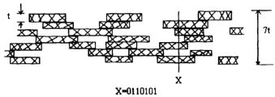

1..代表存在纤维 0..代表空隙

实际的纸页是三维结构的,纸页的每一层都有一定的厚度。假设纸页有 m个平行、厚度均匀的含有纤维和空隙层构成(如上图所示m=7)。模型纤维的横切面为矩形,纸页每层厚度为t,在某一垂直于纸页的切面上发现纤维的概率为q,空隙的概率为(1-q)。键合位置的概率函数为:

$$P_{n}(K)=\frac{(k-1) \omega+q}{2}\left(\frac{k-1}{m}\right)^{n} \frac{(m-(k-1)}{m-1} \sum_{j=1}^{k-i} q^{(i-j) *}\quad (1-11)$$

m——模型纸页层数；m=2,3,......k——纸样纤维数量；k=2,3,......i——键指数；i=1,2,....(k-1)或 i=1,2,....(m(k-1))

纤维间表面所有键合点的发现概率可以简单地表达为：

$$\sum _ { i = 1 } ^ { d } P _ { n } \left( k \right) = q ^ { T } . \quad ( 1 - 1 2 )$$

进一步说一个键合点属于临近的两个纤维层，所以整张纸的 RBA 表述为：

$$RBA=\frac{m-1}{~m} q^{2},\quad (1-13)$$

纸页中纤维的体积浓度可以替代模型中纤维的发现概率q;纸页的表观紧密度通过纤维壁密度而与纤维的体积浓度有关。所以知道纸页纤维的平均层数和纸页的表观紧密度可以估计相对键合面积。

### 4.3 影响键合面积的因素

键合面积决定于纤维网络结构的键合潜能,所谓的键合潜能指的是纤维网络的最大键合能力。另一方面,细胞壁的厚度决定键合面积和打浆时键合面积的变化。薄壁柔软纤维比厚壁纤维可能产生更大的键合面积,因而会受到表面应力的更大的影响并且彼此能够靠得更近,形成纤维间接触。因此,细小组分和外部细纤维化都能提高键合面积。

对针叶木硫酸盐浆键合面积的研究表明,影响键合面积的因素主要有以下

---

几个：

- ① 纤维表伤的表面积,它由给定定量纸页中纤维的数目、纤维的宽度和细胞
腔的宽度和纤维的长度所决定,并受外部细纤维化和细小组分的影响。
② 纤维的自由度和压溃性。
③ 纤维表面的几何形状,如表面光滑度等。
④ 影响表面张力的因素,如细小组分和外部细纤维化状况等。
在同一打浆度水平下,增大纤维的相对键合面积可以通过增加湿压力以克服纤维本身的刚性来完成。然而仅靠湿压榨来提高纤维间的相对键合面积是有限的。进一步增加纤维间的相对合面积需使纤维具有更大的柔软性和外部的细纤维化,这些均可通过打浆来实现。

键合面积与纤维柔韧性和网络总面积密切相关。外部纤维化和细小组分的形成以两种方式影响键合面积:

- （1）增加总表面积并通过增大表面张力来促进纤维间键的形成。局部均一
性对键合面积的影响同样不能低估。
（2）打浆通过增加纤维的柔软性、形成的细小组分和外部细纤维化而增大
键合面积。
文献中关于纤维强度有不同的观点。有人认为纤维外部细纤维通过纤维之间键合增加了纸页的强度。也有人认为通过打浆使得纤维的柔软性提高而增加纤维间的键合和纸张的强度。

## 5、损伤力学理论

### 5.1、纸页损伤理论的研究内容、意义和方法

纸页的损伤力学是损伤理论与纸页结构有机结合的一门刚刚开始的新研究领域,也是一种新的尝试。制浆造纸工程界对损伤理论接触很少,因此,首先对损伤的基本理论作一下简介。

材料的内部有许多孔隙和微裂缝,在一定外部载荷下,微裂缝会不断的扩展,使材料的强度和刚度等力学性能下降,这些导致材料的结构力学性能劣化的微观结构的变化称为损伤。结构材料中的损伤,有的是在制造和加工过程中产生的,称为初始损伤;有时是在外力作用下或环境因素影响下发生和演变的; 有的是在自然状态下就是一种疏松介质,这类材料受力时,会在体内产生弥散裂纹。这些以孔洞或微裂纹形式表现的材料损伤,将在载荷、温度或环境效应等因素持续作用下进一步增长、扩展、逐渐并集、聚合,形成一定尺度的宏观裂纹,导致结构的强度、刚度下降,以至破坏。这种属于工程塑料抗力性能的损伤劣化现象,在塑性变形、疲劳和蠕变等力学行为中都能观察到,它决定着

---

结构的使用寿命和安全可靠性,从而成为材料科学、力学和工程技术界所共同关心的课题。损伤力学是研究含损伤介质的材料性质,以及在变形过程中损伤的演化发展直至破坏的力学过程的学科$^{[4]}$。损伤理论将是用固体理论、材料强度理论和连续介质力学统一起来进行研究的。因此,用损伤理论导出的结果,既反映材料微观结构的变化,又能说明材料宏观力学性能的实际变化情况,而且计算的参数还应是宏观可观的,这在一定程度上弥补微观研究和断裂力学研究的不足,也为这些学科的发展和相互结合开拓新的前景。

物体内存在的损伤(微裂纹),可以理解为一种连续的变量场(损伤场), 它和应力-应变场以及温度场的概念相似。所以在分析时首先在物体某点处选取 “体积元”,并假定该体积元内的应力-应变以及损伤都是均匀分布的,这样, 就能在连续介质力学的框架内对损伤及其材料力学性能的影响作系统的处理 [49]。

### 5.2、损伤理论的基础

### 5.2.1  损伤变量$^{[50]}$

用损伤理论分析材料受力后的力学状态时,首先选择恰当的损伤变量以描述材料的损伤状态。由于材料的损伤引起材料微观结构和某些宏观物理性能的变化,因此,可以从微观和宏观两方面选择度量损伤的基准。从微观方面,可以选用空隙的数目、长度、面积和体积;从宏观方面,可选用弹性系数、屈服应力、拉伸强度、伸长率、密度、电阻、超声波和声辐射等。在这两类基准中, 最常用的是:

- (1) 空隙的数目、长度、面积和体积;
(2) 由空隙的形状、排列和取向决定的有效面积;
(3) 弹性系数(弹性模量和泊松比);
(4) 密度等。
在不同情况下,可将损伤变量定义为标量、矢量或张量。例如对于短小直角形状的空隙分布或者各向分布相同的球形空洞,损伤变量可采用标量;对于微小分布的平面裂纹,可用与它垂直的矢量表示损伤,但矢量表示的损伤变量, 不能简单的相加以表示不同方向平面裂纹的集合;而用张量表示损伤,尽管其数学表达式比较复杂,但也有可能比较准确地表示微空隙的排列状态及力学特性,因此,在各向异性损伤理论中常利用张量表示损伤。

从热力学观点看,损伤变量是一种内部状态变量,它能反映物质结构的不可逆变化过程$^{[50]}$。

### 5.2.2 有效应力的概念$^{[49]}$

考虑一均匀受拉伸的直杆，认为材料劣化主要机制是由于微缺陷导致的有

---

效承载面积的减小。设其无固态时的横截面面积为A, 损伤后的有效承载面积减小为A, 则损伤因子定义为:

$${ \bf D } = 1 - { \frac { \vec { A } } { \vec { A } } } ~ ~ ~ ~ ~ ~ ~ ~ ~ ~ ~ ~ ~ ~ ~ ~ ~ ~ ~ ~ ~ ~ ~ ~ ~ ~ ~ ~ ~ ~ ~ ~ ~ ~ ~ ~ ~ ~ ~ ~ ~ ~ ~ ~ ~ ~ ~ ~ ~ ~ ~ ~ ~ ~ ~ ~ ~ ~ ~ ~ ~ ~ ~ ~ ~ ~ ~ ~ ~ ~ ~ ~ ~ ~ ~ ~ ~ ~ ~ ~ ~ ~ ~ ~ ~ ~ ~ ~ ~ ~ ~ ~ ~ ~ ~ ~ ~ ~ ~ ~ ~ ~ ~ ~ ~ ~ ~ ~ ~ ~ ~ ~ ~ ~ ~ ~ ~ ~ ~ ~ ~ ~ ~ ~ ~ ~ ~ ~ ~ ~ ~ ~ ~ ~ ~ ~ ~ ~ ~ ~ ~ ~ ~ ~ ~ ~ ~ ~ ~ ~ ~ ~ ~ ~ ~ ~ ~ ~ ~ ~ ~ ~ ~ ~ ~ ~ ~ ~ ~ ~ ~ ~ ~ ~ ~ ~ ~ ~ ~ ~ ~ ~ ~ ~ ~ ~ ~ ~ ~ ~ ~ ~ ~ ~ ~ ~ ~ ~ ~ ~ ~ ~ ~ ~ ~ ~ ~ ~ ~ ~ ~ ~ ~ ~ ~ ~ ~ ~ ~ ~ ~ ~ ~ ~ ~ ~ ~ ~ ~ ~ ~ ~ ~ ~ ~ ~ ~ ~ ~ ~ ~ ~ ~ ~ ~ ~ ~ ~ ~ ~ ~ ~ ~ ~ ~ ~ ~ ~ ~ ~ ~ ~ ~ ~ ~ ~ ~ ~ ~ ~ ~ ~ ~ ~ ~ ~ ~ ~ ~ ~ ~ ~ ~ ~ ~ ~ ~ ~ ~ ~ ~ ~ ~ ~ ~ ~ ~ ~ ~ ~ ~ ~ ~ ~ ~ ~ ~ ~ ~ ~ ~ ~ ~ ~ ~ ~ ~ ~ ~ ~ ~ ~ ~ ~ ~ ~ ~ ~ ~ ~ ~ ~ ~ ~ ~ ~ ~ ~ ~ ~ ~ ~ ~ ~ ~ ~ ~ ~ ~ ~ ~ ~ ~ ~ ~ ~ ~ ~ ~ ~ ~ ~ ~ ~ ~ ~ ~ ~ ~ ~ ~ ~ ~ ~ ~ ~ ~ ~ ~ ~ ~ ~ ~ ~ ~ ~ ~ ~ ~ ~ ~ ~ ~ ~ ~ ~ ~ ~ ~ ~ ~ ~ ~ ~ ~ ~ ~ ~ ~ ~ ~ ~ ~ ~ ~ ~ ~ ~ ~ ~ ~ ~ ~ ~ ~ ~ ~ ~ ~ ~ ~ ~ ~ ~ ~ ~ ~ ~ ~ ~ ~ ~ ~ ~ ~ ~ ~ ~ ~ ~ ~ ~ ~ ~ ~ ~ ~ ~ ~ ~ ~ ~ ~ ~ ~ ~ ~ ~ ~ ~ ~ ~ ~ ~ ~ ~ ~ ~ ~ ~ ~ ~ ~ ~ ~ ~ ~ ~ ~ ~ ~ ~ ~ ~ ~ ~ ~ ~ ~ ~ ~ ~ ~ ~ ~ ~ ~ ~ ~ ~ ~ ~ ~ ~ ~ ~ ~ ~ ~ ~ ~ ~ ~ ~ ~ ~ ~ ~ ~ ~ ~ ~ ~ ~ ~ ~ ~ ~ ~ ~ ~ ~ ~ ~ ~ ~ ~ ~ ~ ~ ~ ~ ~ ~ ~ ~ ~ ~ ~ ~ ~ ~ ~ ~ ~ ~ ~ ~ ~ ~ ~ ~ ~ ~ ~ ~ ~ ~ ~ ~ ~ ~ ~ ~ ~ ~ ~ ~ ~ ~ ~ ~ ~ ~ ~ ~ ~ ~ ~ ~ ~ ~ ~ ~ ~ ~ ~ ~ ~ ~ ~ ~ ~ ~ ~ ~ ~ ~ ~ ~ ~ ~ ~ ~ ~ ~ ~ ~ ~ ~ ~ ~ ~ ~ ~ ~ ~ ~ ~ ~ ~ ~ ~ ~ ~ ~ ~ ~ ~ ~ ~ ~ ~ ~ ~ ~ ~ ~ ~ ~ ~ ~ ~ ~ ~ ~ ~ ~ ~ ~ ~ ~ ~ ~ ~ ~ ~ ~ ~ ~ ~ ~ ~ ~ ~ ~ ~ ~ ~ ~ ~ ~ ~ ~ ~ ~ ~ ~ ~ ~ ~ ~ ~ ~ ~ ~ ~ ~ ~ ~ ~ ~ ~ ~ ~ ~ ~ ~ ~ ~ ~ ~ ~ ~ ~ ~ ~ ~ ~ ~ ~ ~ ~ ~ ~ ~ ~ ~ ~ ~ ~ ~ ~ ~ ~ ~ ~ ~ ~ ~ ~ ~ ~ ~ ~ ~ ~ ~ ~ ~ ~ ~ ~ ~ ~ ~ ~ ~ ~ ~ ~ ~ ~ ~ ~ ~ ~ ~ ~ ~ ~ ~ ~ ~ ~ ~ ~ ~ ~ ~ ~ ~ ~ ~ ~ ~ ~ ~ ~ ~ ~ ~ ~ ~ ~ ~ ~ ~ ~ ~ ~ ~ ~ ~ ~ ~ ~ ~ ~ ~ ~ ~ ~ ~ ~ ~ ~ ~ ~ ~ ~ ~ ~ ~ ~ ~ ~ ~ ~ ~ ~ ~ ~ ~ ~ ~ ~ ~ ~ ~ ~ ~ ~ ~ ~ ~ ~ ~ ~ ~ ~ ~ ~ ~ ~ ~ ~ ~ ~ ~ ~ ~ ~ ~ ~ ~ ~ ~ ~ ~ ~ ~ ~ ~ ~ ~ ~ ~ ~ ~ ~ ~ ~ ~ ~ ~ ~ ~ ~ ~ ~ ~ ~ ~ ~ ~ ~ ~ ~ ~ ~ ~ ~ ~ ~ ~ ~ ~ ~ ~ ~ ~ ~ ~ ~ ~ ~ ~ ~ ~ ~ ~ ~ ~ ~ ~ ~ ~ ~ ~ ~ ~ ~ ~ ~ ~ ~ ~ ~ ~ ~ ~ ~ ~ ~ ~ ~ ~ ~ ~ ~ ~ ~ ~ ~ ~ ~ ~ ~ ~ ~ ~ ~ ~ ~ ~ ~ ~ ~ ~ ~ ~ ~ ~ ~ ~ ~ ~ ~ ~ ~ ~ ~ ~ ~ ~ ~ ~ ~ ~ ~ ~ ~ ~ ~ ~ ~ ~ ~ ~ ~ ~ ~ ~ ~ ~ ~ ~ ~ ~ ~ ~ ~ ~ ~ ~ ~ ~ ~ ~ ~ ~ ~ ~ ~ ~ ~ ~ ~ ~ ~ ~ ~ ~ ~ ~ ~ ~ ~ ~ ~ ~ ~ ~ ~ ~ ~ ~ ~ ~ ~ ~ ~ ~ ~ ~ ~ ~ ~ ~ ~ ~ ~ ~ ~ ~ ~ ~ ~ ~ ~ ~ ~ ~ ~ ~ ~ ~ ~ ~ ~ ~ ~ ~ ~ ~ ~ ~ ~ ~ ~ ~ ~ ~ ~ ~ ~ ~ ~ ~ ~ ~ ~ ~ ~ ~ ~ ~ ~ ~ ~ ~ ~ ~ ~ ~ ~ ~ ~ ~ ~ ~ ~ ~ ~ ~ ~ ~ ~ ~ ~ ~ ~ ~ ~ ~ ~ ~ ~ ~ ~ ~ ~ ~ ~ ~ ~ ~ ~ ~ ~ ~ ~ ~ ~ ~ ~ ~ ~ ~ ~ ~ ~ ~ ~ ~ ~ ~ ~ ~ ~ ~ ~ ~ ~ ~ ~ ~ ~ ~ ~ ~ ~ ~ ~ ~ ~ ~ ~ ~ ~ ~ ~ ~ ~ ~ ~ ~ ~ ~ ~ ~ ~ ~ ~ ~ ~ ~ ~ ~ ~ ~ ~ ~ ~ ~ ~ ~ ~ ~ ~ ~ ~ ~ ~ ~ ~ ~ ~ ~ ~ ~ ~ ~ ~ ~ ~ ~ ~ ~ ~ ~ ~ ~ ~ ~ ~ ~ ~ ~ ~ ~ ~ ~ ~ ~ ~ ~ ~ ~ ~ ~ ~ ~ ~ ~ ~ ~ ~ ~ ~ ~ ~ ~ ~ ~ ~ ~ ~ ~ ~ ~ ~ ~ ~ ~ ~ ~ ~ ~ ~ ~ ~ ~ ~ ~ ~ ~ ~ ~ ~ ~ ~ ~ ~ ~ ~ ~ ~ ~ ~ ~ ~ ~ ~ ~ ~ ~ ~ ~ ~ ~ ~ ~ ~ ~ ~ ~ ~ ~ ~ ~ ~ ~ ~ ~ ~ ~ ~ ~ ~ ~ ~ ~ ~ ~ ~ ~ ~ ~ ~ ~ ~ ~ ~ ~ ~ ~ ~ ~ ~ ~ ~ ~ ~ ~ ~ ~ ~ ~ ~ ~ ~ ~ ~ ~ ~ ~ ~ ~ ~ ~ ~ ~ ~ ~ ~ ~ ~ ~ ~ ~ ~ ~ ~ ~ ~ ~ ~ ~ ~ ~ ~ ~ ~ ~ ~ ~ ~ ~ ~ ~ ~ ~ ~ ~ ~ ~ ~ ~ ~ ~ ~ ~ ~ ~ ~ ~ ~ ~ ~ ~ ~ ~ ~ ~ ~ ~ ~ ~ ~ ~ ~ ~ ~ ~ ~ ~ ~ ~ ~ ~ ~ ~ ~ ~ ~ ~ ~ ~ ~ ~ ~ ~ ~ ~ ~ ~ ~ ~ ~ ~ ~ ~ ~ ~ ~ ~ ~ ~ ~ ~ ~ ~ ~ ~ ~ ~ ~ ~ ~ ~ ~ ~ ~ ~ ~ ~ ~ ~ ~ ~ ~ ~ ~ ~ ~ ~ ~ ~ ~ ~ ~ ~ ~ ~ ~ ~ ~ ~ ~ ~ ~ ~ ~ ~ ~ ~ ~ ~ ~ ~ ~ ~ ~ ~ ~ ~ ~ ~ ~ ~ ~ ~ ~ ~ ~ ~ ~ ~ ~ ~ ~ ~ ~ ~ ~ ~ ~ ~ ~ ~ ~ ~ ~ ~ ~ ~ ~ ~ ~ ~ ~ ~ ~ ~ ~ ~ ~ ~ ~ ~ ~ ~ ~ ~ ~ ~ ~ ~ ~ ~ ~ ~ ~ ~ ~ ~ ~ ~ ~ ~ ~ ~ ~ ~ ~ ~ ~ ~ ~ ~ ~ ~ ~ ~ ~ ~ ~ ~ ~ ~ ~ ~ ~ ~ ~ ~ ~ ~ ~ ~ ~ ~ ~ ~ ~ ~ ~ ~ ~ ~ ~ ~ ~ ~ ~ ~ ~ ~ ~ ~ ~ ~ ~ ~ ~ ~ ~ ~ ~ ~ ~ ~ ~ ~ ~ ~ ~ ~ ~ ~ ~ ~ ~ ~ ~ ~ ~ ~ ~ ~ ~ ~ ~ ~ ~ ~ ~ ~ ~ ~ ~ ~ ~ ~ ~ ~ ~ ~ ~ ~ ~ ~ ~ ~ ~ ~ ~ ~ ~ ~ ~ ~ ~ ~ ~ ~ ~ ~ ~ ~ ~ ~ ~ ~ ~ ~ ~ ~ ~ ~ ~ ~ ~ ~ ~ ~ ~ ~ ~ ~ ~ ~ ~ ~ ~ ~ ~ ~ ~ ~ ~ ~ ~ ~ ~ ~ ~ ~ ~ ~ ~ ~ ~ ~ ~ ~ ~ ~ ~ ~ ~ ~ ~ ~ ~ ~ ~ ~ ~ ~ ~ ~ ~ ~ ~ ~ ~ ~ ~ ~ ~ ~ ~ ~ ~ ~ ~ ~ ~ ~ ~ ~ ~ ~ ~ ~ ~ ~ ~ ~ ~ ~ ~ ~ ~ ~ ~ ~ ~ ~ ~ ~ ~ ~ ~ ~ ~ ~ ~ ~ ~ ~ ~ ~ ~ ~ ~ ~ ~ ~ ~ ~ ~ ~ ~ ~ ~ ~ ~ ~ ~ ~ ~ ~ ~ ~ ~ ~ ~ ~ ~ ~ ~ ~ ~ ~ ~ ~ ~ ~ ~ ~ ~ ~ ~ ~ ~ ~ ~ ~ ~ ~ ~ ~ ~ ~ ~ ~ ~ ~ ~ ~ ~ ~ ~ ~ ~ ~ ~ ~ ~ ~ ~ ~ ~ ~ ~ ~ ~ ~ ~ ~ ~ ~ ~ ~ ~ ~ ~ ~ ~ ~ ~ ~ ~ ~ ~ ~ ~ ~ ~ ~ ~ ~ ~ ~ ~ ~ ~ ~ ~ ~ ~ ~ ~ ~ ~ ~ ~ ~ ~ ~ ~ ~ ~ ~ ~ ~ ~ ~ ~ ~ ~ ~ ~ ~ ~ ~ ~ ~ ~ ~ ~ ~ ~ ~ ~ ~ ~ ~ ~ ~ ~ ~ ~ ~ ~ ~ ~ ~ ~ ~ ~ ~ ~ ~ ~ ~ ~ ~ ~ ~ ~ ~ ~ ~ ~ ~ ~ ~ ~ ~ ~ ~ ~ ~ ~ ~ ~ ~ ~ ~ ~ ~ ~ ~ ~ ~ ~ ~ ~ ~ ~ ~ ~ ~ ~ ~ ~ ~ ~ ~ ~ ~ ~ ~ ~ ~ ~ ~ ~ ~ ~ ~ ~ ~ ~ ~ ~ ~ ~ ~ ~ ~ ~ ~ ~ ~ ~ ~ ~ ~ ~ ~ ~ ~ ~ ~ ~ ~ ~ ~ ~ ~ ~ ~ ~ ~ ~ ~ ~ ~ ~ ~ ~ ~ ~ ~ ~ ~ ~ ~ ~ ~ ~ ~ ~ ~ ~ ~ ~ ~ ~ ~ ~ ~ ~ ~ ~ ~ ~ ~ ~ ~ ~ ~ ~ ~ ~ ~ ~ ~ ~ ~ ~ ~ ~ ~ ~ ~ ~ ~ ~ ~ ~ ~ ~ ~ ~ ~ ~ ~ ~ ~ ~ ~ ~ ~ ~ ~ ~ ~ ~ ~ ~ ~ ~ ~ ~ ~ ~ ~ ~ ~ ~ ~ ~ ~ ~ ~ ~ ~ ~ ~ ~ ~ ~ ~ ~ ~ ~ ~ ~ ~ ~ ~ ~ ~ ~ ~ ~ ~ ~ ~ ~ ~ ~ ~ ~ ~ ~ ~ ~ ~ ~ ~ ~ ~ ~ ~ ~ ~ ~ ~ ~ ~ ~ ~ ~ ~ ~ ~ ~ ~ ~ ~ ~ ~ ~ ~ ~ ~ ~ ~ ~ ~ ~ ~ ~ ~ ~ ~ ~ ~ ~ ~ ~ ~ ~ ~ ~ ~ ~ ~ ~ ~ ~ ~ ~ ~ ~ ~ ~ ~ ~ ~ ~ ~ ~ ~ ~ ~ ~ ~ ~ ~ ~ ~ ~ ~ ~ ~ ~ ~ ~ ~ ~ ~ ~ ~ ~ ~ ~ ~ ~ ~ ~ ~ ~ ~ ~ ~ ~ ~ ~ ~ ~ ~ ~ ~ ~ ~ ~ ~ ~ ~ ~ ~ ~ ~ ~ ~ ~ ~ ~ ~ ~ ~ ~ ~ ~ ~ ~ ~ ~ ~ ~ ~ ~ ~ ~ ~ ~ ~ ~ ~ ~ ~ ~ ~ ~ ~ ~ ~ ~ ~ ~ ~ ~ ~ ~ ~ ~ ~ ~ ~ ~ ~ ~ ~ ~ ~ ~ ~ ~ ~ ~ ~ ~ ~ ~ ~ ~ ~ ~ ~ ~ ~ ~ ~ ~ ~ ~ ~ ~ ~ ~ ~ ~ ~ ~ ~ ~ ~ ~ ~ ~ ~ ~ ~ ~ ~ ~ ~ ~ ~ ~ ~ ~ ~ ~ ~ ~ ~ ~ ~ ~ ~ ~ ~ ~ ~ ~ ~ ~ ~ ~ ~ ~ ~ ~ ~ ~ ~ ~ ~ ~ ~ ~ ~ ~ ~ ~ ~ ~ ~ ~ ~ ~ ~ ~ ~ ~ ~ ~ ~ ~ ~ ~ ~ ~ ~ ~ ~ ~ ~ ~ ~ ~ ~ ~ ~ ~ ~ ~ ~ ~ ~ ~ ~ ~ ~ ~ ~ ~ ~ ~ ~ ~ ~ ~ ~ ~ ~ ~ ~ ~ ~ ~ ~ ~ ~ ~ ~ ~ ~ ~ ~ ~ ~ ~ ~ ~ ~ ~ ~ ~ ~ ~ ~ ~ ~ ~ ~ ~ ~ ~ ~ ~ ~ ~ ~ ~ ~ ~ ~ ~ ~ ~ ~ ~ ~ ~ ~ ~ ~ ~ ~ ~ ~ ~ ~ ~ ~ ~ ~ ~ ~ ~ ~ ~ ~ ~ ~ ~ ~ ~ ~ ~ ~ ~ ~ ~ ~ ~ ~ ~ ~ ~ ~ ~ ~ ~ ~ ~ ~ ~ ~ ~ ~ ~ ~ ~ ~ ~ ~ ~ ~ ~ ~ ~ ~ ~ ~ ~ ~ ~ ~ ~ ~ ~ ~ ~ ~ ~ ~ ~ ~ ~ ~ ~ ~ ~ ~ ~ ~ ~ ~ ~ ~ ~ ~ ~ ~ ~ ~ ~ ~ ~ ~ ~ ~ ~ ~ ~ ~ ~ ~ ~ ~ ~ ~ ~ ~ ~ ~ ~ ~ ~ ~ ~ ~ ~ ~ ~ ~ ~ ~ ~ ~ ~ ~ ~ ~ ~ ~ ~ ~ ~ ~ ~ ~ ~ ~ ~ ~ ~ ~ ~ ~ ~ ~ ~ ~ ~ ~ ~ ~ ~ ~ ~ ~ ~ ~ ~ ~ ~ ~ ~ ~ ~ ~ ~ ~ ~ ~ ~ ~ ~ ~ ~ ~ ~ ~ ~ ~ ~ ~ ~ ~ ~ ~ ~ ~ ~ ~ ~ ~ ~ ~ ~ ~ ~ ~ ~ ~ ~ ~ ~ ~ ~ ~ ~ ~ ~ ~ ~ ~ ~ ~ ~ ~ ~ ~ ~ ~ ~ ~ ~ ~ ~ ~ ~ ~ ~ ~ ~ ~ ~ ~ ~ ~ ~ ~ ~ ~ ~ ~ ~ ~ ~ ~ ~ ~ ~ ~ ~ ~ ~ ~ ~ ~ ~ ~ ~ ~ ~ ~ ~ ~ ~ ~ ~ ~ ~ ~ ~ ~ ~ ~ ~ ~ ~ ~ ~ ~ ~ ~ ~ ~ ~ ~ ~ ~ ~ ~ ~ ~ ~ ~ ~ ~ ~ ~ ~ ~ ~ ~ ~ ~ ~ ~ ~ ~ ~ ~ ~ ~ ~ ~ ~ ~ ~ ~ ~ ~ ~ ~ ~ ~ ~ ~ ~ ~ ~ ~ ~ ~ ~ ~ ~ ~ ~ ~ ~ ~ ~ ~ ~ ~ ~ ~ ~ ~ ~ ~ ~ ~ ~ ~ ~ ~ ~ ~ ~ ~ ~ ~ ~ ~ ~ ~ ~ ~ ~ ~ ~ ~ ~ ~ ~ ~ ~ ~ ~ ~ ~ ~ ~ ~ ~ ~ ~ ~ ~ ~ ~ ~ ~ ~ ~ ~ ~ ~ ~ ~ ~ ~ ~ ~ ~ ~ ~ ~ ~ ~ ~ ~ ~ ~ ~ ~ ~ ~ ~ ~ ~ ~ ~ ~ ~ ~ ~ ~ ~ ~ ~ ~ ~ ~ ~ ~ ~ ~ ~ ~ ~ ~ ~ ~ ~ ~ ~ ~ ~ ~ ~ ~ ~ ~ ~ ~ ~ ~ ~ ~ ~ ~ ~ ~ ~ ~ ~ ~ ~ ~ ~ ~ ~ ~ ~ ~ ~ ~ ~ ~ ~ ~ ~ ~ ~ ~ ~ ~ ~ ~ ~ ~ ~ ~ ~ ~ ~ ~ ~ ~ ~ ~ ~ ~ ~ ~ ~ ~ ~ ~ ~ ~ ~ ~ ~ ~ ~ ~ ~ ~ ~ ~ ~ ~ ~ ~ ~ ~ ~ ~ ~ ~ ~ ~ ~ ~ ~ ~ ~ ~ ~ ~ ~ ~ ~ ~ ~ ~ ~ ~ ~ ~ ~ ~ ~ ~ ~ ~ ~ ~ ~ ~ ~ ~ ~ ~ ~ ~ ~ ~ ~ ~ ~ ~ ~ ~ ~ ~ ~ ~ ~ ~ ~ ~ ~ ~ ~ ~ ~ ~ ~ ~ ~ ~ ~ ~ ~ ~ ~ ~ ~ ~ ~ ~ ~ ~ ~ ~ ~ ~ ~ ~ ~ ~ ~ ~ ~ ~ ~ ~ ~ ~ ~ ~ ~ ~ ~ ~ ~ ~ ~ ~ ~ ~ ~ ~ ~ ~ ~ ~ ~ ~ ~ ~ ~ ~ ~ ~ ~ ~ ~ ~ ~ ~ ~ ~ ~ ~ ~ ~ ~ ~ ~ ~ ~ ~ ~ ~ ~ ~ ~ ~ ~ ~ ~ ~ ~ ~ ~ ~ ~ ~ ~ ~ ~ ~ ~ ~ ~ ~ ~ ~ ~ ~ ~ ~ ~ ~ ~ ~ ~ ~ ~ ~ ~ ~ ~ ~ ~ ~ ~ ~ ~ ~ ~ ~ ~ ~ ~ ~ ~ ~ ~ ~ ~ ~ ~ ~ ~ ~ ~ ~ ~ ~ ~ ~ ~ ~ ~ ~ ~ ~ ~ ~ ~ ~ ~ ~ ~ ~ ~ ~ ~ ~ ~ ~ ~ ~ ~ ~ ~ ~ ~ ~ ~ ~ ~ ~ ~ ~ ~ ~ ~ ~ ~ ~ ~ ~ ~ ~ ~ ~ ~ ~ ~ ~ ~ ~ ~ ~ ~ ~ ~ ~ ~ ~ ~ ~ ~ ~ ~ ~ ~ ~ ~ ~ ~ ~ ~ ~ ~ ~ ~ ~ ~ ~ ~ ~ ~ ~ ~ ~ ~ ~ ~ ~ ~ ~ ~ ~ ~ ~ ~ ~ ~ ~ ~ ~ ~ ~ ~ ~ ~ ~ ~ ~ ~ ~ ~ ~ ~ ~ ~ ~ ~ ~ ~ ~ ~ ~ ~ ~ ~ ~ ~ ~ ~ ~ ~ ~ ~ ~ ~ ~ ~ ~ ~ ~ ~ ~ ~ ~ ~ ~ ~ ~ ~ ~ ~ ~ ~ ~ ~ ~ ~ ~ ~ ~ ~ ~ ~ ~ ~ ~ ~ ~ ~ ~ ~ ~ ~ ~ ~ ~ ~ ~ ~ ~ ~ ~ ~ ~ ~ ~ ~ ~ ~ ~ ~ ~ ~ ~ ~ ~ ~ ~ ~ ~ ~ ~ ~ ~ ~ ~ ~ ~ ~ ~ ~ ~ ~ ~ ~ ~ ~ ~ ~ ~ ~ ~ ~ ~ ~ ~ ~ ~ ~ ~ ~ ~ ~ ~ ~ ~ ~ ~ ~ ~ ~ ~ ~ ~ ~ ~ ~ ~ ~ ~ ~ ~ ~ ~ ~ ~ ~ ~ ~ ~ ~ ~ ~ ~ ~ ~ ~ ~ ~ ~ ~ ~ ~ ~ ~ ~ ~ ~ ~ ~ ~ ~ ~ ~ ~ ~ ~ ~ ~ ~ ~ ~ ~ ~ ~ ~ ~ ~ ~ ~ ~ ~ ~ ~ ~ ~ ~ ~ ~ ~ ~ ~ ~ ~ ~ ~ ~ ~ ~ ~ ~ ~ ~ ~ ~ ~ ~ ~ ~ ~ ~ ~ ~ ~ ~ ~ ~ ~ ~ ~ ~ ~ ~ ~ ~ ~ ~ ~ ~ ~ ~ ~ ~ ~ ~ ~ ~ ~ ~ ~ ~ ~ ~ ~ ~ ~ ~ ~ ~ ~ ~ ~ ~ ~ ~ ~ ~ ~ ~ ~ ~ ~ ~ ~ ~ ~ ~ ~ ~ ~ ~ ~ ~ ~ ~ ~ ~ ~ ~ ~ ~ ~ ~ ~ ~ ~ ~ ~ ~ ~ ~ ~ ~ ~ ~ ~ ~ ~ ~ ~ ~ ~ ~ ~ ~ ~ ~ ~ ~ ~ ~ ~ ~ ~ ~ ~ ~ ~ ~ ~ ~ ~ ~ ~ ~ ~ ~ ~ ~ ~ ~ ~ ~ ~ ~ ~ ~ ~ ~ ~ ~ ~ ~ ~ ~ ~ ~ ~ ~ ~ ~ ~ ~ ~ ~ ~ ~ ~ ~ ~ ~ ~ ~ ~ ~ ~ ~ ~ ~ ~ ~ ~ ~ ~ ~ ~ ~ ~ ~ ~ ~ ~ ~ ~ ~ ~ ~ ~ ~ ~ ~ ~ ~ ~ ~ ~ ~ ~ ~ ~ ~ ~ ~ ~ ~ ~ ~ ~ ~ ~ ~ ~ ~ ~ ~ ~ ~ ~ ~ ~ ~ ~ ~ ~ ~ ~ ~ ~ ~ ~ ~ ~ ~ ~ ~ ~ ~ ~ ~ ~ ~ ~ ~ ~ ~ ~ ~ ~ ~ ~ ~ ~ ~ ~ ~ ~ ~ ~ ~ ~ ~ ~ ~ ~ ~ ~ ~ ~ ~ ~ ~ ~ ~ ~ ~ ~ ~ ~ ~ ~ ~ ~ ~ ~ ~ ~ ~ ~ ~ ~ ~ ~ ~ ~ ~ ~ ~ ~ ~ ~ ~ ~ ~ ~ ~ ~ ~ ~ ~ ~ ~ ~ ~ ~ ~ ~ ~ ~ ~ ~ ~ ~ ~ ~ ~ ~ ~ ~ ~ ~ ~ ~ ~ ~ ~ ~ ~ ~ ~ ~ ~ ~ ~ ~ ~ ~ ~ ~ ~ ~ ~ ~ ~ ~ ~ ~ ~ ~ ~ ~ ~ ~ ~ ~ ~ ~ ~ ~ ~ ~ ~ ~ ~ ~ ~ ~ ~ ~ ~ ~ ~ ~ ~ ~ ~ ~ ~ ~ ~ ~ ~ ~ ~ ~ ~ ~ ~ ~ ~ ~ ~ ~ ~ ~ ~ ~ ~ ~ ~ ~ ~ ~ ~ ~ ~ ~ ~ ~ ~ ~ ~ ~ ~ ~ ~ ~ ~ ~ ~ ~ ~ ~$$

显然,损伤因子 D 是一个无量纲的标量场变量,D = 0 对应于完全没有缺陷的理想材料状态;D = 1 对应于完全破坏的没有任何承载能力的材料状态;0<D <1 对应于材料不同程度的损伤状态。

将外加载荷F与有效承载面积$\bar{A}$之比定义为有效应力$\bar{\sigma}$，即：

$${ \vec { \sigma } } = { \frac { F } { A } } = { \frac { \sigma } { \sqrt { 1 - D } } } \quad ( 1 - 1 5 )$$

式中 $\alpha = \frac{F}{A}$ 为 Cauchy 应力;

### 5.2.3 应变等价性假设及应力等价性假设$^{[48, 49]}$

在外力作用下，受损材料的本构关系可采用无损时的形式，只要把其中的 Cauchy应力简单地换成有效应力即可，这一假设称为应变等价性假设。据此， 在一维线弹性问题中，如以ε表示损伤弹性应变，则

$$\tau = { \frac { \sigma } { E } } = { \frac { \sigma } { E ( D - I ) } } = { \frac { \sigma } { E } } \quad ( 1 . 1 6 )$$

式中E为弹性模量，$\bar{E}=E(1-D)$为受损材料的弹性模量。由（1—16）式还可得重要公式：

$$ D  = 1 - { \frac { \dot { E } } { E } } \quad ( 1 - 1 7 )$$

这是通过材料弹性模量的变化来定义损伤变量的形式。

如果在（1—16）式中，定义：

$$\tilde{\varepsilon}=\varepsilon(1-D)\quad (1-18)$$

$\overline{\varepsilon}$ 称为有效应变，这时：

$$\sigma=E \tilde{\varepsilon}\quad (1-19)$$

此公式称为应力等价性假设。

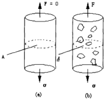

在建立计算模型时,与有效应力及应变等阶性假设相应的是以应变为基本变量的弹塑性损伤方程;与有效应变及应力等阶性假设相应的是以应力为基本变量的弹塑性损伤方程$^{[9]}$。

---

## 6. 本论文研究的内容及意义

### 6.1 研究内容

- 1.研究植物纤维经回用后,纤维形态、内部结构的变化,再生纸页回
用后物理、光学性能的衰变。
2.研究二次纤维角质化损伤,探求二次纤维角质化的解决方法。
3.初步确定适合纤维损伤的损伤因子。
4.研究二次纤维的老化、角质化与损伤因子之间的关系及其表征。
5.研究二次纤维成型过程中纤维的结构形态如结晶区的变化,测定二
次纤维的性能指标如保水值、弹性模量等的变化。确定适合纤维材
料的损伤变量,建立其与纸页性能的关系。
### 6.2 实验方案

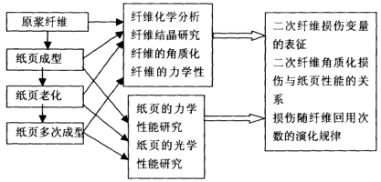

### 6.3 研究意义

本论文引进了损伤力学的理论和研究方法,从一个全新的视研究二次纤维及其纸页的损伤和破坏行为。对角质化的研究有利于寻出解决二次纤维性能衰变的方法。改善纤维性能。运用损伤理论有利于进一步探索二次纤维角质化和老化时导致纸页裂化的机理。建立一套纸页损伤和破坏力学的新理论,同时推动二次纤维作为重要的造纸纤维原料来源的进一步利用,为我国造纸工业的发展和提高我国二次纤维纸浆的实用性能提供理论基础。

---

## 第二章  纤维损伤的纸页性能研究

### 第一节   二次纤维特性的变化

### 1、引言

纤维在回用过程中,纤维细胞壁发生不可逆的变化——角质化。发生角质化后的纤维的润滑能力、纤维均一性( conformability)、韧性等性能均会发生一定程度的变软$^{[21]}$。浸入纤维细胞壁空隙中的水分子在烘干被蒸发除的过程中,水分子较大的内聚力作用使纤维细胞内壁两侧互相靠拢贴紧,造成所谓的“胞腔塌陷”,纤维表面凹凸不平。纤维表面状态的改变导致氢键连结受阻$^{[21]}$,从而影响纸页中纤维间的结合能力,进而影响纸页的各个强度性能。

纤维性能主要包括纤维长度、粗度、纤维强度、纤维膨胀力或塑性以及纤维结合能力等。下面主要研究了三次纤维对几个很重要的性能:纤维长度、 聚合度、结晶度、纤维强度、润胀能力(保水值)在回用过程中发生的变化。

### 2、实验部分

苯 济：取自工业漂白针叶木硫酸盐浆：加拿大进口 APMP：三倍体毛白杨，实验室自制

<table><tr><td>1</td><td>GBJ—A标准纤维疏解器</td><td>英国</td></tr><tr><td>2</td><td>离心机（及测保水信用附件）</td><td>德国</td></tr><tr><td>3</td><td>肖氏打浆度仪</td><td>国产</td></tr><tr><td>4</td><td>HANGPING FA2004分析天平</td><td>国产</td></tr><tr><td>5</td><td>HR分析天平</td><td>日本</td></tr><tr><td>6</td><td>Frank Rapid Kothen抄片器</td><td>德国</td></tr><tr><td>7</td><td>电热干燥箱</td><td>国产</td></tr><tr><td>8</td><td>纤维长度仪FS-100</td><td>芬兰</td></tr><tr><td>9</td><td>红外光谱仪VECTOR22</td><td>美国布鲁克（BRUKER）公司</td></tr><tr><td>10</td><td>毛细管粘度计</td><td></td></tr><tr><td>11</td><td>糠醛蒸馏装置</td><td></td></tr><tr><td>12</td><td>X一衍射仪</td><td>进口（天津南开大学中心实验室）</td></tr><tr><td>13</td><td>零距抗张强度仪</td><td>北京制浆造纸研究院</td></tr></table>

---

### 2.3 实验方法

### 2.3.1 保水值（WRV）的测定：

纤维保水值采用离心法测定,称取绝干重相当于15克的浆料或纸片,用蒸馏水浸泡过夜(24小时)后疏解,并在3000转/分的转速下,离心处理15 分钟。称取浆料的湿重和烘干后的绝干重,两者之差与浆料绝干重的比值即为WRV值。

$$WRV=\frac{W_{0}-W_{1}}{W_{0}}\quad (2\cdot 1)$$

其中，$W_{0}$——离心力和湿汽重（g） $W_{1}$——浆液干纯重（g）

### 2.3.2 聚合度（DP）测定

采用铜乙二胺法（见国标 GB1548-89）

### 2.3.3 纤维弹性模量$E^{[25]}$

其中，$K=\frac{3RT}{M_{e}}$ R——气体常数 T——绝对温度 $M_{e}$——平均分子量

### 2.3.4 纤维结晶度的测定

纤维素的结晶度是指纤维素构成的结晶区占纤维素整体的百分率,它反映了纤维素聚集时形成结晶的程度。测定纤维素结晶度常用的方法有X-射线法、红外光谱法、密度法等。本文主要采用了前两种方法。

### 2.3.4.1 红外结晶指数（N—O'KI）测定$^{[12]}$：

将磨碎的纤维素粉末和预先研磨和干燥过KBr分别过200目筛子,取3mg 纤维素和300mgKBr混合均匀后,再称取混合物100mg于60℃下干燥,然后压成透明薄片,在VECTOR22型红外光谱仪上进行检测。最后计算波数为 1372cm$^{-1}$和2900cm$^{-1}$两个峰的强度比值或者1429 cm$^{-1}$和893 cm$^{-1}$两个峰的强比值,称之为红外(IR)结晶指数。本论文选用N-O KI红外结晶指数。

$$N-O^{\prime} K^{\prime}=\frac{I_{1372}}{I_{2900}}\quad (2-3)$$

其中，$I_{1372}=13.72 cm^{2}$; 该带强度: 此谱带属于 CH 曲曲折振动 $I_{12900}=2900 cm^{2}$; 该带强度: 此谱带属于 CH 和 CH₂ 振伸振动。

### 2.3.4.2 X-射线衍射法结晶度测定:

采用 CuK 烈射、40kV/100mA、扫描范围在 二倍镜的 2$^{\circ}$ $^{\circ}$ $^{\circ}$ $^{\circ}$ $^{\circ}$ $^{\circ}$ $^{\circ}$ $^{\circ}$ $^{\circ}$ $^{\circ}$ $^{\circ}$ $^{\circ}$ $^{\circ}$ $^{\circ}$ $^{\circ}$ $^{\circ}$ $^{\circ}$ $^{\circ}$ $^{\circ}$ $^{\circ}$ $^{\circ}$ $^{\circ}$ $^{\circ}$ $^{\circ}$ $^{\circ}$ $^{\circ}$ $^{\circ}$ $^{\circ}$ $^{\circ}$ $^{\circ}$ $^{\circ}$ $^{\circ}$ $^{\circ}$ $^{\circ}$ $^{\circ}$ $^{\circ}$ $^{\circ}$ $^{\circ}$ $^{\circ}$ $^{\circ}$ $^{\circ}$ $^{\circ}$ $^{\circ}$ $^{\circ}$ $^{\circ}$ $^{\circ}$ $^{\circ}$ $^{\circ}$ $^{\circ}$ $^{\circ}$ $^{\circ}$ $^{\circ}$ $^{\circ}$ $^{\circ}$ $^{\circ}$ $^{\circ}$ $^{\circ}$ $^{\circ}$ $^{\circ}$ $^{\circ}$ $^{\circ}$ $^{\circ}$ $^{\circ}$ $^{\circ}$ $^{\circ}$ $^{\circ}$ $^{\circ}$ $^{\circ}$ $^{\circ}$ $^{\circ}$ $^{\circ}$ $^{\circ}$ $^{\circ}$ $^{\circ}$ $^{\circ}$ $^{\circ}$ $^{\circ}$ $^{\circ}$ $^{\circ}$ $^{\circ}$ $^{\circ}$ $^{\circ}$ $^{\circ}$ $^{\circ}$ $^{\circ}$ $^{\circ}$ $^{\circ}$ $^{\circ}$ $^{\circ}$ $^{\circ}$ $^{\circ}$ $^{\circ}$ $^{\circ}$ $^{\circ}$ $^{\circ}$ $^{\circ}$ $^{\circ}$ $^{\circ}$ $^{\circ}$ $^{\circ}$ $^{\circ}$ $^{\circ}$ $^{\circ}$ $^{\circ}$ $^{\circ}$ $^{\circ}$ $^{\circ}$ $^{\circ}$ $^{\circ}$ $^{\circ}$ $^{\circ}$ $^{\circ}$ $^{\circ}$ $^{\circ}$ $^{\circ}$ $^{\circ}$ $^{\circ}$ $^{\circ}$ $^{\circ}$ $^{\circ}$ $^{\circ}$ $^{\circ}$ $^{\circ}$ $^{\circ}$ $^{\circ}$ $^{\circ}$ $^{\circ}$ $^{\circ}$ $^{\circ}$ $^{\circ}$ $^{\circ}$ $^{\circ}$ $^{\circ}$ $^{\circ}$ $^{\circ}$ $^{\circ}$ $^{\circ}$ $^{\circ}$ $^{\circ}$ $^{\circ}$ $^{\circ}$ $^{\circ}$ $^{\circ}$ $^{\circ}$ $^{\circ}$ $^{\circ}$ $^{\circ}$ $^{\circ}$ $^{\circ}$ $^{\circ}$ $^{\circ}$ $^{\circ}$ $^{\circ}$ $^{\circ}$ $^{\circ}$ $^{\circ}$ $^{\circ}$ $^{\circ}$ $^{\circ}$ $^{\circ}$ $^{\circ}$ $^{\circ}$ $^{\circ}$ $^{\circ}$ $^{\circ}$ $^{\circ}$ $^{\circ}$ $^{\circ}$ $^{\circ}$ $^{\circ}$ $^{\circ}$ $^{\circ}$ $^{\circ}$ $^{\circ}$ $^{\circ}$ $^{\circ}$ $^{\circ}$ $^{\circ}$ $^{\circ}$ $^{\circ}$ $^{\circ}$ $^{\circ}$ $^{\circ}$ $^{\circ}$ $^{\circ}$ $^{\circ}$ $^{\circ}$ $^{\circ}$ $^{\circ}$ $^{\circ}$ $^{\circ}$ $^{\circ}$ $^{\circ}$ $^{\circ}$ $^{\circ}$ $^{\circ}$ $^{\circ}$ $^{\circ}$ $^{\circ}$ $^{\circ}$ $^{\circ}$ $^{\circ}$ $^{\circ}$ $^{\circ}$ $^{\circ}$ $^{\circ}$ $^{\circ}$ $^{\circ}$ $^{\circ}$ $^{\circ}$ $^{\circ}$ $^{\circ}$ $^{\circ}$ $^{\circ}$ $^{\circ}$ $^{\circ}$ $^{\circ}$ $^{\circ}$ $^{\circ}$ $^{\circ}$ $^{\circ}$ $^{\circ}$ $^{\circ}$ $^{\circ}$ $^{\circ}$ $^{\circ}$ $^{\circ}$ $^{\circ}$ $^{\circ}$ $^{\circ}$ $^{\circ}$ $^{\circ}$ $^{\circ}$ $^{\circ}$ $^{\circ}$ $^{\circ}$ $^{\circ}$ $^{\circ}$ $^{\circ}$ $^{\circ}$ $^{\circ}$ $^{\circ}$ $^{\circ}$ $^{\circ}$ $^{\circ}$ $^{\circ}$ $^{\circ}$ $^{\circ}$ $^{\circ}$ $^{\circ}$ $^{\circ}$ $^{\circ}$ $^{\circ}$ $^{\circ}$ $^{\circ}$ $^{\circ}$ $^{\circ}$ $^{\circ}$ $^{\circ}$ $^{\circ}$ $^{\circ}$ $^{\circ}$ $^{\circ}$ $^{\circ}$ $^{\circ}$ $^{\circ}$ $^{\circ}$ $^{\circ}$ $^{\circ}$ $^{\circ}$ $^{\circ}$ $^{\circ}$ $^{\circ}$ $^{\circ}$ $^{\circ}$ $^{\circ}$ $^{\circ}$ $^{\circ}$ $^{\circ}$ $^{\circ}$ $^{\circ}$ $^{\circ}$ $^{\circ}$ $^{\circ}$ $^{\circ}$ $^{\circ}$ $^{\circ}$ $^{\circ}$ $^{\circ}$ $^{\circ}$ $^{\circ}$ $^{\circ}$ $^{\circ}$ $^{\circ}$ $^{\circ}$ $^{\circ}$ $^{\circ}$ $^{\circ}$ $^{\circ}$ $^{\circ}$ $^{\circ}$ $^{\circ}$ $^{\circ}$ $^{\circ}$ $^{\circ}$ $^{\circ}$ $^{\circ}$ $^{\circ}$ $^{\circ}$ $^{\circ}$ $^{\circ}$ $^{\circ}$ $^{\circ}$ $^{\circ}$ $^{\circ}$ $^{\circ}$ $^{\circ}$ $^{\circ}$ $^{\circ}$ $^{\circ}$ $^{\circ}$ $^{\circ}$ $^{\circ}$ $^{\circ}$ $^{\circ}$ $^{\circ}$ $^{\circ}$ $^{\circ}$ $^{\circ}$ $^{\circ}$ $^{\circ}$ $^{\circ}$ $^{\circ}$ $^{\circ}$ $^{\circ}$ $^{\circ}$ $^{\circ}$ $^{\circ}$ $^{\circ}$ $^{\circ}$ $^{\circ}$ $^{\circ}$ $^{\circ}$ $^{\circ}$ $^{\circ}$ $^{\circ}$ $^{\circ}$ $^{\circ}$ $^{\circ}$ $^{\circ}$ $^{\circ}$ $^{\circ}$ $^{\circ}$ $^{\circ}$ $^{\circ}$ $^{\circ}$ $^{\circ}$ $^{\circ}$ $^{\circ}$ $^{\circ}$ $^{\circ}$ $^{\circ}$ $^{\circ}$ $^{\circ}$ $^{\circ}$ $^{\circ}$ $^{\circ}$ $^{\circ}$ $^{\circ}$ $^{\circ}$ $^{\circ}$ $^{\circ}$ $^{\circ}$ $^{\circ}$ $^{\circ}$ $^{\circ}$ $^{\circ}$ $^{\circ}$ $^{\circ}$ $^{\circ}$ $^{\circ}$ $^{\circ}$ $^{\circ}$ $^{\circ}$ $^{\circ}$ $^{\circ}$ $^{\circ}$ $^{\circ}$ $^{\circ}$ $^{\circ}$ $^{\circ}$ $^{\circ}$ $^{\circ}$ $^{\circ}$ $^{\circ}$ $^{\circ}$ $^{\circ}$ $^{\circ}$ $^{\circ}$ $^{\circ}$ $^{\circ}$ $^{\circ}$ $^{\circ}$ $^{\circ}$ $^{\circ}$ $^{\circ}$ $^{\circ}$ $^{\circ}$ $^{\circ}$ $^{\circ}$ $^{\circ}$ $^{\circ}$ $^{\circ}$ $^{\circ}$ $^{\circ}$ $^{\circ}$ $^{\circ}$ $^{\circ}$ $^{\circ}$ $^{\circ}$ $^{\circ}$ $^{\circ}$ $^{\circ}$ $^{\circ}$ $^{\circ}$ $^{\circ}$ $^{\circ}$ $^{\circ}$ $^{\circ}$ $^{\circ}$ $^{\circ}$ $^{\circ}$ $^{\circ}$ $^{\circ}$ $^{\circ}$ $^{\circ}$ $^{\circ}$ $^{\circ}$ $^{\circ}$ $^{\circ}$ $^{\circ}$ $^{\circ}$ $^{\circ}$ $^{\circ}$ $^{\circ}$ $^{\circ}$ $^{\circ}$ $^{\circ}$ $^{\circ}$ $^{\circ}$ $^{\circ}$ $^{\circ}$ $^{\circ}$ $^{\circ}$ $^{\circ}$ $^{\circ}$ $^{\circ}$ $^{\circ}$ $^{\circ}$ $^{\circ}$ $^{\circ}$ $^{\circ}$ $^{\circ}$ $^{\circ}$ $^{\circ}$ $^{\circ}$ $^{\circ}$ $^{\circ}$ $^{\circ}$ $^{\circ}$ $^{\circ}$ $^{\circ}$ $^{\circ}$ $^{\circ}$ $^{\circ}$ $^{\circ}$ $^{\circ}$ $^{\circ}$ $^{\circ}$ $^{\circ}$ $^{\circ}$ $^{\circ}$ $^{\circ}$ $^{\circ}$ $^{\circ}$ $^{\circ}$ $^{\circ}$ $^{\circ}$ $^{\circ}$ $^{\circ}$ $^{\circ}$ $^{\circ}$ $^{\circ}$ $^{\circ}$ $^{\circ}$ $^{\circ}$ $^{\circ}$ $^{\circ}$ $^{\circ}$ $^{\circ}$ $^{\circ}$ $^{\circ}$ $^{\circ}$ $^{\circ}$ $^{\circ}$ $^{\circ}$ $^{\circ}$ $^{\circ}$ $^{\circ}$ $^{\circ}$ $^{\circ}$ $^{\circ}$ $^{\circ}$ $^{\circ}$ $^{\circ}$ $^{\circ}$ $^{\circ}$ $^{\circ}$ $^{\circ}$ $^{\circ}$ $^{\circ}$ $^{\circ}$ $^{\circ}$ $^{\circ}$ $^{\circ}$ $^{\circ}$ $^{\circ}$ $^{\circ}$ $^{\circ}$ $^{\circ}$ $^{\circ}$ $^{\circ}$ $^{\circ}$ $^{\circ}$ $^{\circ}$ $^{\circ}$ $^{\circ}$ $^{\circ}$ $^{\circ}$ $^{\circ}$ $^{\circ}$ $^{\circ}$ $^{\circ}$ $^{\circ}$ $^{\circ}$ $^{\circ}$ $^{\circ}$ $^{\circ}$ $^{\circ}$ $^{\circ}$ $^{\circ}$ $^{\circ}$ $^{\circ}$ $^{\circ}$ $^{\circ}$ $^{\circ}$ $^{\circ}$ $^{\circ}$ $^{\circ}$ $^{\circ}$ $^{\circ}$ $^{\circ}$ $^{\circ}$ $^{\circ}$ $^{\circ}$ $^{\circ}$ $^{\circ}$ $^{\circ}$ $^{\circ}$ $^{\circ}$ $^{\circ}$ $^{\circ}$ $^{\circ}$ $^{\circ}$ $^{\circ}$ $^{\circ}$ $^{\circ}$ $^{\circ}$ $^{\circ}$ $^{\circ}$ $^{\circ}$ $^{\circ}$ $^{\circ}$ $^{\circ}$ $^{\circ}$ $^{\circ}$ $^{\circ}$ $^{\circ}$ $^{\circ}$ $^{\circ}$ $^{\circ}$ $^{\circ}$ $^{\circ}$ $^{\circ}$ $^{\circ}$ $^{\circ}$ $^{\circ}$ $^{\circ}$ $^{\circ}$ $^{\circ}$ $^{\circ}$ $^{\circ}$ $^{\circ}$ $^{\circ}$ $^{\circ}$ $^{\circ}$ $^{\circ}$ $^{\circ}$ $^{\circ}$ $^{\circ}$ $^{\circ}$ $^{\circ}$ $^{\circ}$ $^{\circ}$ $^{\circ}$ $^{\circ}$ $^{\circ}$ $^{\circ}$ $^{\circ}$ $^{\circ}$ $^{\circ}$ $^{\circ}$ $^{\circ}$ $^{\circ}$ $^{\circ}$ $^{\circ}$ $^{\circ}$ $^{\circ}$ $^{\circ}$ $^{\circ}$ $^{\circ}$ $^{\circ}$ $^{\circ}$ $^{\circ}$ $^{\circ}$ $^{\circ}$ $^{\circ}$ $^{\circ}$ $^{\circ}$ $^{\circ}$ $^{\circ}$ $^{\circ}$ $^{\circ}$ $^{\circ}$ $^{\circ}$ $^{\circ}$ $^{\circ}$ $^{\circ}$ $^{\circ}$ $^{\circ}$ $^{\circ}$ $^{\circ}$ $^{\circ}$ $^{\circ}$ $^{\circ}$ $^{\circ}$ $^{\circ}$ $^{\circ}$ $^{\circ}$ $^{\circ}$ $^{\circ}$ $^{\circ}$ $^{\circ}$ $^{\circ}$ $^{\circ}$ $^{\circ}$ $^{\circ}$ $^{\circ}$ $^{\circ}$ $^{\circ}$ $^{\circ}$ $^{\circ}$ $^{\circ}$ $^{\circ}$ $^{\circ}$ $^{\circ}$ $^{\circ}$ $^{\circ}$ $^{\circ}$ $^{\circ}$ $^{\circ}$ $^{\circ}$ $^{\circ}$ $^{\circ}$ $^{\circ}$ $^{\circ}$ $^{\circ}$ $^{\circ}$ $^{\circ}$ $^{\circ}$ $^{\circ}$ $^{\circ}$ $^{\circ}$ $^{\circ}$ $^{\circ}$ $^{\circ}$ $^{\circ}$ $^{\circ}$ $^{\circ}$ $^{\circ}$ $^{\circ}$ $^{\circ}$ $^{\circ}$ $^{\circ}$ $^{\circ}$ $^{\circ}$ $^{\circ}$ $^{\circ}$ $^{\circ}$ $^{\circ}$ $^{\circ}$ $^{\circ}$ $^{\circ}$ $^{\circ}$ $^{\circ}$ $^{\circ}$ $^{\circ}$ $^{\circ}$ $^{\circ}$ $^{\circ}$ $^{\circ}$ $^{\circ}$ $^{\circ}$ $^{\circ}$ $^{\circ}$ $^{\circ}$ $^{\circ}$ $^{\circ}$ $^{\circ}$ $^{\circ}$ $^{\circ}$ $^{\circ}$ $^{\circ}$ $^{\circ}$ $^{\circ}$ $^{\circ}$ $^{\circ}$ $^{\circ}$ $^{\circ}$ $^{\circ}$ $^{\circ}$ $^{\circ}$ $^{\circ}$ $^{\circ}$ $^{\circ}$ $^{\circ}$ $^{\circ}$ $^{\circ}$ $^{\circ}$ $^{\circ}$ $^{\circ}$ $^{\circ}$ $^{\circ}$ $^{\circ}$ $^{\circ}$ $^{\circ}$ $^{\circ}$ $^{\circ}$ $^{\circ}$ $^{\circ}$ $^{\circ}$ $^{\circ}$ $^{\circ}$ $^{\circ}$ $^{\circ}$ $^{\circ}$ $^{\circ}$ $^{\circ}$ $^{\circ}$ $^{\circ}$ $^{\circ}$ $^{\circ}$ $^{\circ}$ $^{\circ}$ $^{\circ}$ $^{\circ}$ $^{\circ}$ $^{\circ}$ $^{\circ}$ $^{\circ}$ $^{\circ}$ $^{\circ}$ $^{\circ}$ $^{\circ}$ $^{\circ}$ $^{\circ}$ $^{\circ}$ $^{\circ}$ $^{\circ}$ $^{\circ}$ $^{\circ}$ $^{\circ}$ $^{\circ}$ $^{\circ}$ $^{\circ}$ $^{\circ}$ $^{\circ}$ $^{\circ}$ $^{\circ}$ $^{\circ}$ $^{\circ}$ $^{\circ}$ $^{\circ}$ $^{\circ}$ $^{\circ}$ $^{\circ}$ $^{\circ}$ $^{\circ}$ $^{\circ}$ $^{\circ}$ $^{\circ}$ $^{\circ}$ $^{\circ}$ $^

---

$$\text{相对结晶指数}RCI=\frac{I_{\text{固态}}-I_{\text{液}}}{{I_{\text{液}}}}\times100\cdot s\cdot s\cdot s\cdot s\cdot s\cdot s\cdot s\cdot s\cdot s\cdot s\cdot s\cdot s\cdot s\cdot s\cdot s\cdot s\cdot s\cdot s\cdot s\cdot s\cdot s\cdot s\cdot s\cdot s\cdot s\cdot s\cdot s\cdot s\cdot s\cdot s\cdot s\cdot s\cdot s\cdot s\cdot s\cdot s\cdot s\cdot s\cdot s\cdot s\cdot s\cdot s\cdot s\cdot s\cdot s\cdot s\cdot s\cdot s\cdot s\cdot s\cdot s\cdot s\cdot s\cdot s\cdot s\cdot s\cdot s\cdot s\cdot s\cdot s\cdot s\cdot s\cdot s\cdot s\cdot s\cdot s\cdot s\cdot s\cdot s\cdot s\cdot s\cdot s\cdot s\cdot s\cdot s\cdot s\cdot s\cdot s\cdot s\cdot s\cdot s\cdot s\cdot s\cdot s\cdot s\cdot s\cdot s\cdot s\cdot s\cdot s\cdot s\cdot s\cdot s\cdot s\cdot s\cdot s\cdot s\cdot s\cdot s\cdot s\cdot s\cdot s\cdot s\cdot s\cdot s\cdot s\cdot s\cdot s\cdot s\cdot s\cdot s\cdot s\cdot s\cdot s\cdot s\cdot s\cdot s\cdot s\cdot s\cdot s\cdot s\cdot s\cdot s\cdot s\cdot s\cdot s\cdot s\cdot s\cdot s\cdot s\cdot s\cdot s\cdot s\cdot s\cdot s\cdot s\cdot s\cdot s\cdot s\cdot s\cdot s\cdot s\cdot s\cdot s\cdot s\cdot s\cdot s\cdot s\cdot s\cdot s\cdot s\cdot s\cdot s\cdot s\cdot s\cdot s\cdot s\cdot s\cdot s\cdot s\cdot s\cdot s\cdot s\cdot s\cdot s\cdot s\cdot s\cdot s\cdot s\cdot s\cdot s\cdot s\cdot s\cdot s\cdot s\cdot s\cdot s\cdot s\cdot s\cdot s\cdot s\cdot s\cdot s\cdot s\cdot s\cdot s\cdot s\cdot s\cdot s\cdot s\cdot s\cdot s\cdot s\cdot s\cdot s\cdot s\cdot s\cdot s\cdot s\cdot s\cdot s\cdot s\cdot s\cdot s\cdot s\cdot s\cdot s\cdot s\cdot s\cdot s\cdot s\cdot s\cdot s\cdot s\cdot s\cdot s\cdot s\cdot s\cdot s\cdot s\cdot s\cdot s\cdot s\cdot s\cdot s\cdot s\cdot s\cdot s\cdot s\cdot s\cdot s\cdot s\cdot s\cdot s\cdot s\cdot s\cdot s\cdot s\cdot s\cdot s\cdot s\cdot s\cdot s\cdot s\cdot s\cdot s\cdot s\cdot s\cdot s\cdot s\cdot s\cdot s\cdot s\cdot s\cdot s\cdot s\cdot s\cdot s\cdot s\cdot s\cdot s\cdot s\cdot s\cdot s\cdot s\cdot s\cdot s\cdot s\cdot s\cdot s\cdot s\cdot s\cdot s\cdot s\cdot s\cdot s\cdot s\cdot s\cdot s\cdot s\cdot s\cdot s\cdot s\cdot s\cdot s\cdot s\cdot s\cdot s\cdot s\cdot s\cdot s\cdot s\cdot s\cdot s\cdot s\cdot s\cdot s\cdot s\cdot s\cdot s\cdot s\cdot s\cdot s\cdot s\cdot s\cdot s\cdot s\cdot s\cdot s\cdot s\cdot s\cdot s\cdot s\cdot s\cdot s\cdot s\cdot s\cdot s\cdot s\cdot s\cdot s\cdot s\cdot s\cdot s\cdot s\cdot s\cdot s\cdot s\cdot s\cdot s\cdot s\cdot s\cdot s\cdot s\cdot s\cdot s\cdot s\cdot s\cdot s\cdot s\cdot s\cdot s\cdot s\cdot s\cdot s\cdot s\cdot s\cdot s\cdot s\cdot s\cdot s\cdot s\cdot s\cdot s\cdot s\cdot s\cdot s\cdot s\cdot s\cdot s\cdot s\cdot s\cdot s\cdot s\cdot s\cdot s\cdot s\cdot s\cdot s\cdot s\cdot s\cdot s\cdot s\cdot s\cdot s\cdot s\cdot s\cdot s\cdot s\cdot s\cdot s\cdot s\cdot s\cdot s\cdot s\cdot s\cdot s\cdot s\cdot s\cdot s\cdot s\cdot s\cdot s\cdot s\cdot s\cdot s\cdot s\cdot s\cdot s\cdot s\cdot s\cdot s\cdot s\cdot s\cdot s\cdot s\cdot s\cdot s\cdot s\cdot s\cdot s\cdot s\cdot s\cdot s\cdot s\cdot s\cdot s\cdot s\cdot s\cdot s\cdot s\cdot s\cdot s\cdot s\cdot s\cdot s\cdot s\cdot s\cdot s\cdot s\cdot s\cdot s\cdot s\cdot s\cdot s\cdot s\cd�\cdot s\cdot s\cdot s\cdot s\cdot s\cdot s\cdot s\cdot s\cdot s\cdot s\cd�\cdot s\cdot s\cdot s\cdot s\cdot s\cdot s\cdot s\cdot s\cdot s\cdot s\cdot s\cdot s\cdot s\cdot s\cdot s\cdot s\cdot s\cdot s\cdot s\cdot s\cdot s\cdot s\cdot s\cdot s\cdot s\cdot s\cdot s\cdot s\cdot s\cdot s\cdot s\cdot s\cdot s\cdot s\cdot s\cdot s\cdot s\cdot s\cdot s\cdot s\cdot s\cdot s\cdot s\cdot s\cdot s\cdot s\cdot s\cdot s\cdot s\cdot s\cdot s\cdot s\cdot s\cdot s\cdot s\cdot s\cdot s\cdot s\cdot s\cdot s\cdot s\cdot s\cdot s\cdot s\cdot s\cdot s\cdot s\cdot s\cdot s\cdot s\cdot s\cdot s\cdot s\cdot s\cdot s\cdot s\cdot s\cdot s\cdot s\cdot s\cdot s\cdot s\cdot s\cdot s\cdot s\cdot s\cdot s\cdot s\cdot s\cdot s\cdot s\cdot s\cdot s\cdot s\cdot s\cdot s\cdot s\cdot s\cdot s\cdot s\cdot s\cdot s\cdot s\cdot s\cdot s\cdot s\cdot s\cdot s\cdot s\cdot s\cdot s\cdot s\cdot s\cdot s\cdot s\cdot s\cdot s\cdot s\cdot s\cdot s\cdot s\cdot s\cdot s\cdot s\cdot s\cdot s\cdot s\cdot s\cdot s\cdot s\cdot s\cdot s\cdot s\cdot s\cdot s\cdot s\cdot s\cdot s\cdot s\cdot s\cdot s\cdot s\cdot s\cdot s\cdot s\cdot s\cdot s\cdot s\cdot s\cdot s\cdot s\cdot s\cdot s\cdot s\cdot s\cdot s\cdot s\cdot s\cdot s\cdot s\cdot s\cdot s\cdot s\cdot s\cdot s\cdot s\cdot s\cdot s\cdot s\cdot s\cdot s\cdot s\cdot s\cdot s\cdot s\cdot s\cdot s\cdot s\cdot s\cdot s\cdot s\cdot s\cdot s\cdot s\cdot s\cdot s\cdot s\cdot s\cdot s\cdot s\cdot s\cdot s\cdot s\cdot s\cdot s\cdot s\cdot s\cdot s\cdot s\cdot s\cdot s\cdot s\cdot s\cdot s\cdot s\cdot s\cdot s\cdot s\cdot s\cdot s\cdot s\cdot s\cdot s\cdot s\cdot s\cdot s\cdot s\cdot s\cdot s\cdot s\cdot s\cdot s\cdot s\cdot s\cdot s\cdot s\cdot s\cdot s\cdot s\cdot s\cdot s\cdot s\cdot s\cdot s\cdot s\cdot s\cdot s\cdot s\cdot s\cdot s\cdot s\cdot s\cdot s\cdot s\cdot s\cdot s\cdot s\cdot s\cdot s\cdot s\cdot s\cdot s\cdot s\cdot s\cdot s\cdot s\cdot s\cdot s\cdot s\cdot s\cdot s\cdot s\cdot s\cdot s\cdot s\cdot s\cdot s\cdot s\cdot s\cdot s\cdot s\cdot s\cdot s\cdot s\cdot s\cdot s\cdot s\cdot s\cdot s\cdot s\cdot s\cdot s\cdot s\cdot s\cdot s\cdot s\cdot s\cdot s\cdot s\cdot s\cdot s\cdot s\cdot s\cdot s\cdot s\cdot s\cdot s\cdot s\cdot s\cdot s\cdot s\cdot s\cdot s\cdot s\cdot s\cdot s\cdot s\cdot s\cdot s\cdot s\cdot s\cdot s\cdot s\cdot s\cdot s\cdot s\cdot s\cdot s\cdot s\cdot s\cdot s\cdot s\cdot s\cdot s\cdot s\cdot s\cdot s\cdot s\cdot s\cdot s\cdot s\cdot s\cdot s\cdot s\cdot s\cdot s\cdot s\cdot s\cdot s\cdot s\cdot s\cdot s\cdot s\cdot s\cdot s\cdot s\cdot s\cdot s\cdot s\cdot s\cdot s\cdot s\cdot s\cdot s\cdot s\cdot s\cdot s\cdot s\cdot s\cdot s\cdot s\cdot s\cdot s\cdot s\cdot s\cdot s\cdot s\cdot s\cdot s\cdot s\cdot s\cdot s\cdot s\cdot s\cdot s\cdot s\cdot s\cdot s\cdot s\cdot s\cdot s\cdot s\cdot s\cdot s\cdot s\cdot s\cdot s\cdot s\cdot s\cdot s\cdot s\cdot s\cdot s\cdot s\cdot s\cdot s\cdot s\cdot s\cdot s\cdot s\cdot s\cdot s\cdot s\cdot s\cdot s\cdot s\cdot s\cdot s\cdot s\cdot s\cdot s\cdot s\cdot s\cdot s\cdot s\cdot s\cdot s\cdot s\cdot s\cdot s\cdot s\cdot s\cdot s\cdot s\cdot s\cdot s\cdot s\cdot s\cdot s\cdot s\cdot s\cdot s\cdot s\cdot s\cdot s\cdot s\cdot s\cdot s\cdot s\cdot s\cdot s\cdot s\cdot s\cdot s\cdot s\cdot s\cdot s\cdot s\cdot s\cdot s\cdot s\cdot s\cdot s\cdot s\cdot s\cdot s\cdot s\cdot s\cdot s\cdot s\cdot s\cdot s\cdot s\cdot s\cdot s\cdot s\cdot s\cdot s\cdot s\cdot s\cdot s\cdot s\cdot s\cdot s\cdot s\cdot s\cdot s\cdot s\cdot s\cdot s\cdot s\cdot s\cdot s\cdot s\cdot s\cdot s\cdot s\cdot s\cdot s\cdot s\cdot s\cdot s\cdot s\cdot s\cdot s\cdot s\cdot s\cdot s\cdot s\cdot s\cdot s\cdot s\cdot s\cdot s\cdot s\cdot s\cdot s\cdot s\cdot s\cdot s\cdot s\cdot s\cdot s\cdot s\cdot s\cdot s\cdot s\cdot s\cdot s\cdot s\cdot s\cdot s\cdot s\cdot s\cdot s\cdot s\cdot s\cdot s\cdot s\cdot s\cdot s\cdot s\cdot s\cdot s\cdot s\cdot s\cdot s\cdot s\cdot s\cdot s\cdot s\cdot s\cdot s\cdot s\cdot s\cdot s\cdot s\cdot s\cdot s\cdot s\cdot s\cdot s\cdot s\cdot s\cdot s\cdot s\cdot s\cdot s\cdot s\cdot s\cdot s\cdot s\cdot s\cdot s\cdot s\cdot s\cdot s\cdot s\cdot s\cdot s\cdot s\cdot s\cdot s\cdot s\cdot s\cdot s\cdot s\cdot s\cdot s\cdot s\cdot s\cdot s\cdot s\cdot s\cdot s\cdot s\cdot s\cdot s\cdot s\cdot s\cdot s\cdot s\cdot s\cdot s\cdot s\cdot s\cdot s\cdot s\cdot s\cdot s\cdot s\cdot s\cdot s\cdot s\cdot s\cdot s\cdot s\cdot s\cdot s\cdot s\cdot s\cdot s\cdot s\cdot s\cdot s\cdot s\cdot s\cdot s\cdot s\cdot s\cdot s\cdot s\cdot s\cdot s\cdot s\cdot s\cdot s\cdot s\cdot s\cdot s\cdot s\cdot s\cdot s\cdot s\cdot s\cdot s\cdot s\cdot s\cdot s\cdot s\cdot s\cdot s\cdot s\cdot s\cdot s\cdot s\cdot s\cdot s\cdot s\cdot s\cdot s\cdot s\cdot s\cdot s\cdot s\cdot s\cdot s\cdot s\cdot s\cdot s\cdot s\cdot s\cdot s\cdot s\cdot s\cdot s\cdot s\cdot s\cdot s\cdot s\cdot s\cdot s\cdot s\cdot s\cdot s\cdot s\cdot s\cdot s\cdot s\cdot s\cdot s\cdot s\cdot s\cdot s\cdot s\cdot s\cdot s\cdot s\cdot s\cdot s\cdot s\cdot s\cdot s\cdot s\cdot s\cdot s\cdot s\cdot s\cdot s\cdot s\cdot s\cdot s\cdot s\cdot s\cdot s\cdot s\cdot s\cdot s\cdot s\cdot s\cdot s\cdot s\cdot s\cdot s\cdot s\cdot s\cdot s\cdot s\cdot s\cdot s\cdot s\cdot s\cdot s\cdot s\cdot s\cdot s\cdot s\cdot s\cdot s\cdot s\cdot s\cdot s\cdot s\cdot s\cdot s\cdot s\cdot s\cdot s\cdot s\cdot s\cdot s\cdot s\cdot s\cdot s\cdot s\cdot s\cdot s\cdot s\cdot s\cdot s\cdot s\cdot s\cdot s\cdot s\cdot s\cdot s\cdot s\cdot s\cdot s\cdot s\cdot s\cdot s\cdot s\cdot s\cdot s\cdot s\cdot s\cdot s\cdot s\cdot s\cdot s\cdot s\cdot s\cdot s\cdot s\cdot s\cdot s\cdot s\cdot s\cdot s\cdot s\cdot s\cdot s\cdot s\cdot s\cdot s\cdot s\cdot s\cdot s\cdot s\cdot s\cdot s\cdot s\cdot s\cdot s\cdot s\cdot s\cdot s\cdot s\cdot s\cdot s\cdot s\cdot s\cdot s\cdot s\cdot s\cdot s\cdot s\cdot s\cdot s\cdot s\cdot s\cdot s\cdot s\cdot s\cdot s\cdot s\cdot s\cdot s\cdot s\cdot s\cdot s\cdot s\cdot s\cdot s\cdot s\cdot s\cdot s\cdot s\cdot s\cdot s\cdot s\cdot s\cdot s\cdot s\cdot s\cdot s\cdot s\cdot s\cdot s\cdot s\cdot s\cdot s\cdot s\cdot s\cdot s\cdot s\cdot s\cdot s\cdot s\cdot s\cdot s\cdot s\cdot s\cdot s\cdot s\cdot s\cdot s\cdot s\cdot s\cdot s\cdot s\cdot s\cdot s\cdot s\cdot s\cdot s\cdot s\cdot s\cdot s\cdot s\cdot s\cdot s\cdot s\cdot s\cdot s\cdot s\cdot s\cdot s\cdot s\cdot s\cdot s\cdot s\cdot s\cdot s\cdot s\cdot s\cdot s\cdot s\cdot s\cdot s\cdot s\cdot s\cdot s\cdot s\cdot s\cdot s\cdot s\cdot s\cdot s\cdot s\cdot s\cdot s$$

$$\text{结晶度}(\alpha)=\frac{\int f_{20}}{\int f_{20}+I_{m}}\times100\cdot s\cdot s\cdot s\cdot s\cdot s\cdot s\cdot s\cdot s(2-5)$$

其中，$I_{020}=2\theta\approx22.5°020$ 峰的强度，代表结晶区的衍射强度

一：基线以上020峰与110斜向2θ≈18°时的峰强度，代表纤维无定型区的衍射强度。

### 2.3.5 聚戊糖含量测定：

见国标 GB2677.9-81，采用二溴化法

### 2.3.6 零距抗张强度测定$^{[55]}$：

零距抗张强度是指在标准实验方法规定的条件下,一定宽度的试样在两夹具间距为零时,试样所能承受的最大张力。实际上零距抗张强度实验夹具间距在0~0.6mm范围内,试样宽度15mm,因此可以用来间接反映纤维本身的强度。

$$\text{零距抗张强度 }Kg/15mm=(P-P_{0})\times 0.367\cdot s\cdot s\cdot s\cdot s\quad (2-6)$$

其中，$P_{0}=1.9$（给定值） $P$ - 设读数

## 3、结果与讨论

### 3.1  纤维长度的变化

<table><tr><td colspan="2">构造次数项</td><td>0</td><td>1</td><td>3</td><td>5</td></tr><tr><td rowspan="3">浆纤维长度</td><td>数均</td><td>0.30</td><td>0.31</td><td>0.31</td><td>0.30</td></tr><tr><td>重均</td><td>0.59</td><td>0.55</td><td>0.55</td><td>0.56</td></tr><tr><td>二重平均</td><td>0.91</td><td>0.84</td><td>0.80</td><td>0.85</td></tr><tr><td rowspan="3">木浆纤维长度</td><td>数均</td><td>1.52</td><td>1.49</td><td>1.48</td><td>1.50</td></tr><tr><td>重均</td><td>2.28</td><td>2.25</td><td>2.20</td><td>2.26</td></tr><tr><td>二重平均</td><td>0.71</td><td>0.68</td><td>0.71</td><td>0.71</td></tr></table>

纤维长度包括纤维垂均长度、纤维数均和纤维二次重均度。表 2-1 中实验数据表明木浆和苇浆纤维经过多次回用后，其纤维长度变化不明显。这里测量的纤维长度是纤维的平均长度，在纤维回用过程中可能由于细小分组的流失，而导致纤维平均长度变化不明显。由表 2-2 可知，纤维经不断回用

---

后，纸浆的打磨度渐渐减少。纸张细小部分影响打磨度的主要因素。由此可以认为纤维应用的小细粒分流失，导致纸张亮度增大。

表 2-2 回用中浆料打浆度的变化

<table><tr><td colspan="2">抄造次级项目</td><td>0</td><td>1</td><td>2</td><td>3</td><td>4</td><td>5</td></tr><tr><td rowspan="4">菲浆SR术浆</td><td>纸板</td><td>40</td><td>39</td><td>35</td><td>36.1</td><td>32.5</td><td>31</td></tr><tr><td rowspan="2">打浆度</td><td>34</td><td>33</td><td>29.3</td><td>29</td><td>29</td><td>28</td></tr><tr><td>47</td><td>43</td><td>40.5</td><td>—</td><td>—</td><td>—</td></tr><tr><td>CTMP</td><td>21</td><td>18.5</td><td>18.5</td><td>17.5</td><td>16</td><td>16</td></tr></table>

### 3.2  纤维 DP 变化

与原浆相比，纤维经第一次回用后，其聚合度明显下降（见表2-3）。因此推测纤维的循环使用引起纤维发生了断链损伤。但随着纤维的不断回用， DP又呈现出不断上升的趋势。究其原因可能是浆料在回用过程中，细小组分流失引起的。以下内容给出了进一步的分析。

<table><tr><td>采种</td><td>砂渣次数/项目</td><td>0</td><td>1</td><td>3</td><td>5</td></tr><tr><td rowspan="2">苇浆</td><td>DP</td><td>644</td><td>549</td><td>562</td><td>601</td></tr><tr><td>红外结晶指数</td><td>—</td><td>0.0905</td><td>0.1129</td><td>0.1167</td></tr><tr><td rowspan="3">木浆</td><td>DP</td><td>959</td><td>886</td><td>883</td><td>898</td></tr><tr><td>红外结晶指数</td><td>0.46</td><td>0.64</td><td>0.646</td><td>0.652</td></tr><tr><td>聚戊糖(%)</td><td>10.12</td><td>8.28</td><td>9.36</td><td>9.32</td></tr></table>

打浆会引起细小组分增多,图2-1 表明浆料打浆度越高,多次回用过程中聚度上升越快,也就是说给细小组分多的浆料经多次回用后DP 上升越明显,而未打浆大家的DP在回用过程中却是逐渐下降的,并没有出现上升趋势。图2-2 表明苇浆纸板回用后其DP的变化小于苇浆纸页回用引起的DP 的变化,而第一次回用后,两者的DP变化近似相同。抄造纸板时,因纸板厚度比较大,所以可以截住较多的细小组分,减少了回用过程中细小组分的流失。因此,以上实验研究可以证实细小组分在纤维回用过程中对纤维特性发生的变化起不可忽视的作用。

此外,实验表明浆料经回用后聚戊糖含量的变化趋势与聚合度的变化一

---

致,说明纤维回收引起部分半纤维素消解。随着纤维的不断回用,纤维红外显胞指数增加(表2-2),说明回收可能导致纤维结晶区增大,从而纤维混凝淀能力下降,适应性减少。据公式(2-2)进行定性分析,得知二次纤维弹性模量增加,也说明了纤维韧性的降低。用X射线衍射法测量的浆液的回用纤维的结晶数据也表明,纤维结晶度发生了变化,如表2-4所示。纤维上述性能的变化最终影响了纸张的性能。

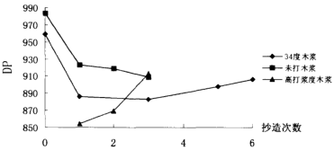

图2-1 回用过程中木浆DP的变化

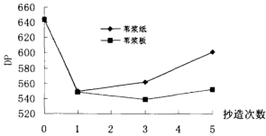

图2-2 回用对苇浆DP的影响

<table><tr><td>项目</td><td>0</td><td>1</td><td>2</td><td>3</td></tr><tr><td>结晶指数(%)</td><td>70.71</td><td>71.62</td><td>74.86</td><td>75.97</td></tr><tr><td>结晶度(%)</td><td>77.34</td><td>77.89</td><td>79.91</td><td>80.62</td></tr></table>

---

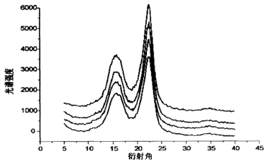

图 2-3-1   苯浆 X—射线衍射图

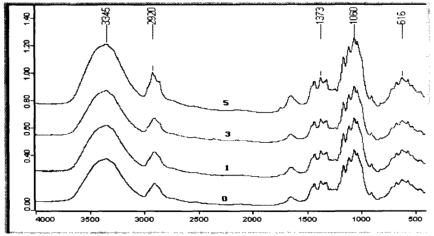

图 2-3-2 木浆纤维 4 次回用后的红外普图

图 2-3-1 是纤维光纤经三次回用后的X射线衍射谱图, 最下面的谱线是未回用纤维的。从下往上依次为回用一次、两次、三次回用后用纤维的衍射图, 从图中可以看出, 002 顿从下往上有逐渐变窄的趋势, 反映出纤维结晶区可能增大。图 2-3-2 为木浆各次回用后的红外线光谱图分析, 说明纤维在回用过程中没有发生官能团的变化。

纤维的 WRV 值能间接反映纤维的湿韧性，随着纤维回收次数的增加，纤维弹性模量、结晶指数的增加都反映出纤维的润胀能力减少了，不同浆料的保水值测量结果更清晰地表明了此现象。如图 2-4 所示，纤维的 WRV 随着

---

纤维的循环使用次数不断减少,但未打浆和机械浆的下降趋势较为平缓。对所有的浆料而言,第二次干燥后的纤维,其WVR下降得最重(图2-4-2-5)。

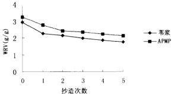

图2-4 保水值与抄造次数的变化关系

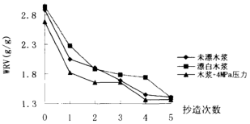

图2-5 木浆WRV与回用的关系

### 3.4  纤维强度的变化

实验采用零距抗张强度来间接反映纤维本身的强度。表2-5中实验数据表明苇秆纤维在不断回用过程中纤维平均强度变化不是很明显。未回用前, 纤维零距抗张强度偏低,回用后又呈现上升趋势,在随后的几次回用中变化较缓。可能是如前所述的细小组分在回用过程中的流失造成的。

<table><tr><td rowspan="2">项目</td><td colspan="4">回用次数</td></tr><tr><td>0</td><td>1</td><td>2</td><td>3</td></tr><tr><td>零距抗张强度(Kg/15mm)</td><td>7.95</td><td>7.63</td><td>7.8</td><td>7.69</td></tr><tr><td>定量(g/m²)</td><td>73.57</td><td>64.33</td><td>65.61</td><td>64.65</td></tr><tr><td>零距抗张指数(Kg/15mm÷g/m²)</td><td>0.1081</td><td>0.1186</td><td>0.1189</td><td>0.1189</td></tr><tr><td>零距抗张指数(N/mg)</td><td>691.84</td><td>759.36</td><td>761.14</td><td>761.55</td></tr></table>

---

- 4.1 纤维经回用后的长度变化不明显,浆料打浆度下降,细小组分流失。
4.2 纤维聚合度(DP)经一次回用后下降,在随后各次回用过程中,由于
细小组份的流失,呈现上升趋势。抄纸造板,聚合度则在回用过程中上
升较缓慢,并且未打浆纤维回用后聚合基本成下降趋势,因此,细小
组分在纤维回用过程中起着不可忽视的作用。
4.3 对纤维结晶度的研究表明,两种方法测量的纤维结晶度都增大了,说明
纤维的角质化过程中,内部微细纤维排列趋向于规则化,纤维的结晶区
有增大的趋势。
4.4 纤维经多次抄造,其化学成分也有一定的变化。聚戊糖含量减少,在
回用过程中部分半纤维素溶出。
---

## 第二节   纸页强度性能的变化

### 1、引言

构成纸张强度的主要因素：①构成纸的多种纤维本身的强度和数量② 取决于纤维之间的交织所造成的机械摩擦强度③纤维之间的结合强度（作用于纤维与纤维之间化学方面的结合强度），所以纸张强度好与坏直接与纤维的性能相关。二次纤维是在由回用过程中发生了上述纤维形态、物理性质以及化学组成等一系列的变化，进而最终会影响到成纸的物理、光学性能。

同上

<table><tr><td>1</td><td>Frank Rapid Kothen 抄片器</td><td>德国</td></tr><tr><td>2</td><td>油压机</td><td>西北轻院</td></tr><tr><td>3</td><td>YQ-Z-20 纸张撕裂度仪</td><td>四川宜宾长江造纸仪器厂</td></tr><tr><td>4</td><td>SE-062 抗张强度测试仪</td><td>瑞典 L&amp;W 公司</td></tr><tr><td>5</td><td>YQ-Z-31 型 MIT 耐折度测定仪</td><td>四川长江造纸仪器厂</td></tr><tr><td>6</td><td>YQ-Z-48A 白度仪</td><td>杭州</td></tr><tr><td>7</td><td>厚度测定仪（气压式）</td><td>瑞典 L&amp;W 公司</td></tr><tr><td>8</td><td>抗张强度测试仪</td><td>四川长江造纸仪器厂</td></tr></table>

### 2.3.1 相对键合面积(RBA)测定

RBA 采用第一章中的间接测定法。测定 Kubelka-munk 光散射系数 $S[m^{2}/g]$。RBA 的计算如下：

$$R B A = \frac { S _ { o } - S } { S _ { o } } = 1 - \frac { S } { S _ { o } } \quad ................. ( 2 . 7 )$$

表中：w——一定量，g/m² S——光散射系数 m²/g，

其中，

$$S = \frac { 1 0 0 0 } { W } \left[ \frac { R _ { 2 } - R _ { 1 } } { 1 - R _ { 2 } ^ { 2 } } \right] \times \ln \left( \frac { R _ { 1 } ( 1 - R _ { 2 } ) } { R _ { 2 } - R _ { 1 } } \right) .$$

$R_{♖}$——单层反射因素，% $R_{♖}$——内反射因素，% $S_{♖}$——纤维未键合的页纸的光散射系数，通常以外延抗张强度——光散射系数曲线，用抗张强度为零时的 S 值表示。

---

2.3.3 纸张强度性能

按国标 GB453-89，GB454-89 等标准测定

## 3、结果与讨论

随纤维不断回用,抗张指数和耐破指数减少,紧度下降;机械浆经几次回用后强度变化平缓(图2-7、2-8、2-9),机械浆木素含量高,相应地,纤维细胞壁孔隙少,纤维干燥后角质化程度轻,因此抗张强度变化较缓。打过浆的浆和未打浆苇的实验结果表明,打浆后苇浆的抗张强度下降的比较快, 而未打浆的变化较缓。因此认为未打浆的浆料有较大的回用潜能。

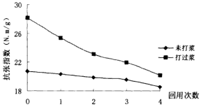

图2-7  等浆抗张强度随回用次数的变化

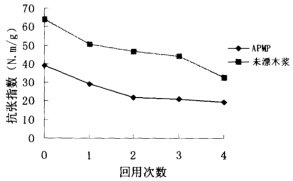

图2-8  回用对纸页抗张强度的影响

---

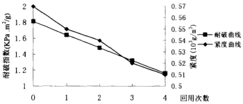

图2-9 纸页紧度和耐破与回用的关系

图2-9中1线显度随着纤维的回缩逐渐减少表明纤维初始网络松厚变大， 纤维结合变少，变弱。这一变化最终归结为纤维发生的应变损伤。

回用纸页性能的变一方面来源于纤维性能的变化,另一方面可能是细小纤维的影响。众所周知,细小纤维有增强作用。细小纤维覆盖在纤维表面, 可加固被破坏或被塌弱;干燥过程中,细小纤维有利于提高坎普尔贝 (Campbell)力,该力有助于缩短结合纤维间的距离;细小纤维还能在纤维间隙间形成桥联以改善结合,这对于角质化的韧性差且彼此不相适应的纤维来说是非常重要的。纤维在回用中,细小组分不仅会流失,而且细小组分发生了比纤维更严重的角质化,因此必然失去了它们的强效作用。

### 3.2 纸页撕裂度的变化

纤维的循环作用导致撕裂度出现先上后下降的变化趋势,有时变化反复,但对所有研究的浆料而言,基本上都是从第一次回用(第二次抄片) 时开始上升,然后下降,如图2-10所示。

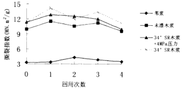

图2-10 断裂度与回用次数的关系

---

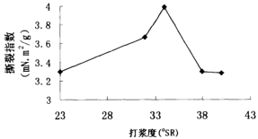

图2-11  苯浆撕裂度与打浆度的关系

众所周知,影响撕裂度的主要因素为纤维长度、纤维的交织情况及纤维本身的强度。通常用零距抗张强度间接反映纤维本身 的强度。研究表明,在实验条件下随着纤维多次回用,零距抗张强度有保持不变或显略上升的趋势,纤维平均长度在回用中基本不变,因此撕裂度的变化可以认为直接与纤维交织情况有关。另一个不容忽视的因素就是打浆度的影响。打浆度对撕裂的影响极其灵敏,回用前,浆栗打浆度处于断裂度与打浆度关系线(图2-11) 的转折点之后,并且实验结果已表明纤维回用后打浆度逐渐下降,并越过该转折点。因此纤维的打浆度在越过该转折点前,打浆度的下降会对撕裂度有正效应。

### 3.3    相对键合面积（RBA）的变化

相对键合面积(RBA)是纸张强度和光学性能的一个决定因素,量化了纸页中纤维间键合的程度,RBA定义为纤维键合的表面积与它们总表面积的比值, 也有的定义为键合纸页中键合纤维比表面积与未键合纸页中未键合纤维比表面积的比值。

### 3.3.1 完全未键合纸页的光散射系数 $S_o$ 的确定

表 2-6 苯浆纸页抗张强度和光学性能

<table><tr><td>抗张指数(N/M/g)</td><td>28.12</td><td>25.35</td><td>23.13</td><td>21.98</td></tr><tr><td>光散射系数S</td><td>6.88</td><td>7.12</td><td>7.27</td><td>7.33</td></tr><tr><td>光散射系数S0</td><td colspan="4">8.912</td></tr></table>

---

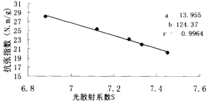

图2-12 芡浆抗张强度与光散射系数曲线

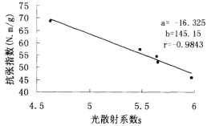

图2-13 木浆抗张强度与光散射系数的关系

$S_{0}$ 反映了成纸时能够结合的有效纤维面积。将苇浆和木浆的实验数据作抗张指数与光散射系数的曲线，并做出趋势线（见图 2-12 和 2-13）。所以， 完全未键合的纸页的光散射系数 $S_{0}$ 为：

$$S_{0}=\frac{124.37}{13.955}=8.912$$

同理，图 2-13 中，$S_{\odot}=8.89$。

### 3.3.2 纸页相对键合面积 RBA 的变化

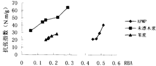

图2-14 相对键合面积与抗张强度的变化关系

---

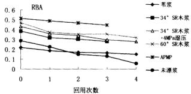

表 2-7 纸页光学性能随在回用中的变化

<table><tr><td></td><td colspan="6">光散射系数S(m2/kg)</td></tr><tr><td>回用次数</td><td>0</td><td>1</td><td>2</td><td>3</td><td>4</td><td></td></tr><tr><td>木浆+4MPa压力</td><td>4.98</td><td>5.62</td><td>5.76</td><td>6.15</td><td>6.32</td><td></td></tr><tr><td>苇浆(未加压)</td><td>6.88</td><td>7.12</td><td>7.27</td><td>7.33</td><td>7.45</td><td></td></tr></table>

表 2-7 数据进一步说明纤维多次回用后，纸页结构越来越松疏，紧定下降，纸页相对键值含量不断下降（图 21-15），表明纤维键合程度变小。

研究结果表明,纤维经回用后其长度(表2-1)、周长、零距抗张等几乎没有发生变化,根据Page方程可知,纤维的上述性能对再生纸页抗张强度的减小影响很少,主要是纤维与纤维之间的键合以及键切剪切强度影响。因此回用引起的纸页强度性能的变化主要是由纤维间键合情况的变化引起的。

- 4.1  纤维的角质化损伤引起纸页性能的一系列变化。浆料结晶指数的增加使
纤维变的挺硬，纤维适应性变差，从而影响了纤维间的结合。纤维在回
用过程中的结晶现象是纤维角质化的一个因素。
4.2  纤维回用引起抗张、耐破强度下降；纸页撕裂度基本上呈现出先上升后
下降的趋势。纸页光散射系数的增加表明纸页结构疏松，表现在纸页紧
度随用回用逐渐下降。
4.3  在不断回用中，与纤维形态相关的一些纤维性能基本保持不变。因此利
用 Page 方程得出纤维键合的降低是造成纸页抗张强度下降的一个主要原
因。
4.4 未打浆的纤维有较大的回用潜能，降低打浆度也有利于减少纤维回用时的
角质化程度。
---

## 第三章 二次纤维的角质化问题

### 1、引言

近年来国内上废旧材料原料短缺,特别是国内纸浆造纸工业面临的环境污染和能耗问题,使人们对二次纤维即废纸的利用越来越重视。废纸利用率的迅速增长正成为世界造纸工业的重要发展趋势。

二次纤维严格来讲应称为“再生纤维”或“回用纤维”,是指经一次或多次回用的废纸纤维。与一次纤维相比,二次纤维在第一次造纸时会发生不可逆损伤,通常称之为纤维的角质化。二次纤维的角质化通常指的是纤维在干燥过程中,纤维组胞壁发生的不可逆物理变化。目前已提出许多可能的纤维角质化机理$^{[4]}$。如结晶、孔隙的不可逆封闭、交联、酸性造纸时纤维素断链等。在干燥过程中以氢键的形式形成的纤维之间的交联在干燥过程中增加,微细纤维间的交联有两个来源:(1)氢键(2)木素-半纤维素间的共价键和氢键的复杂混合。在纸页的抄造过程中,纤维素分子链重排和共结晶,原来分离的纤维结合成额外的结晶区,或者形成更强的键团。

发生角质的纤维其诸多性质如润胀能力、湿韧性或可塑性等降低,最终表现为纸张各个强度性能发生衰变。同时,由于纤维的角质化,生产纤维素产品如醋酸纤维素而,反应试剂不能有效地润胀纤维来到达纤维的化学反应基团,从而降低了浆料在化学处理过程中的反应能力。

因此,二次纤维的角质化问题是有效利用二次纤维所面临的最重要问题, 是研究二次纤维损伤规律的首要切入点。本文将二次纤维的角质化作为再生纤维的一种损伤形式,详细研究了二次纤维的角质化过程及演变规律。

### 2 实验部分

1. 2.1 值水值（WRV）的测定离心法（同上）

通常以光纤纤维膨胀力的保值为(WRV)的减少来表征纤维的角质化程度$^{[1]}$。为此,本文将纤维角质化以下几方程式表示:

$$\text{角化度}(D)=\frac{W R_{16}-W R_{16}}{W R_{16}}\times100\%$$

$WR_{V_1}$: 纤维开始的保水值 $WR_{V_2}$: 发生角周后纤维的保水值

---

## 3、结果与讨论

### 3.1 角质化的产生过程

纤维一经干燥后，其腔胞塌陷且润胀程度有较大的降低（上章已述）。研究表明纤维角质化主要发生在干燥阶段。对未打麦粒叶木酸盐浆纤维干燥过程中的角质化研究表明：角质化主要发生在干燥收缩的第一阶段；当纸页干度大于20%时，纤维开始发生角质化，纸页干度超过70%后几乎不再发生角质化（如图3-1所示）。所以认为干燥脱水第二阶段几乎没有发生干角质化。 这与以前的木浆的研究结果相吻合$^{[2]}$。图3-2更加明显地说明了纤维角质化在干燥过程中的变化趋势。打过浆后的苇絮也有类似的结果。但干燥超过10 分钟后，纸页干度基本保持不变时，保水值先适度下降，后趋于平缓（见表 3-1），因此该阶段的纤维角质化与脱水无关，可能主要是受到与热有关的其它因素的影响。

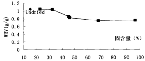

图3-1 未打木浆干燥中固含量与保水值的变化

表 3-1  羊浆干燥过程中角质化变化规律

<table><tr><td rowspan="2"></td><td colspan="8">干燥时间(min)</td></tr><tr><td>1</td><td>2</td><td>4</td><td>6</td><td>8</td><td>10</td><td>14</td><td>16</td></tr><tr><td>WRV(g/g)</td><td>2.83</td><td>2.60</td><td>2.43</td><td>2.277</td><td>2.28</td><td>2.02</td><td>2.09</td><td>2.02</td></tr></table>

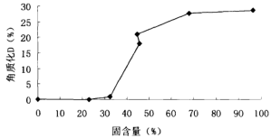

图3-2  干燥过程中纤维角质化损伤的发展

---

在湿压榨过程中,纤维细胞壁脱水,胞壁压溃实,部分空隙不可逆封闭。所以即使经过长时间润胀,纤维膨胀能力也不会完全恢复,即发生纤维湿角质化$^{[10]}$。图 3-3 表示湿压榨过程中纤维质化的变化过程。纸页干度约 20%以上时,纤维才开始发生角质。研究表明湿压榨同样会引起纤维的角质化,但在程度上小于干燥引起的角质化。

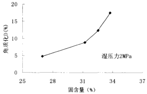

图3-3  湿压榨过程角质化的变化

该部分的实验研究表明纤维角质化主要与抄造过程中纤维细胞壁的脱水相关联,当细胞壁脱掉大部分水时,纤维的自由化程度不明显。从而说明了细胞壁空腔的不可逆封闭是纤维角质化的一个主要原因。

自由水能使纤维素链具有流动性,进而打开微细纤维间形成的氢键。在纤维再次干燥发生角质化过程中,打开的氢键会重新形成,使纤维结构更规则、紧密,纤维变形较硬。温度的提高使纤维素的链断面运动。氢键重排, 所以干燥方法对角质化的影响很大。干燥越剧烈,纤维角质化损伤越严重。

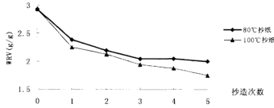

图3-4不同干燥温度苇浆保水值随回用变化

---

表 3-2  干燥对苇浆纤维角质化的影响

<table><tr><td>干燥方式</td><td>保水值 WRV (g/g)</td><td>角质化 D (%)</td></tr><tr><td>80℃抄片</td><td>2.39</td><td>18.43</td></tr><tr><td>100℃抄片</td><td>2.25</td><td>23.21</td></tr></table>

表 3-3  干燥对木浆角质化的影响

<table><tr><td>干燥方式</td><td>保水值 WRV(g/g)</td><td>角质化 D(%)</td></tr><tr><td>室温自由干燥</td><td>1.89</td><td>29.34</td></tr><tr><td>105℃烘干箱干燥</td><td>1.68</td><td>37.31</td></tr><tr><td>120℃烘干箱干燥</td><td>1.56</td><td>41.79</td></tr></table>

表3-2和3-3数据以及图3-4都表明:纤维在低温非强制条件下干燥,可以减缓纤维的角化程度;升高温度可增加角质化程度,在高温条件下对试样进行强制干燥,可能使角质化程度急剧增加。高的温度塑化纤维素,很容易使纤维素重排,回用引起DP的下降(第二章)进一步说明重排可能发生。

## 2、抄造环境的影响

浆料碎解时的pH对角质化的影响也比较明显,实验结果表明,弱酸性条件下经一次干燥的纤维的角质化程度比在弱碱性条件下的纤维角质化程度严重,说明提高pH可以部分防止纤维发生角质化,但过于提高pH值,反而会增加角质化程度,如图3-5所示。

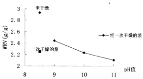

图3-5 抄造环境对纤维角质化的影响

---

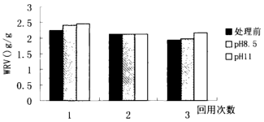

其原因可能是pH值提高导致一次纤维过于润脆,因为纤维过分的初始润胀会加大二次纤维的角质化程度$^{[2]}$。然而,提高处理二次纤维的pH值,可以部分恢复,特别是经过一次干燥的纤维的角质化,如结果如图3-6所示。

## 3、打浆工艺

实验表明化学浆的一次纤维打浆越强烈,一次纤维润胀越大,纤维再次干燥后发生角质化的程度越剧烈。由图3-7和图3-8可知,未打浆的米浆和木浆的纤维保水值变化比较缓慢,说明纤维角质化程度较小。因此未打浆抄造的纸片的抗张强度随在纤维回用过程中变化较小,这与图2-1表征的一致。 打浆使纤维分子沿化,细胞壁脱除,在纤维中形成更多的空隙。在纤维润胀过程中,空隙充填成份并且又在随后的干燥和压榨过程中脱水,纤维收缩, 致使更多的空隙键间形成氢键或酯键,空隙发生不可逆的封闭。因此角质化比未打浆的严重。

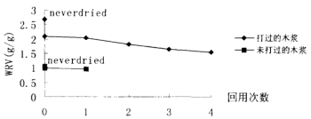

图3-7  打浆对纤维角质化的影响

---

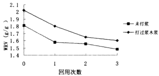

图3-8  苯浆打浆与角质化的变化

## 4、其它因素

影响纤维角质化的其它因素还有半纤维素含量、回用次数、压榨压力、 压榨次数等。图3-8 结果表明打浆后浆角的角质化程度比未打浆纤维的严重, 纤维角质化随回用次数增加逐渐增大。图3-9 和3-10 表明了压缩对纤维角质

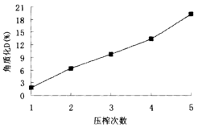

图3-9 纤维角质化与压榨次数的关系

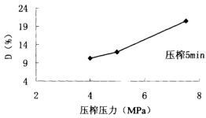

图3-10 纤维角质化与压榨压力的关系

化的影响,纤维压榨压力越高, 压榨道数越多, 角质化越严重。纤维压榨后

---

最重要的变化可能是纤维压实，细胞脱水后，产生了不可逆脱能力的损失。随压力和时间的增加，纤维柔弱能力的损失增加。

当然,还有角化的其它影响因素,譬如浆种的影应。从许多资料来看, 机械浆角化程度较轻,机械浆纤维细壁中含有木质半纤维素,干燥时能够阻止纤维素表面的接触[10],并且机械浆纤维木素含量多,孔隙少。而木素属于憎性木物质,所以原机械浆纤维初始润胀程度轻,干燥过程中,微细纤维间形成的不可逆氢键相应的较少,启用后的纤维角化程度小。本实验结果同样表明机械浆角化程度随固态变化较为缓慢(如图2.9所示)。回用引起细小组分的流失,细小组分含量是一个不可忽视的因素。因为细组分有比长纤维组分高的保水值,所以在循环使用中,细小组分的流失降低了纤维保水值,使角化质严重。

## 4、本章结论

- 4.1  二次纤维的角质化主要源于两个阶段:干燥和湿压榨阶段。角质化
主要产生在细胞壁脱水的第一阶段,即大部分水阶段。缓和的干燥
条件及较低的压力可以减轻角质化程度。降低出纸的干度可以减少
纤维的角质化损伤。纸页的固含量约大于70%以后,纤维几乎不发
生角质化。
4.2 弱碱性条件下,抄纸可以部分防止角质化,但pH值过高反而会增加
角质化程度。在适当的碱性条件下处理一次纤维可以部分恢复角质
化,但对多次回用的二次纤维作用极小。实验结果表明比较好的pH
值在9左右,不应超过10。
4.3 纤维的角质化受多种因素的影响。纤维打磨越严重,在湿压榨过程中
压力越大、压榨次数越多,二次纤维角质化程度越大。一次纤维(未
经干燥)初始润胀程度越大,纤维干燥再润湿后的润胀能力减少越明
显。
---

## 第四章  纤维角质化损伤解决方法初探

### 1、引言

如前言所述,研究者提出了很多二次纤维可能的角质化机理,如结晶、 孔隙的不可逆封闭、交联、酸性造纸时纤维素断链等。在纸页的抄造过程中, 纤维素分子链发生重排和共结晶,原来分离的纤维结合成额外的结晶区, 或者形成更强的氢键$^{[8]}$。

在上一章内容中,主要讨论了二次纤维角质化损伤的一系列问题。纤维角质化是影响在抄纸的纸页性能的根本原因。因此寻求解决成形角质化的方法是改善回执的纸页强度性能的一个关键。浆料、一些纤维的改性产品, 如制造CMC、纤维素醋酸酯等的溶解浆以及浆粕,为了运输方便,需要对原料进行干燥。但由于干燥引起了纤维的角质化,一些化学处理试剂以与纤维素的某些反应基团较近,致使溶解剂的反应性能降低,从而影响了纤维素类品产品的质量。从这一角度来考虑,解决纤维角质化也是很重要的。

根据二次纤维性能衰变的机理,为改变二次纤维抄造纸页强度性能,对浆料进行了力学理化。有如下理论依据[9]:

- 1.加入的药品能阻止纤维孔隙在干燥后封闭。
2.进入孔隙内充当塑剂或捆剂来增加纸页压缩强度性能。
3.疏水基团可能影响二次纤维度;适当的乙酸化可以增加纤维的键合
能力,并且当回用后仍能起作用,乙酸基阻止形成难以恢复的氢键,
但因为连接的纤维素表面引起局部结晶,所以不能确定孔隙能否在
再浸润后会重新打开。
4.使纤维表面有一定密度的羧酸基(羧甲基化可以实现)。
### 2、实验部分

### 2.1 实验材料

原料：  纥浆      加拿大进口漂白叶针木硫酸盐浆药品：  异丙醚    一氯醋酸    乙醇    NaBH₄    NaOH 十六烷基三甲基氯化铵（表面活性剂）

强有力电磁探伤器 D-8401型多功能调速器温度可调式电热套三口圆下烧板纸页性能测试仪器（同上）

---

### 2.3.1 纤维丝光化处理

浆料丝光化处理是指用LiOH、NaOH等处理浆料。碱的存在可以减少 NaOH水化层的尺寸，所以可在较低浓度下渗透进纤维素纤维的原纤结构， 引起微温内润胀$^{[81]}$。本实验把浆料在120g/1 NaOH溶液中、35℃下浸泡5分钟，洗浆料至中性得溶解浆。

### 2.3.2 纤维的羧甲基化$^{[4]}$

### 2.3.2.1 低取代度 CMC:

将6g绝干浆放入60ml蒸馏水中,并加入40ml异丙醇,用强力搅拌器搅拌10分钟后再加入0.22gNaOH,浸渍并不断搅拌1h后加入0.475g氯乙酸 (MCA)并继续搅拌30min,最后升温到50℃熟化1h,待反应完成后用95% 和50%的乙醇冲洗三次以备用。

### 2.3.2.2 中取代度 CMC:

将绝干重相当于6g的浆料放入圆底烧瓶中,加入40ml蒸馏水和60ml 异丙醇,强力搅拌器搅拌10min后加入0.44gNaOH,在搅拌条件下浸渍1h, 加入0.945gMCA继续搅拌30min,最后升温到50℃熟化1h,待反应完成后用 95%和50%的乙醇冲洗三次以备用。

### 2.3.2.3 高取代度 CMC:

将绝干重相当于6g的浆料放入圆底烧瓶中,加入20mL蒸馏水和80ml异丙醇,强力搅拌搅拌10min后加入0.88gNaOH,在搅拌条件下浸滚1h,加入1.4175gMCA继续搅拌30min,最后升温到70°C熟化1h。待反应完成后用 95%和50%的乙醇冲洗三次以备用。

### 2.3.3 WRV 测定：

离心法（同上）

### 2.4 实验过程：

处理后的浆果榨液后，在过滤器中滤去滤纸滤。用烘干干燥，部分留作纤维性能用，其余回用。测纸张性能用的纸页用抄纸片抄造。

## 3、结果与讨论

### 3.1  改善 pH 值

适当的提高pH值可以使部分预防水和恢复纤维松弛化,此部分内容在上一章角化质的影响因素已经给出解释,这里再赘述。

### 3.2 形成弱的氢键或干扰氢键的形成

---

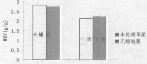

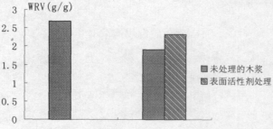

图4-2 表面活性剂处理前后纤维角质化的变化

图4-1表明乙醇对纤维的润胀能力比对纤维的润胀能力小的多,并且一次干燥后的纤维的角质化程度也较低。醇的存在可以增加纤维的无序度, 水分子在润胀的纤维素分子链间形成暂时的氢键交联;再者,醇是单官能团合产物,形成的氢键较少,且不形成交联,己润胀纤维的分子链更容易移动, 纤维素的无序度和可及表面更大$^{[10]}$。所以以乙醇处理后的纤维在干燥脱水过程中,醛羟基与纤维羟基形成的氢键较弱,用水再润胀时,氢键比较易于打开, 因此纤维发生角质化的程度较小。

加入表面活性剂的浆料长时间没用后,因表面活性剂(十八烷基三甲基氯胺)的分子链很长,吸附和渗透到纤维毛细管中,可以阻止孔隙的封闭, 从而干扰了纸页抄纸过程中纤维内部氢键的形成。因此用表面活性剂处理的木浆纤维经一次干燥后的WRV远高于未处理的(如图4-2所示),进而部分预防了纤维角化。

该部分结果反而证实了次纤维角质化中的一个机理——形成不可逆的氢键结合或细胞壁细胞的不可逆封闭。

### 3.3 化学反应将纤维改性

资料表明投料含量以及基胶的存在会对纤维的角质化有很大的影响。 图4-3 是 胱胺甲基纤维切回作用后，其润胀能力的变化情况。0，1，2，3，分别

---

表示浆料的回用次数。未取代的纤维经过多次回用尤其是第一次回用后，纤维保水值下降较为较低，低取代和中取代的纤维回用品质有改善。

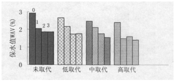

图 4-4 保水值随回用次数的变化

图 4-4 表示木浆纤维经羧甲基化后,成纸强度随纤维不断回用的变化情况,浆料在羧甲基化反应后未进行后洗涤处理,因此羧基以钠盐形勢存在。 由图可以看出,纤维进行羧甲基取代后,其回用品质有所改善。随纤维回用次数的增加,纸页抗张强度衰变趋势逐渐变缓,表明取代后,二次纤维角质化程度减小。

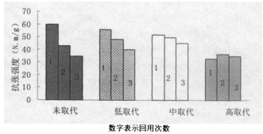

图4-4 羟甲基化后纸页强度随回用的变化

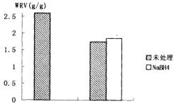

图4-4 硼氢化钠处理前后角质化的变化

---

使用还原剂还是纤维组分的那些能导致纤维角质化的基因,同样可以预防角质化。图4-5是用硼氢钠处理木浆后角质化的变化情况,显然有一定的作用。硼氢钠还原了C=O和COOH基团,因此可防止角质化。进一步的内容还在研究中,如最佳加入量等。

## 4 本章结论

- 4.1 在适当的碱性条件下抄纸可以部分预防纤维质化,碱的润胀能力较
强,因此提高处理二次纤维的pH值减轻了角质化。
4.2 弱极性溶液,如乙醇可与纤维形成弱的氢键结合,因此在抄片回用
后纤维内部形成的氢键比较容易打开,使水分子进入纤维细胞壁孔
隙内,降低了随后回用中缝针的角质化程度。
4.3 表面活性剂有很大的分子链,浆料经较长时间浸泡后,表面活性剂大
分子能进入到纤维细胞壁的孔隙内,在干燥过程中可以阻止纤维壁
内两侧的羟基过多的形成氢键或其他连接。纤维再浸润时,水分子
就容易进入,从而可以部分抑制纤维的角质化。
4.4 对纤维进行羧甲基化改性表明适当增加纤维的取代度可以改善二
次纤维的回用品质,使回用后的纸页强度有所改观。
---

## 第五章 回用纸页损伤初探

### 第一节   纤维损伤因子表征

### 1、引言

损伤力学是研究含损伤介质的材料的性质,以及在变形过程中损伤的演化发展直到破坏的力学过程的学科。在载荷、温度、环境的作用下,由于细观结构的缺陷引起的材料或结构上的裂纹过程,称之为损作$^{[8]}$.

损伤理论的研究方法之一是运用唯象论,即从实验结果所得出的现象出发,以实验为主要研究手段,大量的精确实验数据为基础而得出一定的理论。 研究材料损伤首先要选择易于测量并能与宏观力学量建立联系的变量——损伤因子(变量),用以描述材料的损伤状态。损伤变量是物质结构某种不可逆变化的一种定量表示。

不同的损伤过程,可以选取不同的损伤变量,即使同一损伤过程,也可以选取不同的损伤变量。在造纸领域,植物纤维经不断回用后,纤维的细胞壁发生了不可逆的变化——纤维角质化。二次纤维角质化现象宏观表现为纤维润胀能力、表面网件等纤维性能的劣化,以及再生纸页强度性能的衰变。 因此可以根据损伤理论,从新的视角来研究二次纤维及其纸页再回用过程中发生的不可逆损伤。

### 2、损伤变量的古典定义$^{[53]}$

定义什么样的损伤变量以及如何用直接的或间接的、力学的、或物理学的方法来测量一直是损伤理论中存在争议的问题。损伤力学已经在钢筋、岩土等领域得到充分应用,并有了自己的一套理论依据。

### 2.1  损伤变量的经典定义

$$D=\frac{A_{*}}{A_{0}}\quad (5-1)\quad \text{或}$$

$$D=\frac{V_{s}}{V}\quad \cdot s\cdot s\cdot s\cdot s\cdot s\cdot s\cdot s\cdot s\cdot s\cdot s\cdot s\cdot s\cdot s\cdot s\cdot s\cdot s\cdot s\cdot s\cdot s\cdot s\cdot s\cdot s\cdot s\cdot s\cdot s\cdot s\cdot s\cdot s\cdot s\cdot s\cdot s\cdot s\cdot s\cdot s\cdot s\cdot s\cdot s\cdot s\cdot s\cdot s\cdot s\cdot s\cdot s\cdot s\cdot s\cdot s\cdot s\cdot s\cdot s\cdot s\cdot s\cdot s\cdot s\cdot s\cdot s\cdot s\cdot s\cdot s\cdot s\cdot s\cdot s\cdot s\cdot s\cdot s\cdot s\cdot s\cdot s\cdot s\cdot s\cdot s\cdot s\cdot s\cdot s\cdot s\cdot s\cdot s\cdot s\cdot s\cdot s\cdot s\cdot s\cdot s\cdot s\cdot s\cdot s\cdot s\cdot s\cdot s\cdot s\cdot s\cdot s\cdot s\cdot s\cdot s\cdot s\cdot s\cdot s\cdot s\cdot s\cdot s\cdot s\cdot s\cdot s\cdot s\cdot s\cdot s\cdot s\cdot s\cdot s\cdot s\cdot s\cdot s\cdot s\cdot s\cdot s\cdot s\cdot s\cdot s\cdot s\cdot s\cdot s\cdot s\cdot s\cdot s\cdot s\cdot s\cdot s\cdot s\cdot s\cdot s\cdot s\cdot s\cdot s\cdot s\cdot s\cdot s\cdot s\cdot s\cdot s\cdot s\cdot s\cdot s\cdot s\cdot s\cdot s\cdot s\cdot s\cdot s\cdot s\cdot s\cdot s\cdot s\cdot s\cdot s\cdot s\cdot s\cdot s\cdot s\cdot s\cdot s\cdot s\cdot s\cdot s\cdot s\cdot s\cdot s\cdot s\cdot s\cdot s\cdot s\cdot s\cdot s\cdot s\cdot s\cdot s\cdot s\cdot s\cdot s\cdot s\cdot s\cdot s\cdot s\cdot s\cdot s\cdot s\cdot s\cdot s\cdot s\cdot s\cdot s\cdot s\cdot s\cdot s\cdot s\cdot s\cdot s\cdot s\cdot s\cdot s\cdot s\cdot s\cdot s\cdot s\cdot s\cdot s\cdot s\cdot s\cdot s\cdot s\cdot s\cdot s\cdot s\cdot s\cdot s\cdot s\cdot s\cdot s\cdot s\cdot s\cdot s\cdot s\cdot s\cdot s\cdot s\cdot s\cdot s\cdot s\cdot s\cdot s\cdot s\cdot s\cdot s\cdot s\cdot s\cdot s\cdot s\cdot s\cdot s\cdot s\cdot s\cdot s\cdot s\cdot s\cdot s\cdot s\cdot s\cdot s\cdot s\cdot s\cdot s\cdot s\cdot s\cdot s\cdot s\cdot s\cdot s\cdot s\cdot s\cdot s\cdot s\cdot s\cdot s\cdot s\cdot s\cdot s\cdot s\cdot s\cdot s\cdot s\cdot s\cdot s\cdot s\cdot s\cdot s\cdot s\cdot s\cdot s\cdot s\cdot s\cdot s\cdot s\cdot s\cdot s\cdot s\cdot s\cdot s\cdot s\cdot s\cdot s\cdot s\cdot s\cdot s\cdot s\cdot s\cdot s\cdot s\cdot s\cdot s\cdot s\cdot s\cdot s\cdot s\cdot s\cdot s\cdot s\cdot s\cdot s\cdot s\cdot s\cdot s\cdot s\cdot s\cdot s\cdot s\cdot s\cdot s\cdot s\cdot s\cdot s\cdot s\cdot s\cdot s\cdot s\cdot s\cdot s\cdot s\cdot s\cdot s\cdot s\cdot s\cdot s\cdot s\cdot s\cdot s\cdot s\cdot s\cdot s\cdot s\cdot s\cdot s\cdot s\cdot s\cdot s\cdot s\cdot s\cdot s\cdot s\cdot s\cdot s\cdot s\cdot s\cdot s\cdot s\cdot s\cdot s\cdot s\cdot s\cdot s\cdot s\cdot s\cdot s\cdot s\cdot s\cdot s\cdot s\cdot s\cdot s\cdot s\cdot s\cdot s\cdot s\cdot s\cdot s\cdot s\cdot s\cdot s\cdot s\cdot s\cdot s\cdot s\cdot s\cdot s\cdot s\cdot s\cdot s\cdot s\cdot s\cdot s\cdot s\cdot s\cdot s\cdot s\cdot s\cdot s\cdot s\cdot s\cdot s\cdot s\cdot s\cdot s\cdot s\cdot s\cdot s\cdot s\cdot s\cdot s\cdot s\cdot s\cdot s\cdot s\cdot s\cdot s\cdot s\cdot s\cdot s\cdot s\cdot s\cdot s\cdot s\cdot s\cdot s\cdot s\cdot s\cdot s\cdot s\cdot s\cdot s\cdot s\cdot s\cdot s\cdot s\cdot s\cdot s\cdot s\cdot s\cdot s\cdot s\cdot s\cdot s\cdot s\cdot s\cdot s\cdot s\cdot s\cdot s\cdot s\cdot s\cdot s\cdot s\cdot s\cdot s\cdot s\cdot s\cdot s\cdot s\cdot s\cdot s\cdot s\cdot s\cdot s\cdot s\cdot s\cdot s\cdot s\cdot s\cdot s\cdot s\cdot s\cdot s\cdot s\cdot s\cdot s\cdot s\cdot s\cdot s\cdot s\cdot s\cdot s\cdot s\cdot s\cdot s\cdot s\cdot s\cdot s\cdot s\cdot s\cdot s\cdot s\cdot s\cdot s\cdot s\cdot s\cdot s\cdot s\cdot s\cdot s\cdot s\cdot s\cdot s\cdot s\cdot s\cdot s\cdot s\cdot s\cdot s\cdot s\cdot s\cdot s\cdot s\cdot s\cdot s\cdot s\cdot s\cdot s\cdot s\cdot s\cdot s\cdot s\cdot s\cdot s\cdot s\cdot s\cdot s\cdot s\cdot s\cdot s\cdot s\cdot s\cdot s\cdot s\cdot s\cdot s\cdot s\cdot s\cdot s\cdot s\cdot s\cdot s\cdot s\cdot s\cdot s\cdot s\cdot s\cdot s\cdot s\cdot s\cdot s\cdot s\cdot s\cdot s\cdot s\cdot s\cdot s\cdot s\cdot s\cdot s\cdot s\cdot s\cdot s\cdot s\cdot s\cdot s\cdot s\cdot s\cdot s\cdot s\cdot s\cdot s\cdot s\cdot s\cdot s\cdot s\cdot s\cdot s\cdot s\cdot s\cdot s\cdot s\cdot s\cdot s\cdot s\cdot s\cdot s\cdot s\cdot s\cdot s\cdot s\cdot s\cdot s\cdot s\cdot s\cdot s\cdot s\cdot s\cdot s\cdot s\cdot s\cdot s\cdot s\cdot s\cdot s\cdot s\cdot s\cdot s\cdot s\cdot s\cdot s\cdot s\cdot s\cdot s\cdot s\cdot s\cdot s\cdot s\cdot s\cdot s\cdot s\cdot s\cdot s\cdot s\cdot s\cdot s\cdot s\cdot s\cdot s\cdot s\cdot s\cdot s\cdot s\cdot s\cdot s\cdot s\cdot s\cdot s\cdot s\cdot s\cdot s\cdot s\cdot s\cdot s\cdot s\cdot s\cdot s\cdot s\cdot s\cdot s\cdot s\cdot s\cdot s\cdot s\cdot s\cdot s\cdot s\cdot s\cdot s\cdot s\cdot s\cdot s\cdot s\cdot s\cdot s\cdot s\cdot s\cdot s\cdot s\cdot s\cdot s\cdot s\cdot s\cdot s\cdot s\cdot s\cdot s\cdot s\cdot s\cdot s\cdot s\cdot s\cdot s\cdot s\cdot s\cdot s\cdot s\cdot s\cdot s\cdot s\cdot s\cdot s\cdot s\cdot s\cdot s\cdot s\cdot s\cdot s\cdot s\cdot s\cdot s\cdot s\cdot s\cdot s\cdot s\cdot s\cdot s\cdot s\cdot s\cdot s\cdot s\cdot s\cdot s\cdot s\cdot s\cdot s\cdot s\cdot s\cdot s\cdot s\cdot s\cdot s\cdot s\cdot s\cdot s\cdot s\cdot s\cdot s\cdot s\cdot s\cdot s\cdot s\cdot s\cdot s\cdot s\cdot s\cdot s\cdot s\cdot s\cdot s\cdot s\cdot s\cdot s\cdot s\cdot s\cdot s\cdot s\cdot s\cdot s\cdot s\cdot s\cdot s\cdot s\cdot s\cdot s\cdot s\cdot s\cdot s\cdot s\cdot s\cdot s\cdot s\cdot s\cdot s\cdot s\cdot s\cdot s\cdot s\cdot s\cdot s\cdot s\cdot s\cdot s\cdot s\cdot s\cdot s\cdot s\cdot s\cdot s\cdot s\cdot s\cdot s\cdot s\cdot s\cdot s\cdot s\cdot s\cdot s\cdot s\cdot s\cdot s\cdot s\cdot s\cdot s\cdot s\cdot s\cdot s\cdot s\cdot s\cdot s\cdot s\cdot s\cdot s\cdot s\cdot s\cdot s\cdot s\cdot s\cdot s\cdot s\cdot s\cdot s\cdot s\cdot s\cdot s\cdot s\cdot s\cdot s\cdot s\cdot s\cdot s\cdot s\cdot s\cdot s\cdot s\cdot s\cdot s\cdot s\cdot s\cdot s\cdot s\cdot s\cdot s\cdot s\cdot s\cdot s\cdot s\cdot s\cdot s\cdot s\cdot s\cdot s\cdot s\cdot s\cdot s\cdot s\cdot s\cdot s\cdot s\cdot s\cdot s\cdot s\cdot s\cdot s\cdot s\cdot s\cdot s\cdot s\cdot s\cdot s\cdot s\cdot s\cdot s\cdot s\cdot s\cdot s\cdot s\cdot s\cdot s\cdot s\cdot s\cdot s\cdot s\cdot s\cdot s\cdot s\cdot s\cdot s\cdot s\cdot s\cdot s\cdot s\cdot s\cdot s\cdot s\cdot s\cdot s\cdot s\cdot s\cdot s\cdot s\cdot s\cdot s\cdot s\cdot s\cdot s\cdot s\cdot s\cdot s\cdot s\cdot s\cdot s\cdot s\cdot s\cdot s\cdot s\cdot s\cdot s\cdot s\cdot s\cdot s\cdot s\cdot s\cdot s\cdot s\cdot s\cdot s\cdot s\cdot s\cdot s\cdot s\cdot s\cdot s\cdot s\cdot s\cdot s\cdot s\cdot s\cdot s\cdot s\cdot s\cdot s\cdot s\cdot s\cdot s\cdot s\cdot s\cdot s\cdot s\cdot s\cdot s\cdot s\cdot s\cdot s\cdot s\cdot s\cdot s\cdot s\cdot s\cdot s\cdot s\cdot s\cdot s\cdot s\cdot s\cdot s\cdot s\cdot s\cdot s\cdot s\cdot s\cdot s\cdot s\cdot s\cdot s\cdot s\cdot s\cdot s\cdot s\cdot s\cdot s\cdot s\cdot s\cdot s\cdot s\cdot s\cdot s\cdot s\cdot s\cdot s\cdot s\cdot s\cdot s\cdot s\cdot s\cdot s\cdot s\cdot s\cdot s\cdot s\cdot s\cdot s\cdot s\cdot s\cdot s\cdot s\cdot s\cdot s\cdot s\cdot s\cdot s\cdot s\cdot s\cdot s\cdot s\cdot s\cdot s\cdot s\cdot s\cdot s\cdot s\cdot s\cdot s\cdot s\cdot s\cdot s\cdot s\cdot s\cdot s\cdot s\cdot s\cdot s\cdot s\cdot s\cdot s\cdot s\cdot s\cdot s\cdot s\cdot s\cdot s\cdot s\cdot s\cdot s\cdot s\cdot s\cdot s\cdot s\cdot s\cdot s\cdot s\cdot s\cdot s\cdot s\cdot s\cdot s\cdot s\cdot s\cdot s\cdot s\cdot s\cdot s\cdot s\cdot s\cdot s\cdot s\cdot s\cdot s\cdot s\cdot s\cdot s\cdot s\cdot s\cdot s\cdot s\cdot s\cdot s\cdot s\cdot s\cdot s\cdot s\cdot s\cdot s\cdot s\cdot s\cdot s\cdot s\cdot s\cdot s\cdot s\cdot s\cdot s\cdot s\cdot s\cdot s\cdot s\cdot s\cdot s\cdot s\cdot s\cdot s\cdot s\cdot s\cdot s\cdot s\cdot s\cdot s\cdot s\cdot s\cdot s\cdot s\cdot s\cdot s\cdot s\cdot s\cdot s\cdot s\cdot s\cdot s\cdot s\cdot s\cdot s\cdot s\cdot s\cdot s\cdot s\cdot s\cdot s\cdot s\cdot s\cdot s\cdot s\cdot s\cdot s\cdot s\cdot s\cdot s\cdot s\cdot s\cdot s\cdot s\cdot s\cdot s\cdot s\cdot s\cdot s\cdot s\cdot s\cdot s\cdot s\cdot s\cdot s\cdot s\cdot s\cdot s\cdot s\cdot s\cdot s\cdot s\cdot s\cdot s\cdot s\cdot s\cdot s\cdot s\cdot s\cdot s\cdot s\cdot s\cdot s\cdot s\cdot s\cdot s\cdot s\cdot s\cdot s\cdot s\cdot s\cdot s\cdot s\cdot s\cdot s\cdot s\cdot s\cdot s\cdot s\cdot s\cdot s\cdot s\cdot s\cdot s\cdot s\cdot s\cdot s\cdot s\cdot s\cdot s\cdot s\cdot s\cdot s\cdot s\cdot s\cdot s\cdot s\cdot s\cdot s\cdot s\cdot s\cdot s\cdot s\cdot s\cdot s\cdot s\cdot s\cdot s\cdot s\cdot s\cdot s\cdot s\cdot s\cdot s\cdot s\cdot s\cdot s\cdot s\cdot s\cdot s\cdot s\cdot s\cdot s\cdot s\cdot s\cdot s\cdot s\cdot s\cdot s\cdot s\cdot s\cdot s\cdot s\cdot s\cdot s\cdot s\cdot s\cdot s\cdot s\cdot s\cdot s\cdot s\cdot s\cdot s\cdot s\cdot s\cdot s\cdot s\cdot s\cdot s\cdot s\cdot s\cdot s\cdot s\cdot s\cdot s\cdot s\cdot s\cdot s\cdot s\cdot s\cdot s\cdot s\cdot s\cdot s\cdot s\cdot s\cdot s\cdot s\cdot s\cdot s\cdot s\cdot s\cdot s\cdot s\cdot s\cdot s\cdot s\cdot s\cdot s\cdot s\cdot s\cdot s\cdot s\cdot s\cdot s\cdot s\cdot s\cdot s\cdot s\cdot s\cdot s\cdot s\cdot s\cdot s\cdot s\cdot s\cdot s\cdot s\cdot s\cdot s\cdot s\cdot s\cdot s\cdot s\cdot s\cdot s\cdot s\cdot s\cdot s\cdot s\cdot s\cdot s\cdot s\cdot s\cdot s\cdot s\cdot s\cdot s\cdot s\cdot s\cdot s\cdot s\cdot s\cdot s\cdot s\cdot s\cdot s\cdot s\cdot s\cdot s\cdot s\cdot s\cdot s\cdot s\cdot s\cdot s\cdot s\cdot s\cdot s\cdot s\cdot s\cdot s\cdot s\cdot s\cdot s\cdot s\cdot s\cdot s\cdot s\cdot s\cdot s\cdot s\cdot s\cdot s\cdot s\cdot s\cdot s\cdot s\cdot s\cdot s\cdot s\cdot s\cdot s\cdot s\cdot s\cdot s\cdot s$$

式中，D——损伤值 A_{o}——试样的表观承载面积 A_{w}——试样的承载截面上微孔隙所占面积之和 V——受损试样的总体积 V_{w}——微孔隙所占体积之和。

根据应变等效假设，从上式可推出：

---

$$D_{E}=1-\frac{E}{E_{o}}\quad (5.3)$$

式（5-3）称为损伤的弹性模量定义式。

$E_{a}=受损前某一方方向的拉伸弹性模量$ $E_{b}=受损后在某一方面的方向的拉伸弹性模量$

根据式 (5-2) 又可推出：

$$D _ { t } = 1 - \frac { g } { g ^ { 0 } } \cdot s \cdot s \cdot s \cdot s \cdot s \cdot s \cdot s \cdot s \cdot s \cdot s \cdot s \cdot s \cdot s \cdot s \cdot s \cdot s \cdot s \cdot s \cdot s \cdot s \cdot s \cdot s \cdot s \cdot s \cdot s \cdot s \cdot s \cdot s \cdot s \cdot s \cdot s \cdot s \cdot s \cdot s \cdot s \cdot s \cdot s \cdot s \cdot s \cdot s \cdot s \cdot s \cdot s \cdot s \cdot s \cdot s \cdot s \cdot s \cdot s \cdot s \cdot s \cdot s \�� \�� \�� \�� \�� \�� \�� \�� \�� \�� \�� \�� \�� \�� \�� \�� \�� \�� \�� \�� \�� \�� \�� \�� \�� \�� \�� \�� \�� \�� \�� \�� \�� \�� \�� \�� \�� \�� \�� \�� \�� \�� \�� \�� \�� \�� \�� \�� \�� \�� \�� \�� \�� \�� \�� \�� \�� \�� \�� \�� \�� \�� \�� \�� \�� \�� \�� \�� \�� \�� \�� \�� \�� \�� \�� \�� \�� \�� \�� \�� \�� \�� \�� \�� \�� \�� \�� \�� \�� \�� \�� \�� \�� \�� \�� \�� \�� \�� \�� \�� \�� \�� \�� \�� \�� \�� \�� \�� \�� \�� \�� \�� \�� \�� \�� \�� \�� \�� \�� \�� \�� \�� \�� \�� \�� \�� \�� \�� \�� \�� \�� \�� \�� \�� \�� \�� \�� \�� \�� \�� \�� \�� \�� \�� \�� \�� \�� \�� \�� \�� \�� \�� \�� \�� \�� \�� \�� \�� \�� \�� \�� \�� \�� \�� \�� \�� \�� \�� \�� \�� \�� \�� \�� \�� \�� \�� \�� \�� \�� \�� \�� \�� \�� \�� \�� \�� \�� \�� \�� \�� \�� \�� \�� \�� \�� \�� \�� \�� \�� \�� \�� \�� \�� \�� \�� \�� \�� \�� \�� \�� \�� \�� \�� \�� \�� \�� \�� \�� \�� \�� \�� \�� \�� \�� \�� \�� \�� \�� \�� \�� \�� \�� \�� \�� \�� \�� \�� \�� \�� \�� \�� \�� \�� \�� \�� \�� \�� \�� \�� \�� \�� \�� \�� \�� \�� \�� \�� \�� \�� \�� \�� \�� \�� \�� \�� \�� \�� \�� \�� \�� \�� \�� \�� \�� \�� \�� \�� \�� \�� \�� \�� \�� \�� \�� \�� \�� \�� \�� \�� \�� \�� \�� \�� \�� \�� \�� \�� \�� \�� \�� \�� \�� \�� \�� \�� \�� \�� \�� \�� \�� \�� \�� \�� \�� \�� \�� \�� \�� \�� \�� \�� \�� \�� \�� \�� \�� \�� \�� \�� \�� \�� \�� \�� \�� \�� \�� \�� \�� \�� \�� \�� \�� \�� \�� \�� \�� \�� \�� \�� \�� \�� \�� \�� \�� \�� \�� \�� \�� \�� \�� \�� \�� \�� \�� \�� \�� \�� \�� \�� \�� \�� \�� \�� \�� \�� \�� \�� \�� \�� \�� \�� \�� \�� \�� \�� \�� \�� \�� \�� \�� \�� \�� \�� \�� \�� \�� \�� \�� \�� \�� \�� \�� \�� \�� \�� \�� \�� \�� \�� \�� \�� \�� \�� \�� \�� \�� \�� \�� \�� \�� \�� \�� \�� \�� \�� \�� \�� \�� \�� \�� \�� \�� \�� \�� \�� \�� \�� \�� \�� \�� \�� \�� \�� \�� \�� \�� \�� \�� \�� \�� \�� \�� \�� \�� \�� \�� \�� \�� \�� \�� \�� \�� \�� \�� \�� \�� \�� \�� \�� \�� \�� \�� \�� \�� \�� \�� \�� \�� \�� \�� \�� \�� \�� \�� \�� \�� \�� \�� \�� \�� \�� \�� \�� \�� \�� \�� \�� \�� \�� \�� \�� \�� \�� \�� \�� \�� \�� \�� \�� \�� \�� \�� \�� \�� \�� \�� \�� \�� \�� \�� \�� \�� \�� \�� \�� \�� \�� \�� \�� \�� \�� \�� \�� \�� \�� \�� \�� \�� \�� \�� \�� \�� \�� \�� \�� \�� \�� \�� \�� \�� \�� \�� \�� \�� \�� \�� \�� \�� \�� \�� \�� \�� \�� \�� \�� \�� \�� \�� \�� \�� \�� \�� \�� \�� \�� \�� \�� \�� \�� \�� \�� \�� \�� \�� \�� \�� \�� \�� \�� \�� \�� \�� \�� \�� \�� \�� \�� \�� \�� \�� \�� \�� \�� \�� \�� \�� \�� \�� \�� \�� \�� \�� \�� \�� \�� \�� \�� \�� \�� \�� \�� \�� \�� \�� \�� \�� \�� \�� \�� \�� \�� \�� \�� \�� \�� \�� \�� \�� \�� \�� \�� \�� \�� \�� \�� \�� \�� \�� \�� \�� \�� \�� \�� \�� \�� \�� \�� \�� \�� \�� \�� \�� \�� \�� \�� \�� \�� \�� \�� \�� \�� \�� \�� \�� \�� \�� \�� \�� \�� \�� \�� \�� \�� \�� \�� \�� \�� \�� \�� \�� \�� \�� \�� \�� \�� \�� \�� \�� \�� \�� \�� \�� \�� \�� \�� \�� \�� \�� \�� \�� \�� \�� \�� \�� \�� \�� \�� \�� \�� \�� \�� \�� \�� \�� \�� \�� \�� \�� \�� \�� \�� \�� \�� \�� \�� \�� \�� \�� \�� \�� \�� \�� \�� \�� \�� \�� \�� \�� \�� \�� \�� \�� \�� \�� \�� \�� \�� \�� \�� \�� \�� \�� \�� \�� \�� \�� \�� \�� \�� \�� \�� \�� \�� \�� \�� \�� \�� \�� \�� \�� \�� \�� \�� \�� \�� \�� \�� \�� \�� \�� \�� \�� \�� \�� \�� \�� \�� \�� \�� \�� \�� \�� \�� \�� \�� \�� \�� \�� \�� \�� \�� \�� \�� \�� \�� \�� \�� \�� \�� \�� \�� \�� \�� \�� \�� \�� \�� \�� \�� \�� \�� \�� \�� \�� \�� \�� \�� \�� \�� \�� \�� \�� \�� \�� \�� \�� \�� \�� \�� \�� \�� \�� \�� \�� \�� \�� \�� \�� \�� \�� \�� \�� \�� \�� \�� \�� \�� \�� \�� \�� \�� \�� \�� \�� \�� \�� \�� \�� \�� \�� \�� \�� \�� \�� \�� \�� \�� \�� \�� \�� \�� \�� \�� \�� \�� \�� \�� \�� \�� \�� \�� \�� \�� \�� \�� \�� \�� \�� \�� \�� \�� \�� \�� \�� \�� \�� \�� \�� \�� \�� \�� \�� \�� \�� \�� \�� \�� \�� \�� \�� \�� \�� \�� \�� \�� \�� \�� \�� \�� \�� \�� \�� \�� \�� \�� \�� \�� \�� \�� \�� \�� \�� \�� \�� \�� \�� \�� \�� \�� \�� \�� \�� \�� \�� \�� \�� \�� \�� \�� \�� \�� \�� \�� \�� \�� \�� \�� \�� \�� \�� \�� \�� \�� \�� \�� \�� \�� \�� \�� \�� \�� \�� \�� \�� \�� \�� \�� \�� \�� \�� \�� \�� \�� \�� \�� \�� \�� \�� \�� \�� \�� \�� \�� \�� \�� \�� \�� \�� \�� \�� \�� \�� \�� \�� \�� \�� \�� \�� \�� \�� \�� \�� \�� \�� \�� \�� \�� \�� \�� \�� \�� \�� \�� \�� \�� \�� \�� \�� \�� \�� \�� \�� \�� \�� \�� \�� \�� \�� \�� \�� \�� \�� \�� \�� \�� \�� \�� \�� \�� \�� \�� \�� \�� \�� \�� \�� \�� \�� \�� \�� \�� \�� \�� \�� \�� \�� \�� \�� \�� \�� \�� \�� \�� \�� \�� \�� \�� \�� \�� \�� \�� \�� \�� \�� \�� \�� \�� \�� \�� \�� \�� \�� \�� \�� \�� \�� \�� \�� \�� \�� \�� \�� \�� \�� \�� \�� \�� \�� \�� \�� \�� \�� \�� \�� \�� \�� \�� \�� \�� \�� \�� \�� \�� \�� \�� \�� \�� \�� \�� \�� \�� \�� \�� \�� \�� \�� \�� \�� \�� \�� \�� \�� \�� \�� \�� \�� \�� \�� \�� \�� \�� \�� \�� \�� \�� \�� \�� \�� \�� \�� \�� \�� \�� \�� \�� \�� \�� \�� \�� \�� \�� \�� \�� \�� \�� \�� \�� \�� \�� \�� \�� \�� \�� \�� \�� \�� \�� \�� \�� \�� \�� \�� \�� \�� \�� \�� \�� \�� \�� \�� \�� \�� \�� \�� \�� \�� \�� \�� \�� \�� \�� \�� \�� \�� \�� \�� \�� \�� \�� \�� \�� \�� \�� \�� \�� \�� \�� \�� \�� \�� \�� \�� \�� \�� \�� \�� \�� \�� \�� \�� \�� \�� \�� \�� \�� \�� \�� \�� \�� \�� \�� \�� \�� \�� \�� \�� \�� \�� \�� \�� \�� \�� \�� \�� \�� \�� \�� \�� \�� \�� \�� \�� \�� \�� \�� \�� \�� \�� \�� \�� \�� \�� \�� \�� \�� \�$$

式（5—4）称为材料损伤的密度式。

$g_{m}$—损伤前的密度 $g_{m}$—损伤后的密度

纤维以及纸页在使用或保存过程中,由于各种因素的影响,致使材料发生损伤。根据损伤力学理论,纤维材料同样适合于上述对损伤变量的定义, 对纸而言,可以用密度(通常称为纸页密度),还可以用孔隙率、拉伸强度的变化来定义损伤。本文论从两种不同角度初步选用表征纤维泄胀能力的保水值,以及表征纤维键合情况的纸页光散射系数的变化来定义纤维的不可逆损伤。

纤维角质化是纤维细胞壁的不可逆变化,根据角质化指数的数学量化,定义纤维角质化指数为损伤变量Dn,即

$$D _ { t } = \frac { W R V _ { t } ^ { 1 } - W R V _ { t } ^ { 1 } } { W R V _ { t } } = 1 - \frac { W R V _ { t } } { W R V _ { t } } , \, . . . . . . . . . . \quad ( 5 . 5 )$$

式中, $WRV_{1}$——纤维回用损伤前的保水值; $WRV_{2}$——纤维回用损伤后的保水值。

相对键合面积（RBA）是纸张强度性能和光学性能的一个决定因子，反映了纸页中纤维之间的氢键形成情况。纤维不断回用引起相对键合面积下降， 纸张中的纤维之间氢键合的表面增加，孔隙或裂缝相应地增多。因此可用纸的光散射系数来度量纤维结合链的破坏程度。根据 RBA 公式：$RBA=1-\frac{S}{S_{0}}$ 以及对损伤变量的定义，采用公式（5.1）损伤面积式，对纤维回用导致的纸页损伤作如下定义：

$$D_{s}=\frac{S}{S_{0}}\quad (5.6)$$

S——成纸后的未结合的纤维面积

---

$$S_{o}——成纸时能够结合的有效纤维全面积$$

所以相对键合面积式变为：$RBA=1-Ds$

## 4.本节小结

本节采用了两种不同的定义方法,初步确定了适合纤维材料的损伤变量。 下一节内容集中讨论了纤维损伤变量与纸页性能的变化关系以及损伤因子随纤维回用次数的演化规律。

---

## 第二节 二次纤维损伤变量与纸页力学性能关系

### 1、引言

材料内部的损伤是随外界因素(如载荷、温度变化及腐蚀等)作用的变化而变化的。再生纸张的损伤主要是由于纤维在不断循环使用过程中, 抄造过程引起的纤维的角质化造成的。并且随着纤维循环使用, 纤维角质化损伤不断演化发展。研究纤维损伤与纸页力学性能的关系, 寻求纸页各个性能随纤维损伤演化的规律将对二次纤维的加大利用有一定的作用, 并使损伤力学理论知识在造纸领域得到更快的发展。

### 2、实验部分

### 2.1  实验原料

苯浆板 取自[1] 硫酸盐针叶炭浆板 加拿大进口]

### 2.2  实验方法

2.2.1  S 的测定

见国标 GB7974-87 纸板和纸白度的测试方法

$$S = \frac { 1 0 0 0 } { W } - \frac { R _ { s } } { 1 - R _ { s } ^ { 2 } } \ln \left[ \frac { R _ { s } \left( 1 - R _ { s } R _ { s } \right) } { R _ { s } - R _ { s } ^ { 2 } } \right] .$$

$R_{0}$——单层反射因素，% $R_{♖}$——内反射因素，%

2.2.2  $S_0$ 确定

以直线外延抗张强度——光散射系数曲线，抗张强度为零时的S值作为$S_{0}$.（网上）

### 3、结果与讨论

### 3.1  纸页性能随损伤变量$D_{h}$的演化规律

由木浆纸张干吸性能随纤维损伤因子λ的演化规律（图5-1 和5-2）得知：纸页抗张性能在纤维损伤初始阶段急剧劣化，后随着损伤继续发展变化缓慢，基本上趋于恢复；但是当损伤达到一定范围后，纸页抗张度再次急剧下降。因此纤维第一次回用引起的损伤尤为严重。图5-1 还表明对纸页进行湿压榨，回用后的损伤较大，纸页强度老化较快。

---

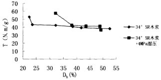

图5-1 木浆纤维损伤与纸页强度的关系

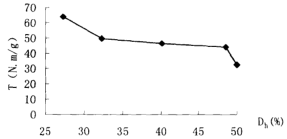

图5-2 未漂木浆损伤与纸页强度关系

苯聚纤维在回波过程中，回用抄造的纸页抗张性能随纤维角质化损伤的发展基本上是呈线性变化的，如表 5-3 所示。纸页抗张强度急剧衰变，r 是负相关系数，a 为直线斜率，b 为谐距。

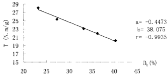

图5-3  苯浆纸页强度随纤维损伤的变化

浆料纤维经过多次回用,纤维性能不断改善,纤维结构不断发生形变程度逐渐加深。图5-4表示纤维损伤因子随反复使用情况的演化规律,由此可以看

---

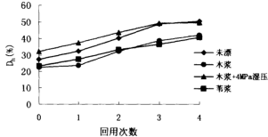

图5-4  纤维损伤随回用的变化

出纤维随回用次数的增加,开始损伤的发展较快,后缓慢。所以认为纤维的角质化损伤主要发生在纤维的前几次回用过程中。纤维经打紧充分润胀后, 首先在纤维表面上传过羟基产生纤维之间的接触;然后水经过微粒之间的空隙渗透,并与微粒表面的羟基充分结合。当纤维经几次尤其是第一次干燥再浸润后,羟基连接紧密难以打开,较多孔隙发生不可逆封闭,导致纤维发生角质化损伤。在随后的回用过程中,由于没有对纤维进行打浆等机械处理,即使润胀很长时间也不会有额外的自由表面暴露,在随后的抄纸干燥过程中也就不会再形成键合能力很强而且不可逆的氢键或其它键,因此二次纤维的润胀能力没有明显的下降趋势,最终使二次纤维角质化损伤的程度可能会相对减弱。

然而对于苇秆纤维,损伤随回用的发展仍呈现很好的线性关系,与纸页强度随损伤发展的规律一致。

### 3.2 纸页性能随损伤变量$D_{S}$的演化规律

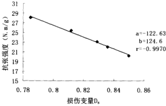

图5-5 苯浆纤维损伤与成纸抗张强度的关系

相同的损伤过程,不同的损伤意义方法。材料会有不同的损伤等级,以上从纤维粒度的数字化量角度定义的结构变量研究了再生纸张强韧性性能

---

损伤的演化,以及冰伤随纤维回用的变化规律。下面从成纸纤维结合面积的变化探讨纸片损伤情况。

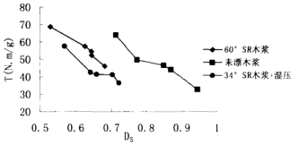

图5-6 木浆纸页随纤维损伤的变化

纤维发生角质以后,纤维润胀能力下降,弹性模量增大,整根纤维挺硬, 均一性差。因此在随后的回用抄纸过程中,纤维之间难于紧密接触,键合强度减弱,致使纸张末键合面积增加(光散射系数S增大),而浆纤维低页强度随损伤的变化规律仍呈现线性关系(见图5-5),但有不同的数学关系。

不同类型的木浆损伤变化规律基本一致,呈现曲线关系,开始纸页强度随损伤急剧下降,中间出现一个很窄的平缓阶段,随后再次急剧下降(见图 5-6)。

以结合面积的变化定义的苇秆纤维损伤变量随回用次数的变化没有呈现较好的线性关系,如图5-7所示。

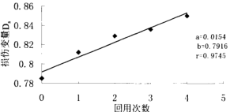

图5-7苇浆纤维损伤随回用次数的演化

图 5-8 是各类浆纸页损伤随回用次数的变化曲线,规律性不太明显。对再生纸页性能的损伤从不同角度定义损伤变量,其演化规律的趋势基本上相同。木浆纸页强度下降有一个较为平缓的阶段,随后急剧下降,但有不同的损伤演化方程。羊皮纸页的损伤基本上为线性衰变。

---

这里初步引入了材料损伤力学的一些最基本的理论知识,对纤维回用引起的损伤带来的纸页性能的衰变的研究方法有别于损伤力学中的研究方法。

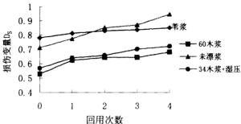

图5-8 浆料纤维损伤随回用的变化

## 4、本节总结

本节初步选定了适合造纸植物纤维的损伤变量。造纸纤维回用引起的损伤导致纸张抗张性能衰变。随损伤发展,纸页劣化逐渐严重,但在损伤初始阶段,纸页性能劣化尤为急剧。在两种不同的损伤变量定义方法中,苇浆再生纸页的损伤基本上以线性规律演化发展。

---

## 第三节 纸页材料的环境损伤

### 1 引言

环境损伤$^{[57]}$是指材料如果处在潮湿的空气中,或处在某种液体中,或处在某种湿度场中,这些条件随着时间发生变化,就会影响材料的基本性能,使材料发生退化。材料的环境损伤主要是热效应和湿效应引起的材料损伤。在造纸行业中,通常称之为纸页的老化现象。

纸张的老化损伤$^{[47]}$:这种现象是纸张在长期保存过程中由于破坏环境以及纸张的化学组分及其结构等因素的长期作用结果,使纸张部分或全部丧失其原有的强度和结构性能。环境是纸页老化的外因,因此讲,纸的老化使环境对纸张组成的不良影响而发生作用的结果。环境的光能、热能及化学物质于适当的条件下促使组成分如纤维素、木素、半纤维素、以及辅助化学成分乳胶料、添加剂、填料等发生光学的、热的以及化学的反应及变化。

热干燥箱离心机及其测纤维保水值附件纸页性能测试仪器（同上）

将抄纸的纸页在热干燥箱中,105℃温度下进行热老化10h,一部分纸页留作测性能用,一部分纸页老化,再留出一部分测性能,其余的重新抄纸, 反复操作上述步骤。

### 3、结果与讨论

由图 5-9 和 5-10 可知,纤维在每次回用前进性热老化处理,抄造的再生纸张强度性能比未经优化处理的纸页的下降较快,纸页损伤更加严重。老化使非结晶区纤维素和半纤维素发生热降解,通过分子重排形成稳定的分子间氢键,导致羟基减少,因而最终导致纸张亲水性下降,而新的氢键结合又会提高弹性模量,使纤维变脆,在随后的回用中纤维更易于损伤,增加了纤维的角化程度。

---

在进一步或大量干燥使纸或纤维的发生热老化过程中,纤维间会形成化学键合,纤维素和半纤维素链间发生半烷醛型的自动交联$^{[6]}$,从而引起了纤维的角质化。

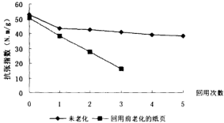

图5-9 回用过程中老化损伤变化

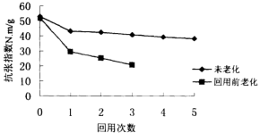

图5-10 回用过程中老化损伤变化

老化引起纤维损伤,但其损伤程度远小于回用对纤维引起的损伤。如图 5-11所示,对每次回抄的纸页测量其老化前后的抗张强度得知,老化引起的损伤较小。

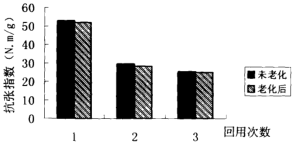

图5-11 纸页老化回用损伤变化曲线

---

纸页在使用或存放过程中,还会受到环境损伤,如湿、热效应,引起纸张老化损伤。再生纸页经热老化回抄,与未老化的回用纸页相比,其损伤极其严重。然而,在同一次纤维回用中,老化损伤的程度相对较小。

## 本章结论

1. 根据损伤力学理论，本文初步选用两个参数定义了不同的损伤变量：

I、以纤维结合面积的变化表征损伤变量：$D_{S}=S/S_{S}$。

Ⅱ、以纤维角质化指数表征损伤变量：

$$D_{0}=\frac{W R I_{0}-W R I_{1}}{W R I_{0}}=1-W R V_{0}/W R V_{0}$$

2. 纸页强度试验随纤维材料损伤演变的变化规律表明,苇浆纸页抗张强度随损伤发生呈线性关系,木浆则表现为曲线关系。

3.  材料由于环境因素的影响发生的损伤称为环境伤。本文简单地研究了纸页的环境损伤，热老化，其引起的损伤小于纤维回用伤的2倍。

---

## 第六章   全文总结

一、论文通过对二次纤维回用过程中纤维损伤及其纸页强度性能的研究, 得出如下结论:

### （一）、角质化、纤维及其纸页性能变化

- 1. 二次纤维在不同回用过程中，纤维平均长度基本保持不变，打浆度逐渐
下降。纤维聚合度(DP)、聚戊糖含量有所下降。但在各次回用中，DP
和聚戊糖有上升的趋势。其原因认为应归结为纤维在循环回用中，细小
组分逐渐流失造成的。未打浆木浆经回用后，DP 依次下降。因此认为细
小组分纤维含量是二次纤维回用性能的一个重要指标。
2. 无论是用红外光谱还是用X射线衍射方法，都表明纤维回用引起了纤维
结晶指数增加。说明纤维经不同回用后，纤维内部结构排列趋于规则化，
结晶区增大，因此致使二次纤维难以润胀（纤维保水值下降），弹性模
量增加，纤维变得挺硬，塑性降低，从而使纸页键合程度变差，表现在
相对键合面积不断减少。最终使纸张干张强度、耐破坏度、紧度减少。
因此认为结晶是纤维角质化的一个机理。
3. 二次纤维的多次回用并没有使断裂度严重下降，反而会有正面影响。在
回用中断裂度的变化趋势基本上是先上升后下降的。
4. 纤维及其纸页各个性能的变化最终归结到二次纤维的角质化。实验结果
表明二次纤维角质化发生在干燥和湿挤压阶段。在干燥和湿挤压阶段，
当纸页固含量超过20%左右时，角质化才开始发生；当固含量大于70%
以上时，角质化基本不再发生。说明角质化主要与纤维脱水相关。在抄
片器中当固含量保持95%左右，持续加热干燥时，与热有关的其它因素
又会加剧角质化程度。
5. 棉浆、打浆、抄造环境、压榨、浆料半纤维素含量等都会影响二次纤维
的角质化程度。机械浆的角质化程度小于化学浆的角质化程度。比较温
和的干燥条件可以减轻纤维角质化程度。半纤维素含量低的浆料角质化
程度大。未打浆的浆料角质化程度小，保水值减少的比较缓慢，相应地，
抄造的纸页的强度下降较小，并且具有略上升的趋势。
6. 弱碱性条件下抄纸可以部分防止角质化，但pH 值过高反而会增加角质
化程度。在适当的碱性条件下处理二次纤维可以部分恢复角质化，但对
多次回用的二次纤维作用极小。实验结果表明比较好的pH 值在9左右，
不应超过10。
7. 用比水与纤维形成氢键弱的溶剂泡浆：纤维角质化程度低。说明二次纤
维角质化过程中，纤维内微细纤维之间形成键，致使再次润胀也无法打
---

开。加入表面化剂的浆料经充分润胀后,表面活性剂浸入纤维细胞壁孔隙内,其大分子链结构适当地阻止了纤维壁内羟基在干燥过程中相互靠近,所以部分抑制了纤维角质化。该部分内容同时也证明了纤维形成不可逆氢键是纤维角质化的一个原因。

8. 纤维经过一次干燥后，纤维的角质化程度最严重。因此纤维保水值及其纸张页张强度下降的最多。

### （二）、纤维及其纸页的损伤研究

1. 根据损伤力学理论，本文初步选用两个参数定义了不同的损伤变量：

Ⅰ、以纤维结合面积的变化表征损伤变量：$D_{S}=S/S_{0}$

Ⅱ、以纤维角质化指数表征损伤变量：

$$=\frac{WR_{16}-WR_{1}}{WR_{16}}=1-WR_{1}/WR_{0}$$

。纸张̃强韧性性能随纤维材料损伤演变的变化规律为:苇浆纸页抗张强度随损伤发展呈现线性关系,木衬则表现为曲线关系。

3.材料由于环境因素的影响发生的损伤称为环境损伤。本文简单地研究了底页的环境损伤。热老化,其引起的损伤小于纤维回用伤的强度。

## 二、本文的创新之处

损伤力学理论对近衬有一种新的尝试。本文首次将二次纤维发生的不可逆角化定义为纤维损伤,并从两个不同的角度初步确定了损伤变量。 研究了纸页抗张强度性能随损伤演化的变应规律。

## 三、需进一步研究的问题

1.   研究二次纤维质化究竟是纤维细解的何种变化引起的，纤维结晶指数增加，是否表明纤维素的结晶区的确大大了。

2.   研究二次纤维角质化实际可行的解决方法。

3. 研究二次纤维损伤变量与纸页各个性能的定量关系。建立二次纤维损伤变量与纤维形态参数的定量关系。通过对二次纤维和纸页的损伤研究, 建立起纸页材料的损伤理论, 如纸页的疲劳损伤模型、损伤积累模型和寿命预测模型等。

---

## 参考文献

1. 彭毓秀，林海等."苇浆回用性能研究"《纤维素科学与技术》1996，Vol.4 No.4：44-48

2. Ulrich Weise, "Homification—mechanisms and terminology," PAPERI JA PUU, 1998, Vol. 80, No. 2: 110-115

3 何北海等. “药用细胞纤回用品质及其衰变特性初探” 《造纸科学与技术》 2001, No.2:3-6

4 黄应刚等,"倒杯回用纤维品质衰变方法及其机理研究" 《造纸科学与技术》 1991, No.5:14-17

5 Gustav Carlsson and Tom Lindström, "Hornification of cellulosic fibers during wet pressing," Svensk papperingssting, 1984, no. 15: R119-R124.

6. Johan Gullichsen, Hannu Paulapuro, Kaanilo Niskanen, "Papermaking Science and Technology", Book 16 Paper Physics    Chapter 1.19--26.

7. Richard L., Ellis and Kelly Sedlachek "Recycled vs. virgin fiber characteristics: a comparison" Tappi Journal, 1993, Vol. 76, No.2 1-43-146

8. Mousa M. Nazhad and Lazlo Paszner, "Fundamentals of strength loss in recycled paper," Tappi Journal, 1994, Vol. 77, No. 9:171-178

9. Tom Lindstø and Gustav Carlsson. "The effect of carboxyl groups and their ionic form drying on the hornification of cellulose fibers" Svensk papertjdsing, 1982, R146-R150.

10 KWEI N. LAW, JACQUES L. VALADE, AND JINGYYING QUAN "Effects of recycling on papermaking properties of mechanical and high yield pulps" Part I: Hardwood pulps. Tappi VOL 79 NO 3: 167-173

11 H.E. Jang, R.S Seth. "Using confocal microscopy to characterize the collapse behavior of fiber," Tappi Journal, 1998, Vol. 5: No. 1 56:177-173

[7] 李D.И.弗里雅捷著，陈有庆等译 “纸的性能”，中国轻工业出版社， 1985

[7] 美] H.F.兰斯主编,陈仲豪等译 . “低的科学”.中国轻工业出版社, 1989

14. J.P.凯西主编，李丰年等译 “制浆造纸化学工艺学” 轻工业出版社第三版第三卷

15. 隆言泉主编 . “造纸原理与工程”. 中国轻工业出版社，1994

16. 陈佩蓉、屈维均 . “制浆造纸实验”. 中国轻工业出版社，1990

---

17 Robert M. Sozyski, Kirkland, Quebec, Canada. "Relative bonded area: A different approach", Nordic Pulp and Paper research Journal 1995 No.2:150

18 K.R. Braaten "Fiber and fibril properties versus light scattering and surface smoothness for mechanical pulps", Pulp &Paper Canada , 101.5(2000) T122-125

19. Rajinder S. Seth and Derek H. Page "The problem of using Page's equation to determine loss in shear strength of fiber—fiber bonds upon pulp drying". Tappi Journal 1996, No 9: 206-210

20. 陈有庆等（译），《纸的性能》，轻工业出版社，1985年第一版

21. "Fiber-Fiber Bond Strength of Once-Dried Pulps". JPPS 2001, Vol 27, No 3 88-91

22. "Relation between fiber shrinkage and hornification" Progr Pap recycl 7, no. 3 14-21 (May 1998)

23  纸浆回用对其化学性质的影响 《四川造纸》1995 年第 2 期

24. Swelling and Elasticity of cell wall of fibers

25. 周小凡 博士论文 1994, 5

26. 叶君等,"超声波处理引起纸浆纤维素晶体结晶度的变化"《广东造纸》1999, No. 2:7

27.全金英 "酰杨菜素浆和高得率浆的回用性能"《林产化学与工业》第 16 卷 第 3 期 1996 年 9 月

19. 彭秀颖 "回用柔毛性能的变化规律及其机理"《纤维素科学与技术》Vol.5 No.3, 1997

29. “纸浆回用对其化学性质的影响” 《四川造纸》1995 年 第 2 期

30. 彭毓秀“纸浆的回用性质及其改善” “China Pulp & Paper” 1994 年 4 月

31 张秀梅 "麦秸和木浆纤维在回用过程中形态结构的变化 "China Pulp & Paper] 1997 年5 月

32  “非木材纤维纸浆回用性能的研究”“China Pulp & Paper”1995 年 11 月

33. Bangi Cao, Ulrike Tschirner, Shri rRanswamy "A study of changes in web-fiber flexibility and surface condition of recycled fibers" PAPERI JA PUU,1999, VOL 81, NO.2 117-122

20. "Effects of drying and pressing on the pore structure in the cellulose fibre wall studied by 1H and 1H NMR relaxation" CELLULOSE (1998) 5,33-49

34 "Swelling of carboxymethylated cellulose fibres" CELLOLOSE(1997)4, 293-303

25 "The influence of drying conditions on the recovery of swelling and strength of recycled fibres" Svensk pavperstidringa nr 11 1978 355-357

---

36. N GURNAGUL, S JU AND D.H PAGE JOURNAL OF PULP AND PAPER SCIENCE: 2001 VOL 27 NO 3 MARCH 88-91

37. A M SCALLAN and A C TIGERSTROM "Swelling and Elasticity of the Cell Walls of Pulp Fibres" JOURNAL OF PULP AND PAPER SCIENCE 1992 VOL 18 NO 5 SEPTEMBER 188-192

38 John F Bobalek and Mayank Chaturvedi "The effects of recycling on the physical properties of handsheets with respect to specific wood species" June 1989 Tappi Journal 123-125

39. Tom Lindstrom and Gustav Carlsson "The effect of carboxyl groups and their ionic form during drying on the homiification of cellulose fibers" svensk paperstiding 1982 146-151

40 MIN ZHANG, MARTIN A HUBBE, RICHARD A. VENDITHI, AND JUHN A. HEITMANN. "Can recycled kraft fibers benet from chemical addition before they are first dried?" Apita Journal , March 2002, VOL.55, NO.2:135-143

41.纤维形态与木材性能的关系  加拿大 OPTEST 公司提供，中国总代理。 北京丹贝尔公司编译

46. 刘长恩《用锅助漂时硫酸盐木浆中纤维素结晶的研究》(稀土)1998 年 第 19 卷第 4 期

72 范宇洁等“复合材料损伤力学的研究方法及应用”《水利电力科技 No.1  Vol.23

23. 张奎金， “关于表征微裂纹型损伤的损伤变量的提出”，《力学与实践》， Vol.17 No.6 1995

55. James d's A Clark. "Pulp Technology and Treatment for paper." Miller freeman publication INC, San Francisco, 1976

---

## 致 谢

本论文在导师胡开堂教授的悉心指导下得以顺利完成的，胡老师业务繁多，但仍在百忙之中抽出时间对我进行指导，在此致以衷心的感谢。

恩师胡开堂教授严谨的治学态度、一丝不苟的敬业精神和精湛的学术造诣将会令我终身受益。

实验室康遵香老师、施美英老师、刘金明师傅、魏德津老师等在论文实验中都给予了很大的支持，在此表示衷心的感谢。

同时向同门卢立正师兄、李翠珍、李燕师妹和盖恒军师弟在我课题研究过程中给予的帮助表示衷心的感谢。同时感谢曲宏业同学帮我完成部分实验工作。

最后，向给与我论文帮助的其它同学、老师、朋友们表示衷心的感谢！

---

### 硕士期间发表的论文：

1. 邵素英 胡开堂 “二次纤维的角质化问题” 《中国造纸》2002 No.2

15  郑素丽 胡开堂 “纤维角质化损伤的纸页的性能研究”《中国造纸》已接收，待发表

39 郭素云 胡开堂 “纸页损伤因子的表征” 《纸和造纸》已接收，待发表

4. Suying Shao, Kaitang Hu. "Hornification Damage of Recycled fibers" The Second International Meeting of Emerging Technology of Pulping and Papermaking in Guangzhou, Oct. 2002

5. 郁素英 “纸页的相对键合面积RBA” 《黑龙江造纸》2002年第2期

6   邵素英 胡开堂 “二次纤维的研究进展” 《上海造纸》 2002 年第 1 期

7 邵素英 胡开堂 “二次纤维回用对纤维及其纸页性能的影响” 《西南造纸》2001 年第 4 期

8 邵素英 “造纸湿法制子在线测量技术和发展趋势” 《浙江造纸》2002 年第 1 期

9 邵素英 “草浆回用性能研究” 《湖北造纸》2001 年第 4 期

10. 邵素英 “纸和纸板的抗弯挺度” 《西南造纸》2001 年第 3 期

